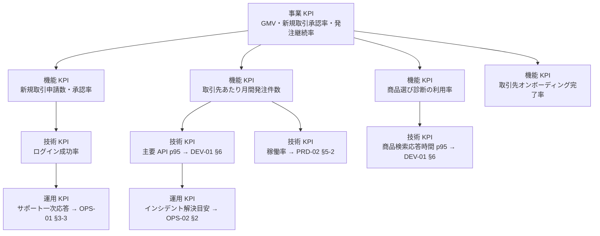

# 02-value-kpi.md — 価値指標・KPI 設計

## このセクションの目的

事業・プロダクトの各レイヤーで何を成功とみなすかを統一する。**本ファイルは「事業・プロダクト KPI（KPI-01〜09）」の正本**である。性能・稼働率・サポート応答などの技術・運用系の数値は本書では定義せず、§2-2 の正本マップに従い各文書がオーナーシップを持つ。

本プロジェクトは SaaS サブスクリプションではなく卸取引モデルのため、MRR・解約率のような SaaS 指標ではなく、**流通額（GMV）・新規取引申請の承認率・発注継続率** を中心に据える。

## 0-H. ハイブリッド編集ガイド（要点）

- 推奨モード: Hybrid（AI 整理 + 事業責任者 / PdM 確定）
- 人間確認必須: KPI 算式、目標値、オーナー、他文書との参照整合

---

## 1. KPI ツリー

---

## 2. KPI マスターテーブル

### 2-1. 事業・プロダクト KPI（本書が正本）

目標値の数値は **§3「フェーズ別 KPI 目標値」のみで管理**する（本表との二重管理を禁止）。本表は定義・計測方法・担当の正本。

| KPI-ID | 名称 | 定義 | 計測方法 | 目標値 | 頻度 | 担当 |
| --- | --- | --- | --- | --- | --- | --- |
| KPI-01 | GMV（流通総額）| 月間の発注合計金額（税抜）| DB 集計（orders テーブル）| フェーズ別目標（§3）参照 | 月次 | 事業責任者 |
| KPI-02 | 新規取引申請承認率 | 月内に審査完了した申請のうち承認された比率 | DB 集計（applications テーブル）| フェーズ別目標（§3）参照 | 月次 | PdM |
| KPI-03 | 申請審査リードタイム | 申請受付から承認/否認までの平均日数 | DB 集計 | フェーズ別目標（§3）参照 | 月次 | PdM |
| KPI-04 | 取引先あたり月間発注件数（中央値）| 稼働中取引先 1 社あたりの月間発注件数中央値 | DB 集計 | フェーズ別目標（§3）参照 | 月次 | PdM |
| KPI-05 | 平均発注単価（AOV）| 発注 1 件あたりの平均金額（税抜）| DB 集計 | フェーズ別目標（§3）参照 | 月次 | 事業責任者 |
| KPI-06 | 取引先継続発注率 | 初回発注後 90 日以内に再発注した取引先の比率 | DB 集計 | フェーズ別目標（§3）参照 | 月次 | PdM |
| KPI-07 | 商品選び診断の利用率 | 月間セッション数のうち診断機能を利用した比率 | イベントログ | フェーズ別目標（§3）参照 | 月次 | PdM |
| KPI-08 | 取引先オンボーディング完了率 | 承認から 14 日以内に初回発注が完了した取引先の比率 | イベントログ | フェーズ別目標（§3）参照 | 月次 | PdM |
| KPI-09 | 取引停止率 | 月内に取引停止・取引終了となった取引先の比率 | DB 集計 | フェーズ別目標（§3）参照 | 月次 | 事業責任者 |

### 2-2. 技術・運用 KPI の正本マップ

以下の KPI は本書では定義しない。定義・目標値・計測方法はすべて右列の文書が正本である。**KPI-ID は他文書からの参照を壊さないため欠番のまま保持し、再採番しない。**

| KPI-ID（欠番）| 名称 | 区分 | 正本文書 |
| --- | --- | --- | --- |
| KPI-10 | 主要 API p95 | 技術（性能）| DEV-01 §6（非機能要件）|
| KPI-11 | 商品検索・診断応答時間 p95 | 技術（性能）| DEV-01 §6（非機能要件）|
| KPI-12a / KPI-12b | 稼働率（管理側 / 公開側）| 技術（可用性）| PRD-02 §5-2（可用性目標の正本）|
| KPI-13 | 一次応答時間 | 運用（サポート）| OPS-01 §3-3（一次応答 SLA の正本）|
| KPI-14 | MTTR | 運用（障害対応）| **廃止** — OPS-02 §2 の解決目安に一本化し、独立 KPI としては管理しない |

---

## 3. フェーズ別 KPI 目標値

フェーズ命名は BIZ-01 §6 と共通の **MVP 期 / 成長期 / 安定期**。本表が事業・プロダクト KPI の目標値の唯一の置き場所である。

| KPI-ID | MVP 期 | 成長期 | 安定期 |
| --- | --- | --- | --- |
| KPI-01 GMV | 計測開始（参考値）| 前期比 +20% / 月 | 前期比 +10% / 月 |
| KPI-02 新規取引申請承認率 | 60% | 70% | 75% |
| KPI-03 申請審査リードタイム | 5 営業日以内 | 3 営業日以内 | 2 営業日以内 |
| KPI-04 取引先あたり月間発注件数 | 1 件 / 月 | 2 件 / 月 | 3 件 / 月 |
| KPI-05 平均発注単価（AOV）| 計測開始（参考値）| 前期比 +5% | 維持 or 微増 |
| KPI-06 取引先継続発注率 | 30% | 45% | 55% |
| KPI-07 商品選び診断の利用率 | 15% | 25% | 35% |
| KPI-08 オンボーディング完了率 | 40% | 55% | 65% |
| KPI-09 取引停止率 | 5% 未満 | 3% 未満 | 2% 未満 |

---

## 4. KPI 定義変更ルール

| 項目 | ルール |
| --- | --- |
| 定義変更権限 | 事業責任者 / PdM の合意で変更（兼務時は単独判断可、ただし GOV-01 に記録）|
| 変更記録先 | GOV-01 |
| 周知対象 | プロジェクト関係者全員 |
| 反映先 | §2-2 正本マップの各文書、DEV-03、OPS-02、ダッシュボード設定 |

> 例：「継続発注」の定義を「90 日以内」から「60 日以内」へ変更する場合、過去比較への影響を注記し GOV-01 に記録。

---

## 5. 記入時チェックポイント

- 事業 KPI と技術 KPI の因果がつながっているか（§1）
- 定義・算式・頻度・担当者が空欄になっていないか
- 目標値の数値が §3 以外の場所（§2 含む）に重複記載されていないか
- 技術・運用系の数値を本書に再定義していないか（§2-2 の正本マップ経由になっているか）
- フェーズごとの目標値が現実的かつ成長余地を示しているか
- BIZ-03 の卸取引条件（支払条件・最低発注額等）と §3 のフェーズ・数値が整合しているか
