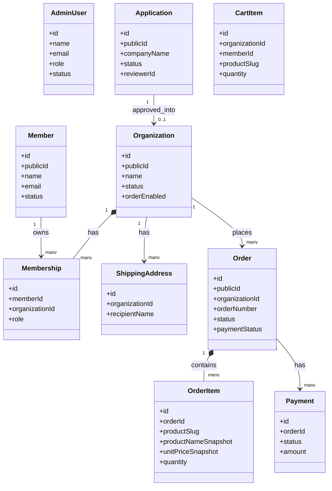

# 01-domain-model.md — ドメインモデル

## このセクションの目的

プロダクトの業務概念をエンティティ単位で整理し、共通言語を確立する。本書は、テンプレート標準の単一運営モデル（00_README §0-1 パターン A）を **ペット漢方 卸売サイト（新規取引申請 → 審査 → 承認済み取引先による卸発注）** のドメインに適用したものである。

## 0-H. ハイブリッド編集ガイド（要点）

- 推奨モード: Hybrid（AI 整理 + PdM / Tech Lead レビュー）
- 人間確認必須: 用語の意味、責務境界、将来拡張との整合、営業用語との衝突

---

## 1. ドメイン構造

### 1-1. 階層モデル

テンプレート標準の `AdminUser`（管理画面）/ `Member`（マイページ、採用時のみ）の 2 系統構造（DEV-01 §1「Permission」・DEV-02 参照）を採用する。ただし本プロジェクトでは、標準テンプレの `Member` が組織を持たない単一種別であるのに対し、**`Member` が `Organization`（取引先会社）に所属する** 点が標準からの拡張である（INTAKE §4-6「会社とユーザーを分けて管理し、将来複数ユーザーを1社に所属させる」という要件による。GOV-01 D-004）。また、商品カタログ（Manufacturer / Brand / Product 等）は `Organization` に属さない、運営（AdminUser）が管理する共有カタログである。

```
Site（運営: 1 事業者・1 運営チーム。マルチテナント SaaS ではない）
  ├─ AdminUser（管理画面ログインユーザー。ロール: admin の 1 ロールのみ）
  │    ├─ 商品カタログ（共有・Organization に属さない）
  │    │   ├─ Manufacturer（メーカー）
  │    │   ├─ Brand（ブランド）
  │    │   ├─ ProductCategory（商品カテゴリー）
  │    │   ├─ Concern（対象となる状態・気になる点）
  │    │   └─ Product（商品）
  │    ├─ Application（新規取引申請。承認すると Organization + 初期 Member を生成）
  │    ├─ News（お知らせ）
  │    └─ Inquiry（お問い合わせ）
  │
  └─ Member（マイページ機能。`apps/public` 側。AdminUser とは完全に別系統 — 認証テーブル・セッション・パスワードハッシュを共有しない）
       └─ Organization（取引先会社。Application の承認により作成される）
            ├─ Membership（Member × Organization の所属。role は `client_user` の 1 種類のみ、将来 `client_admin` 追加は Open）
            ├─ ShippingAddress（配送先）
            ├─ OrganizationProductPrice（取引先別卸価格。設定があれば Product 標準卸価格より優先。GOV-01 D-009）
            ├─ Cart / CartItem（カート）
            └─ Order（発注/受注）
                 ├─ OrderItem（発注明細。商品情報のスナップショットを保持）
                 └─ Payment（決済記録。カード決済 / 銀行振込のみ。掛売りは提供しない — GOV-01 D-010）
```

> **アプリ間のエンティティ所有**（DEV-01 §1「リポジトリ構成」参照）: AdminUser・Application・Inquiry・活動監査ログは `apps/admin` の関心事。Member・Organization・Membership・Cart/CartItem・Order・OrderItem・Payment・ShippingAddress は `apps/public` の関心事（会員マイページ + 発注機能）。商品カタログとお知らせはどちらの所有でもなく `packages/content` が正本である（§1-5、GOV-01 D-017・D-018）。**共有するのは D1 のみ**（R2 は不採用 — D-020）。マイグレーションは `apps/admin` からのみ実行し、スキーマ定義自体は `packages/schema` に一元化する。

### 1-2. ロール構造（最小構成）

| 系統 | ロール | 概要 |
| --- | --- | --- |
| AdminUser（`apps/admin`） | なし（ロール区分を持たない単一種別。テンプレート標準の `admin`/`editor` ロール分けは不採用 — GOV-01 D-014） | 運営側の全体管理（商品・メーカー・ブランド管理、新規取引申請の審査、取引先管理、受注管理、お知らせ・問い合わせ対応、監査ログ確認） |
| Member（`apps/public`） | `client_user` | 承認済み取引先（Organization）に所属し、卸価格確認・発注・発注履歴確認・会社情報/配送先管理を行う |

> 取引先側に管理者権限（社内での権限差、例えば発注可否を制限する担当者ロール）を設けるかは **未確定 `[Open: TBD-05, GOV-02]`**。将来 `client_admin` ロールを追加する場合も Membership の `role` カラムの値追加のみで対応できるようスキーマを設計する（DEV-07 参照）。

### 1-3. 標準エンティティ・プロダクト固有エンティティの役割

| 概念 | 役割 | 例 |
| --- | --- | --- |
| Site | サービス全体の運営（自社）。`AdminUser`（ロール区分なし）を持つ | 運営会社 |
| AdminUser | 管理画面を利用する運営メンバー（Cloudflare Access で認証。アプリにログイン画面は無い — GOV-01 D-022） | 審査担当、受注担当 |
| Organization | 承認済み取引先 1 社（`Member` が所属する単位） | ペットショップ A 社 |
| Member | Organization に所属し、`apps/public` のマイページにログインする担当者 | ペットショップ A 社の仕入れ担当者 |
| Membership | Member の Organization への所属（ロールは `client_user` のみ） | 担当者甲がペットショップ A 社に所属 |
| Application | 新規取引申請 1 件。審査を経て Organization に変換される | A 社からの新規取引申請 |
| Manufacturer / Brand / ProductCategory / Concern / Product | 運営が管理する共有商品カタログ（Organization に属さない） | メーカー X、ブランド「Uchinoko」、商品「〇〇犬用サプリ」 |
| Order / OrderItem / Payment | Organization が行う発注とその明細・決済記録 | A 社の発注 1 件 |
| ShippingAddress | Organization に紐づく配送先 | A 社の店舗配送先 |
| News / Inquiry | 運営が発信するお知らせ、外部からの問い合わせ（Organization に属さない） | 新商品入荷のお知らせ |

### 1-4. サイト・ブランド名の混同に関する注意

INTAKE §4-3 の顧客発言のとおり、「Uchinoko」はサイト全体のブランド名ではなく、Brand エンティティのレコードの一つ（取扱商品ブランドの一つ）である。サイト名・運営会社名は未確定（`[Open: TBD-01, GOV-02]`）であり、Brand としての「Uchinoko」と混同しないこと。

### 1-5. エンティティにしないコンテンツ

本書のエンティティは、すべて D1 のテーブルとして実装される（DEV-07）。一方、公開画面に出るコンテンツのうち **運営が日常的に更新しないもの** は D1 に置かず、エンティティとして扱わない（置き場所の判断は DEV-06 §1-1 が正本）。

本プロジェクトでは、この「運営が日常的に更新しないもの」が**公開コンテンツのすべて**にあたる（GOV-01 D-017・D-018）。商品の改訂は半年に 1 回程度で、実施するのは開発者である。

| コンテンツ | 置き場所 | エンティティか |
| --- | --- | :---: |
| 商品（説明・原材料・使用方法・標準卸価格・発注単位）| `packages/content`（Content Collections）| ✗ |
| メーカー・ブランド | `packages/content` | ✗ |
| 取引先別の個別卸価格 | `packages/content`（`organizations.orgCode` を参照）| ✗ |
| お知らせ | `packages/content` | ✗ |
| 商品選び診断のルール（質問・選択肢 → 推奨商品）| `packages/content` | ✗ |
| 商品画像 | 静的アセット（`apps/public/src/assets/img`）| ✗ |
| 商品カテゴリー・気になる点の分類、FAQ、送料・税率・支払方法、お問い合わせ種別 | TypeScript 定数 | ✗ |
| 利用規約・プライバシーポリシー・特定商取引法に基づく表示 | ページ直書き | ✗ |

したがって **`Product` / `Manufacturer` / `Brand` / `ProductCategory` / `Concern` / `ProductImage` / `OrganizationProductPrice` / `News` はエンティティではない**（GOV-01 D-017〜D-020）。当初の設計ではいずれも D1 テーブルだったが、運営が管理画面から更新する対象ではないことが確認されたため外した。診断系 4 エンティティを外したとき（D-015）と同じ判断を、カタログ全体に広げたものである。

構造定義は `packages/content/src/schema.ts` の Zod スキーマが正本になる。**エンティティ側から見た影響は「参照が外部キーではなく文字列になる」こと**で、`CartItem` / `OrderItem` は `productSlug`、取引先別価格は `Organization.orgCode` で結びつく（DEV-06 §1-1、DEV-07 §6-0）。

---

## 2. ドメインモデル図



> **商品カタログ・お知らせ・商品選び診断は本図に現れない**（§1-5 のとおりエンティティを持たない）。いずれも Content Collections 側にあり、`CartItem.productSlug` / `OrderItem.productSlug` / 取引先別価格ファイルの `orgCode` を通じて**文字列で結びつく**だけである。外部キー制約が無いため、この結びつきは DB では保証されない（DEV-07 §6-0）。

---

## 3. 主要エンティティ定義

### 3-1. 標準エンティティ

| エンティティ | 責務 | 主要属性 |
| --- | --- | --- |
| AdminUser | 管理画面を利用する運営メンバー（`apps/admin`。認証は Cloudflare Access、本表は台帳 — GOV-01 D-022） | name, email, status |
| Organization | 承認済み取引先 1 社。Application の承認によってのみ作成される | name, status, orderEnabled |
| Member | Organization に所属し `apps/public` のマイページにログインする担当者。AdminUser とは別系統（DEV-02 参照） | name, email, status, ログイン方法（§3-3 SocialAccount） |
| Membership | Member × Organization の所属 | memberId, organizationId, role（`client_user` 固定、将来拡張余地）, status |
| AuditLog | 重要操作の監査ログ | actorId, action, targetType, targetId, before, after（物理テーブル名・カラム名は `activity_log`（DEV-07 §4-4）であり、本書の論理名・属性名とは対応が異なる唯一のエンティティ。DEV-01 §2 参照）|

### 3-2. プロダクト固有エンティティ

| エンティティ | 責務 | 主要属性 |
| --- | --- | --- |
| Application | 新規取引申請 1 件。企業情報・審査状況を保持し、承認時に Organization + 初期 Member を生成する | companyName, corporateNumber, businessType, industry, address, representativeName, contactName, contactDepartment, phone, email, website, sns, hasPhysicalStore, plannedSalesChannels, desiredProducts, desiredPaymentMethod, notes, agreedToTerms, agreedTermsVersion, status, reviewerId, reviewMemo, appliedAt, reviewedAt |
| ShippingAddress | Organization に紐づく配送先 | organizationId, recipientName, postalCode, address, phone, isDefault |
| Cart / CartItem | Organization 所属 Member が発注前に保持する仮の商品リスト | organizationId, memberId, productSlug, quantity |
| Order | 発注（取引先視点）/ 受注（運営視点）。同一データを両者の文脈で扱う（INTAKE §4-3 用語整理） | organizationId, memberId, orderNumber, status, paymentStatus, subtotal, tax, shippingFee, total, shippingAddressSnapshot, paymentMethod, notes, placedAt |
| OrderItem | 発注明細。注文確定時点の商品情報をスナップショットとして保持（PRD-02 §8） | orderId, productSlug（参照のみ）, productNameSnapshot, productCodeSnapshot, unitPriceSnapshot, taxRateSnapshot, quantity, subtotal |
| Payment | 決済記録（カード決済 / 銀行振込） | orderId, method, status, amount, paidAt |
| Inquiry | お問い合わせ（主に未ログインの一般閲覧者から） | companyName, name, email, phone, inquiryType, content, status, assigneeId, memo |

> **商品カタログ（Manufacturer / Brand / ProductCategory / Concern / Product / ProductImage / ProductConcern / OrganizationProductPrice）と News はエンティティではない**（§1-5、GOV-01 D-017〜D-020）。属性定義は `packages/content/src/schema.ts` の Zod スキーマが正本になる。
>
> Cart / CartItem・ShippingAddress・Order・OrderItem・Payment・Membership は `organizationId` を持つスコープ対象。Application・Inquiry は運営が管理するデータ、または Organization 作成前のデータであり `organizationId` を持たない（§6 参照）。
>
> **Organization は `orgCode` を持つ**（DEV-07 §5-2）。承認時に運営が採番する安定コードで、取引先別卸価格ファイル（`packages/content/prices/*.md`）からの参照キーになる。`publicId`（ULID）は承認処理まで採番されず Markdown に書けないため、別に必要になった（GOV-01 D-019）。
>
> `Application.agreedTermsVersion` は、申請時点で同意した利用規約のバージョン文字列を保持する。利用規約はページ直書き（§1-5）でありレコードとして存在しないため、同意対象を後から特定できる唯一の手掛かりがこの列になる（DEV-07 §5-1）。

### 3-3. 認証関連エンティティ

| エンティティ | 責務 | 主要属性 |
| --- | --- | --- |
| SocialAccount | Member の OAuth ログイン方法（LINE / Google / Facebook）を複数保持できるようにする（DEV-01 §2「OAuth / SSO」。Arctic を使用） | memberId, provider, providerUserId |

---

## 4. ユビキタス言語定義

| 用語 | 定義 | 使用文脈 | 禁止言い換え |
| --- | --- | --- | --- |
| 取引先（Organization）| 新規取引申請が承認された法人・個人事業主 1 社 | 取引先向け画面・管理画面 | テナント（顧客説明では避ける）|
| 発注 / 受注（Order）| 同一の注文データを、取引先視点では「発注」、運営視点では「受注」と呼ぶ（INTAKE §4-3）| 取引先向け画面は「発注」、管理画面は「受注」 | どちらか一方に統一しない（画面ごとの文脈を保つ）|
| 新規取引申請（Application）| 取引先になるための申請 1 件。承認前は Organization ではない | 公開サイト・管理画面 | 「取引先」（承認前は取引先ではない）|
| ブランド（Brand）| 商品が属する銘柄。「Uchinoko」はブランドの一例であり、サイト全体のブランドではない | 商品管理・商品詳細 | サイト名としての「Uchinoko」利用 |
| 卸価格 | 承認済み取引先にのみ表示される仕入れ価格 | 商品詳細・カート・発注 | 「販売価格」（希望小売価格と混同しない）|
| 商品選び診断（Diagnosis）| 専門知識が少ない事業者向けに、質問への回答から商品を提案するルールベースの機能。医療的診断ではない。ルールは Content Collections の Markdown であり DB レコードではない（§1-5）| 公開サイト | 「診断」単体での医療行為を想起させる表現 |
| 診断ルールセット | 1 つの診断（Uchinoko 専用 / ブランド横断）を構成する質問・選択肢・推奨商品マッピングの一式。`packages/content` の 1 ファイルに対応する | 公開サイト・開発 | 「診断マスタ」（DB のマスタテーブルを想起させる）|

---

## 5. 境界コンテキスト定義

| コンテキスト名 | 対象範囲 | 主責任 | 他コンテキストとの接点 |
| --- | --- | --- | --- |
| Catalog | 商品・メーカー・ブランド・分類・商品画像・取引先別価格（`packages/content` と定数。**D1 テーブルを持たない**）| 商品カタログの公開（`apps/public` 読み取りのみ） | Order |
| Application Screening | Application | 新規取引申請の受付・審査・承認（Organization + 初期 Member の生成、`orgCode` の採番） | Client Access |
| Client Access | Member, Organization, Membership, 認証 | 誰がマイページ・発注機能を利用できるか（AdminUser とは別系統） | Order |
| Order | Cart, CartItem, ShippingAddress, Order, OrderItem, Payment | 卸価格確認・カート・発注・決済 | Catalog, Client Access |
| Diagnosis | 診断ルールセット（`packages/content` の Markdown。**D1 テーブルを持たない** — §1-5）| 商品選び診断の質問・推奨ロジック。推奨結果の商品情報は Catalog から `slug` で解決する | Catalog（読み取りのみ） |
| Content & Inquiry | お知らせ（`packages/content`）, Inquiry | お知らせ発信・問い合わせ対応 | Application Screening |
| Access | AdminUser, Cloudflare Access | 誰が管理画面を操作できるか | 全コンテキスト |

> **Catalog と Diagnosis は D1 を持たない境界コンテキスト**である（GOV-01 D-015・D-017）。書き込み手段はリポジトリへのコミットのみで、管理画面・API による更新経路を持たない。Content & Inquiry は「お知らせ側は書き込み経路なし・問い合わせ側は D1」という混在になる（GOV-01 D-018）。
>
> Access は AdminUser の**識別**のみを担う。認証そのものは Cloudflare Access が担当し、アプリはその結果（JWT の email）を受け取る（GOV-01 D-022）。

---

## 6. モデリング判断ルール

- **テナント境界の適用範囲を業務の実態に合わせて限定する**: 「発注に関わるエンティティ（ShippingAddress / Cart・CartItem / Order・OrderItem / Payment / Membership）のみに `organization_id` を持たせる」という限定的な適用にとどめる。これは意図的な設計判断であり、実装時に他のテーブルへ誤って `organization_id` を追加しないこと（PRD-02 §2 で詳述）。
  - **例外は無い**。旧設計では `OrganizationProductPrice` が唯一の例外だったが、商品カタログごと D1 から外れたため消滅した（GOV-01 D-017・D-019）。取引先別価格は Content Collections 側が `orgCode` で参照する。
- **エンティティにするかどうかは「運営が管理画面から更新するか」で決める**: 更新するなら D1 のエンティティ、しないなら Content Collections・定数・ページ直書きとし、本書のエンティティ一覧に載せない（§1-5、DEV-06 §1-1 が正本）。**テーブルを作るなら、対応する管理画面も同時に設計されていることを確認する。** 診断系 4 テーブル（D-015）も商品カタログ 8 テーブル（D-017）も、この確認を欠いたまま設計されていた。
- **UI の見え方ではなく業務上の意味でエンティティを切る**
- **将来機能を見越しすぎて過剰抽象化しない**：取引先ごとの卸価格は「標準価格 + 上書き」という薄い表現のみとし、掛率計算・価格ティア等の複雑な仕組みは導入しない（GOV-01 D-009）
- **PRD-03 の機能 ID と結びつけて責務を説明できる**
- **状態遷移を持つエンティティは PRD-01 で状態一覧を提示し、DEV-09 で遷移を詳細化**
- **集約ルート（Aggregate Root）を明確化**：Order が集約ルートであり、OrderItem・Payment は Order を経由してのみ操作する
- **AdminUser と Member は完全に別系統として扱う**：認証テーブル・セッション・パスワードハッシュを共有しない（DEV-02 参照）。両者を同一テーブルの `role` 分岐で表現しない

---

## 7. 状態を持つエンティティの状態一覧

エンティティが状態を持つ場合、ここで一覧化し、遷移詳細は DEV-09 状態遷移仕様に記述する。

| エンティティ | 状態名 | 説明 |
| --- | --- | --- |
| Application | received | 申請受付 |
| Application | reviewing | 審査中 |
| Application | needs_confirmation | 確認・差し戻し |
| Application | approved | 承認 |
| Application | rejected | 否認 |
| Application | withdrawn | 申請取消 |
| Organization | active | 稼働中（発注可）|
| Organization | suspended | 取引停止（発注不可）|
| Organization | terminated | 取引終了（保管期間中）|
| Membership | active | 所属中 |
| Membership | suspended | 停止中（担当者退職等）|
| Order | received | 受付済み |
| Order | confirming | 確認中 |
| Order | preparing | 出荷準備中 |
| Order | shipped | 出荷済み |
| Order | completed | 完了 |
| Order | cancelled | キャンセル |
| Payment | unpaid | 未決済 |
| Payment | awaiting_transfer | 入金待ち（銀行振込）|
| Payment | processing | 決済処理中 |
| Payment | paid | 決済済み |
| Payment | failed | 決済失敗 |
| Payment | refunded | 返金済み |
| Payment | partially_refunded | 一部返金 |
| Member | active | 有効 |
| Member | suspended | 停止中 |
| Member | deactivated | 無効化（退職等）|

上表は**遷移に前提条件・副作用を持つエンティティ**に限る。これ以外に AdminUser（有効/無効）、Inquiry（未対応/対応中/対応済み）が状態列を持つが、いずれも任意の値を往復できる単純な切替であり、遷移マトリクスを定義しない（DEV-09 §1-1、値の正本は DEV-07）。

> 状態遷移ルールの詳細は DEV-09 を参照。
>
> **商品・お知らせ・診断ルールは「状態」を D1 に持たない**（GOV-01 D-017・D-018）。公開/非公開は frontmatter の `draft`、取扱終了は `discontinued` で表現し、**公開はデプロイと同義**である。下書きはブランチ上のコミットで表現する（DEV-06 §1-1）。状態遷移の検証対象にもならない。

---

## 8. 記入時チェックポイント

- 標準エンティティ（AdminUser / Organization / Member / Membership 等）が含まれているか
- ロール構造が AdminUser 1 ロール・Member 1 ロールの最小構成で記述され、DEV-02 §2 と整合しているか
- プロダクト固有エンティティが業務観点で定義されているか
- エンティティ一覧に、運営が更新しないコンテンツ（診断ルール・FAQ・法務ページ）が混入していないか（§1-5 / DEV-06 §1-1）
- ユビキタス言語がチーム内で統一されているか（発注/受注の使い分け含む）
- 状態を持つエンティティの状態一覧が DEV-09 と整合しているか
- テナント境界（organization_id）の適用範囲が「発注関連エンティティのみ」という本プロジェクト固有の判断で一貫しているか（商品カタログに誤って付与していないか）
- AdminUser と Member が別系統として一貫して扱われているか（同一テーブル・同一ロールカラムで混在させていないか）
- エンティティ名が PRD-02 §6 / DEV-07 と一致しているか
