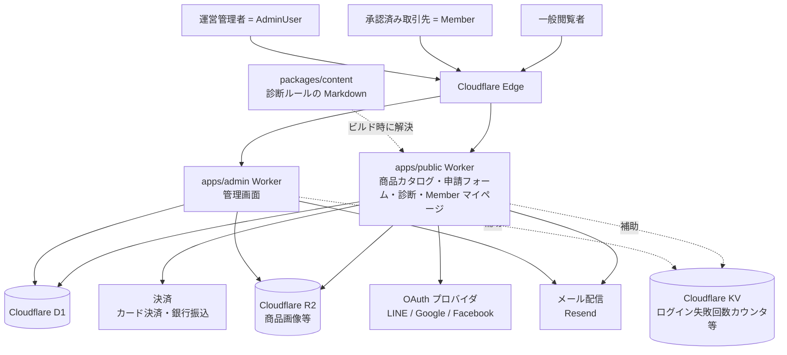
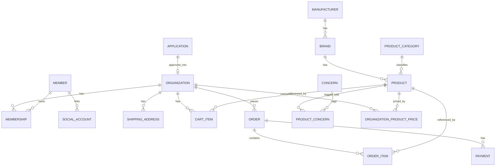

# 02-system-and-data.md — システム構成・データモデル

## このセクションの目的

システム全体の**論理構成**と、プロダクトで扱うエンティティの**論理データモデル**を一体で定義する。**本プロジェクト固有のテナント境界の適用範囲（発注関連のみ）** を含む。

- 具体的な技術・ライブラリ・インフラの選定は **DEV-01（技術スタック決定書）** に一元化されており、本書には技術名を必要最小限（構成の説明に必要な範囲）でのみ記載し、DEV-01 参照を併記する。
- 物理 DB 設計は DEV-07、環境・デプロイは DEV-08、バックアップ・データ保持の運用は OPS-02 に委譲。
- 本プロジェクトはチャット・AI 機能を採用しないため（PRD-05 参照）、リアルタイム通信・LLM・Vector DB の構成要素は持たない。

## 0-H. ハイブリッド編集ガイド（要点）

- 推奨モード: Hybrid（AI 整理 + Tech Lead / PdM レビュー）
- 人間確認必須: 可用性目標、データ保持期間、テナント境界方針、公開側/管理側の構成分離
- 詳細は 00_README.md §6〜8

---

## 1. システム全体構成（論理）

### 1-1. 構成図

各コンポーネントの実体（採用プロダクト名）は DEV-01 §1・§2 を参照。本テンプレートは `apps/public`・`apps/admin` それぞれが独立した Cloudflare Worker（Astro SSR）としてアプリケーション層を担い、別建てのアプリケーションサーバー・DB サーバー・キューワーカー群は持たない（`astro build` の出力そのものが Worker になる）。



> チャット（WebSocket）・LLM・Vector DB は採用しない（PRD-05 参照）。`packages/content` は実行時のデータストアではなく、`astro build` 時に解決されてバンドルに取り込まれる（DEV-06 §1-1）。したがって診断ルールの読み取りは D1 の行読み取りを発生させない。

### 1-2. 構成コンポーネントの責務

| コンポーネント | 責務 | 実体 |
| --- | --- | --- |
| `apps/public` Worker | 商品カタログ・申請フォーム・商品選び診断の公開ページに加え、Member（承認済み取引先の担当者）のログイン・マイページ・卸価格確認・カート・発注を提供 | DEV-01 §1 |
| `apps/admin` Worker | 商品・メーカー・ブランド管理、新規取引申請の審査、取引先（Organization）管理、受注管理、お知らせ・問い合わせ対応 | DEV-01 §1 |
| Cloudflare D1 | 全業務データの正本。両 Worker から共有参照 | DEV-01 §1 |
| Cloudflare R2 | 商品画像・お知らせ添付等の実体。両 Worker から共有参照 | DEV-01 §1 |
| Cloudflare KV | ログイン失敗回数カウンタ・メンテナンスフラグ等の補助ストア（Queues は不採用、定期処理は Cron Triggers。セッションは D1 で確定） | DEV-01 §1 |
| `packages/content` | 商品選び診断のルールセット（Markdown）の正本。開発者がコミットで更新し、管理画面・API からの書き込み経路を持たない（PRD-01 §1-5、DEV-06 §1-1） | DEV-01 §1 |
| メール配信（Resend） | 申請受付・審査結果・発注確認・入金確認等のトランザクションメール | DEV-01 §1 |
| 決済（Stripe） | カード決済（都度課金）・銀行振込の消込管理 | DEV-01 §2 |
| OAuth（Arctic） | Member 向け LINE / Google / Facebook ログイン。AdminUser はメール認証のみ（DEV-02 参照） | DEV-01 §2 |

### 1-3. 公開側・管理側の構成分離

公開側と管理側は **1 リポジトリ内の pnpm workspaces + Turborepo モノレポ**を標準とし、`apps/public`（商品カタログ + Member マイページ）・`apps/admin`（管理 CMS）を独立した Cloudflare Worker として別々にデプロイする。D1 データベースと R2 バケットのみを両アプリで共有する（`CLAUDE.md` D1/R2 binding rules、DEV-08 §1）。

商品カタログは、卸価格表示の有無をログイン状態（Member としてログイン済みかつ所属 Organization が `active` か）で出し分ける必要がある（INTAKE §4-2、§2-3 参照）。Astro の `output: 'server'` は静的生成ではなくリクエストごとの動的レンダリングであるため、この出し分けは `apps/public` 内で Astro Page がリクエスト時にセッションを検証して行う（静的サイト生成 + CDN 分離のような構成は不要 — 別途アプリケーションを分離する必要はない）。

| 側 | アプリ | 主な内容 |
| --- | --- | --- |
| 公開側 + 会員側 | `apps/public` | 商品カタログ（一般公開）、新規取引申請フォーム、商品選び診断、Member ログイン・マイページ、卸価格確認・カート・発注・発注履歴、FAQ・法務ページ |
| 管理側 | `apps/admin` | 商品・メーカー・ブランド管理、新規取引申請の審査、Organization（取引先）管理、受注管理、お知らせ・問い合わせ対応、AdminUser 管理 |

> **エンティティ所有**（PRD-01 §1-1 参照）: AdminUser・商品カタログ（Manufacturer/Brand/ProductCategory/Concern/Product）・Application・News・Inquiry・活動監査ログは `apps/admin` の関心事。Member・Organization・Membership・ShippingAddress・Cart/CartItem・Order/OrderItem/Payment は `apps/public` の関心事。スキーマ定義自体は `packages/schema` に一元化されており、アプリ間でのコピーずれは発生しない。

### 1-4. コンテンツの置き場所（3 層）

公開画面に出るコンテンツは、**運営が管理画面から更新するか** で置き場所が 3 層に分かれる。判断基準と実装方法は DEV-06 §1-1 が正本、エンティティ側の扱いは PRD-01 §1-5 を参照。

| 層 | 対象 | 更新経路 | D1 読み取り |
| --- | --- | --- | :---: |
| D1 + 管理画面 | 商品カタログ（商品・メーカー・ブランド・カテゴリー・気になる点・商品画像）、お知らせ | 運営が `apps/admin` から | 発生する |
| Content Collections（`packages/content`）| 商品選び診断のルールセット | 開発者のコミット + デプロイ | 発生しない（ビルド時解決）|
| ページ直書き | よくある質問（FAQ）、利用規約、プライバシーポリシー、特定商取引法に基づく表示 | 開発者のコミット + デプロイ | 発生しない |

> 診断ルールの推奨商品は `Product.slug` で D1 の商品を引く。したがって診断結果ページは「ルールは Content Collections から / 商品情報は D1 から」という混在構成になる（DEV-06 §1-1、PRD-03 F-03-10）。

---

## 2. テナント境界の実装方針（本プロジェクト固有の適用範囲）

### 2-1. データ分離方式

**共有 D1 + テナント ID カラム方式** を採用するが、**適用対象は Organization（取引先）固有の業務データのみ** とする（PRD-01 §6 参照）。テンプレート標準（単一運営前提、`organization_id` を持たない）からの拡張であり、GOV-01 D-004 に記録する。

```
✓ 発注関連テーブル（shipping_addresses / cart_items / orders / order_items / payments）に organization_id
✓ memberships に organization_id
✓ organization_product_prices（取引先別卸価格の上書き。唯一の例外 — 下記）に organization_id
✗ 商品カタログ系テーブル（manufacturers / brands / product_categories / concerns / products）には organization_id を付与しない
   → 運営が一元管理する共有マスタであり、取引先ごとに異なる商品を持たないため
✗ お知らせ（news）・お問い合わせ（inquiries）・新規取引申請（applications）にも organization_id を付与しない
   → 運営が管理するデータ、または Organization 作成前のデータであるため
```

> `organization_product_prices` は「商品カタログは共有・発注データのみ Organization スコープ」という原則の唯一の例外である（GOV-01 D-009、PRD-01 §6）。Product 自体は共有のまま、特定の Organization に対する価格の上書きだけを保持する薄いテーブルであり、Product 本体を複製するものではない。

### 2-2. テナント境界の強制

| レイヤー | 実装方法 |
| --- | --- |
| D1 | 発注関連テーブルに `organization_id`（NOT NULL）を必須化 |
| Service（`apps/public/src/lib/server/services/`） | 発注関連の取得・更新関数は `organizationId` を引数として必須化する（DEV-05 参照）。商品カタログ系の Service（`apps/admin` 側）は Organization を引数に取らない（共有データのため） |
| 認可チェック | `requireActiveOrganization` 等の検証関数で、操作対象が現在ログイン中の Member が所属する Organization と一致することを Service 入口で必ず検証（発注関連リソースのみ）。商品カタログの閲覧は全ユーザー許可、卸価格表示のみ「承認済み取引先か」で判定（DEV-01 §4「認可チェックの徹底」） |
| Static Analysis | `eslint-plugin-boundaries` のレイヤー境界検証に加え、発注関連 Service が必ず `organizationId` を受け取ることを Vitest のユニットテストで検証する（DEV-03 §3-3・§3-5 参照） |

### 2-3. 卸価格・発注機能の表示制御

商品ページ自体は一般公開するが、以下は承認済み取引先（Member としてログイン中かつ所属 Organization が `active`）にのみ表示する（INTAKE §1 制約、PRD-04 §3-1）。

- 卸価格
- 発注単位の詳細・数量指定
- カート追加操作
- 取引条件に関する限定情報

判定は「Member としてログイン済みか」に加え「所属 Organization のステータスが `active`（発注可）か」の 2 段階で行う。取引停止中の取引先はログインできても発注不可（DEV-09 参照）。Astro Page のフロントマター（サーバーサイド）でリクエストごとにセッションを検証し、コンポーネントを出し分ける。

> 商品選び診断は認証不要の一般公開機能だが、診断結果に卸価格を出してはならない。診断結果の商品カードは公開情報（商品名・希望小売価格・画像）のみで構成し、卸価格は商品詳細（SCR-03）と同じ 2 段階判定を通した上でのみ表示する。

---

## 3. 環境構成

環境分離は `apps/public`/`apps/admin` それぞれの `wrangler.jsonc` の environments 機能で実現する（DEV-01 §1。詳細は DEV-08 §2）。

| 環境 | 用途 | 備考 |
| --- | --- | --- |
| local | 開発者ローカル | Dev Container 内で `pnpm dev`。決済・メール・OAuth はテストキー / ログ出力 |
| staging | 受入テスト | 本番同等構成。外部サービスはテストキー |
| production | 本番 | 本番キー。`wrangler.jsonc` の `replace-with-*` を実値に置換 |

---

## 4. 外部サービス連携（論理）

具体的なサービス選定は DEV-01 §2、連携仕様の詳細は DEV-10 を参照。本書では障害時の影響と方針のみ定義する。

| 機能 | 障害時影響 | 代替策 |
| --- | --- | --- |
| カード決済（Stripe） | 新規決済不可 | 銀行振込への切替案内、リトライ |
| 銀行振込入金確認 | 決済ステータス更新の遅延 | 運営による手動確認フローで補完 |
| メール配信（Resend） | 通知遅延（申請受付・発注確認等） | `ctx.waitUntil()` 内でのリトライ / 手動再送 |
| オブジェクトストレージ（R2） | 商品画像参照不可 | 一時リトライ |
| OAuth（LINE/Google/Facebook、Arctic） | ソーシャルログイン不可 | メール・パスワード認証へ誘導 |
| エラー監視 | 障害検知遅延 | Cloudflare Workers 標準ログ/メトリクスで補助（DEV-01 §2） |

---

## 5. 想定規模・可用性

### 5-1. 想定規模

| 項目 | 初期 | 6 ヶ月後 | 1 年後 |
| --- | --- | --- | --- |
| 承認済み取引先（Organization）数 | 未確定 `[Open]` | 未確定 `[Open]` | 未確定 `[Open]` |
| 月間発注件数 | 未確定 `[Open]` | 未確定 `[Open]` | 未確定 `[Open]` |
| 商品点数 | 数十〜百程度 `[Assumed: 根拠 - 初期主要商品が数点から開始する想定 / 確認先: 事業責任者]` | — | — |
| 同時接続数 | 数十 `[Assumed]` | — | — |

具体的な成長目標値は BIZ-02 の KPI 目標（GMV・発注件数）確定後に見直す。インフラのスケーリング方式は DEV-08 を参照。本テンプレの適用上限を超える規模（同時接続 1 万+）は別途専門設計とする（00_README §2-2）。

### 5-2. 可用性目標（全文書の正本）

可用性の数値目標は本表を正本とし、他文書（PRD-03 / DEV-01 / OPS）は本表を参照する。

| 区分 | 目標 |
| --- | --- |
| 公開側（商品カタログ・申請フォーム。`apps/public` の非会員部分） | 月間 99.9% 以上 |
| 会員側（Member マイページ・発注。`apps/public` の会員部分）・管理側（`apps/admin`） | 月間 99.5% 以上 |
| 計画停止 | 月 1 回まで、利用の少ない時間帯 |

バックアップ・DR・データ保持の運用は OPS-02（運用ハンドブック）に委譲する。

---

## 6. エンティティ一覧（論理レベル）

物理カラム定義は DEV-07 を参照。本書は意味と型の表現のみ。エンティティ定義の正本は PRD-01。

### 6-1. 標準エンティティ

| エンティティ | 主要属性 | 型表現 | 備考 |
| --- | --- | --- | --- |
| AdminUser | name, email, status | status: 列挙（active/inactive）。ロール区分なし（GOV-01 D-014）| email UNIQUE |
| Organization | name, status, orderEnabled | status: 列挙（active/suspended/terminated）| Application の承認によってのみ作成。支払方法は全取引先共通（カード決済・銀行振込のみ、掛売りなし。GOV-01 D-010）のため契約条件カラムは持たない |
| Member | name, email, status | status: 列挙 | AdminUser とは別系統（PRD-01 §1-2、DEV-02）。email UNIQUE |
| Membership | memberId, organizationId, role, status | role: 列挙（`client_user` のみ）、status: 列挙 | (memberId, organizationId) UNIQUE |
| SocialAccount | memberId, provider, providerUserId | provider: 列挙（line/google/facebook）| (provider, providerUserId) UNIQUE |
| AuditLog | actorId, action, targetType, targetId, before, after | before/after: JSON | 保持期間は §8 |

### 6-2. プロダクト固有エンティティ

| エンティティ | 主要属性 | 備考 |
| --- | --- | --- |
| Application | companyName, businessType, address, representativeName, contactName, phone, email, desiredProducts, desiredPaymentMethod, agreedToTerms, agreedTermsVersion, status, reviewerId, appliedAt | status: 列挙（received/reviewing/needs_confirmation/approved/rejected/withdrawn）。承認時に Organization + 初期 Member を生成。`agreedTermsVersion` は同意した利用規約のバージョン文字列（規約はページ直書きのためレコードが存在せず、この列が同意対象を特定する唯一の手掛かりになる — PRD-01 §3-2）|
| Manufacturer | name, description | organizationId を持たない共有マスタ |
| Brand | manufacturerId, name, description | 同上 |
| ProductCategory | name, slug, displayOrder | 同上 |
| Concern | name, slug, displayOrder | 同上 |
| Product | slug, manufacturerId, brandId, categoryId, targetAnimal, name, description, ingredients, retailPrice, wholesalePrice, taxCategory, orderUnit, sku, publishedStatus, handlingStatus, displayOrder | targetAnimal: 列挙（dog/cat/both）。organizationId を持たない共有カタログ。wholesalePrice は標準卸価格（個別設定が無い場合に適用）。画像は ProductImage の別テーブルで保持する。`slug` は診断ルール（Content Collections）からの参照キーでもあるため、変更すると診断の推奨商品が解決できなくなる（§1-4）|
| ProductImage | productId, key, displayOrder | key: R2 オブジェクトキー。organizationId を持たない |
| ProductConcern | productId, concernId | 中間テーブル |
| OrganizationProductPrice | organizationId, productId, wholesalePrice | 取引先別の卸価格上書き（GOV-01 D-009）。organizationId を持つ唯一のカタログ関連テーブル |
| ShippingAddress | organizationId, recipientName, postalCode, address, phone, isDefault | organizationId を持つ |
| CartItem | organizationId, memberId, productId, quantity | organizationId を持つ |
| Order | organizationId, memberId, orderNumber, status, paymentStatus, subtotal, tax, shippingFee, total, paymentMethod, placedAt | organizationId を持つ。status/paymentStatus は別軸で管理（DEV-09）|
| OrderItem | orderId, productId, productNameSnapshot, unitPriceSnapshot, taxRateSnapshot, quantity, subtotal | 注文時点のスナップショットが正（§8）|
| Payment | orderId, method, status, amount, paidAt | method: 列挙（credit_card/bank_transfer）|
| News | title, body, visibility, publishedAt, publishedUntil, status, slug | visibility: 列挙（public/client_only）。organizationId を持たない |
| Inquiry | companyName, name, email, phone, inquiryType, content, status, assigneeId | organizationId を持たない（未ログイン利用者からの問い合わせが主）|

> 商品選び診断のルールは本表に含まれない。D1 のエンティティではなく `packages/content` の Markdown であり（§1-4、PRD-01 §1-5）、ルールの構造定義は `packages/content/src/schema.ts` の Zod スキーマが正本になる。

---

## 7. エンティティ間リレーション



> 診断系のテーブル（`diagnosis_sets` / `diagnosis_questions` / `diagnosis_choices` / `diagnosis_rules`）は本図に存在しない — 診断ルールは D1 に置かないため（GOV-01 D-015）。診断ルールから商品への参照は D1 の外部キーではなく `Product.slug` の文字列一致で解決するため、DB 制約による保証がない — slug の変更・商品削除は診断ルール側の追従が必要になる（DEV-06 §1-1、DEV-03 §3-5 でテスト観点として扱う）。

---

## 8. データライフサイクル方針

| データ種別 | 保持期間 | 削除ポリシー | アーカイブ条件 |
| --- | --- | --- | --- |
| Application（否認・取消）| 1 年 | 1 年経過後に物理削除 | 否認/取消日にアーカイブ |
| Organization（terminated）| 取引終了後 1 年 | 1 年で物理削除 | 取引終了時に terminated ステータス |
| Order / OrderItem / Payment | 取引先の契約終了後 5 年 `[Assumed: 根拠 - 会計・税務上の保存義務の一般的な目安 / 確認先: 事業責任者・会計]` | 保存期間経過後に検討 | 取引終了に連動しない（会計データのため独立保持）|
| 商品カタログ（Product 等）| 取扱終了後も参照保持 | 論理的な `handlingStatus` で管理し物理削除しない（過去の注文履歴から商品情報が消えないようにするため）| — |
| 監査ログ（AuditLog）| 永続 | 削除不可 | — |
| お知らせ（News）| 永続（公開終了後も履歴として保持）| — | 公開終了日時経過で非表示 |
| お問い合わせ（Inquiry）| 対応完了後 1 年 | 1 年で物理削除 | 対応完了時 |
| 診断ルール・FAQ・法務ページの文面 | 永続（Git 履歴）| DB 上に存在しないため削除運用の対象外 | — |

> 利用規約の改定履歴は Git のコミット履歴が実質的な正本になる（OPS-01 §5）。「どの取引先がどの版に同意したか」は `applications.agreed_terms_version` と突き合わせて特定する。

---

## 9. 公開側の構成方針

公開側（`apps/public`）は商品カタログの一般公開に加え、承認済み取引先（Member）のログイン・マイページ・発注という認証必須の領域を併せ持つ点が、本テンプレートの標準（原則認証不要）からの拡張である。

| 項目 | 方針 |
| --- | --- |
| レンダリング | Astro SSR（`output: 'server'`）。ページ単位で SSR し、インタラクティブ部分のみ Svelte island として埋め込む（DEV-01 §1）。卸価格・発注 UI の出し分けはリクエスト時のセッション検証で行う（§1-3、§2-3） |
| 静的化 | FAQ・法務ページ（SCR-27/28/29/32）と診断ルールの読み込みは、ログイン状態に依存しないため `export const prerender = true` を付けてビルド時に確定させる。`output: 'server'` では `getStaticPaths()` が黙って無視されるため、この宣言を忘れると個別ページのみ 500 になる（DEV-06 §1-1） |
| キャッシュ | 商品カタログの一般公開部分（ログイン状態に依存しない商品情報・画像等）はエッジキャッシュの対象とするが、卸価格・カート・マイページ等ログイン状態に依存するレスポンスはキャッシュ対象から除外する。TTL・パージ契機の具体方針は **Open**（案件実装時に確定し DEV-08 に記載） |
| SEO | サイトマップ / robots.txt の動的生成は現時点で未導入（**Open** — 案件実装時に確定）。導入時は Member マイページ配下・管理画面ルートをサイトマップ・robots.txt 双方から除外する |
| ドメイン | プロジェクトごとのカスタムドメイン。管理側（`apps/admin`）は `/admin` パスへの統合ではなく、公開側（`apps/public`）とは別の Cloudflare Worker として同一リポジトリ内で独立デプロイする |
| 認証 | 商品カタログ・申請フォーム・商品選び診断・FAQ・法務ページは認証不要。Member ログイン後のマイページ・卸価格確認・カート・発注・発注履歴・会社情報/配送先管理は認証必須（PRD-01 §1-2）。AdminUser（管理画面）と Member（マイページ）は完全に別系統（DEV-02 参照） |

---

## 10. 記入時チェックポイント

- 本書の技術名への言及が構成説明に必要な範囲にとどまり、DEV-01 参照が併記されているか
- テナント境界（`organization_id` 等）の適用範囲（§2、発注関連のみ）が全書類で一貫しているか（商品カタログに誤って付与していないか）
- コンテンツの置き場所（§1-4）が DEV-06 §1-1・PRD-01 §1-5 と一致しているか（D1 のエンティティ一覧に診断・FAQ・法務が混入していないか）
- 想定規模（§5-1）がテンプレ適用上限（同時接続〜数千）内か、可用性目標（§5-2）が現実的か
- データライフサイクル（§8）が個人情報・会計データの性質に応じて記述されているか
- エンティティ名が PRD-01 / DEV-07 と一致しているか
- DEV-07 が物理設計に着手できる粒度か
- AdminUser と Member の別系統・Member と Organization の所属関係が PRD-01 と整合しているか
