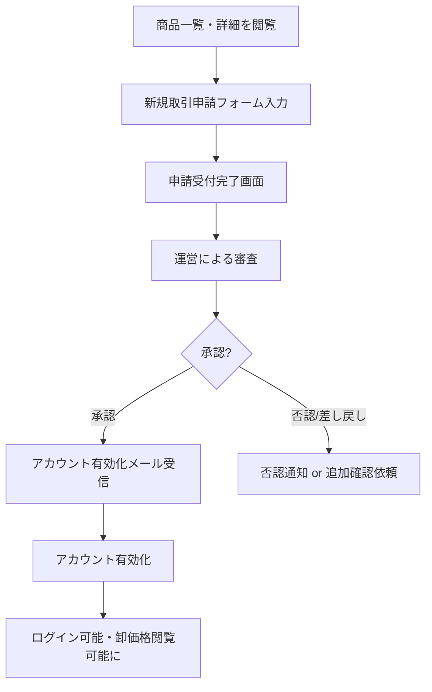
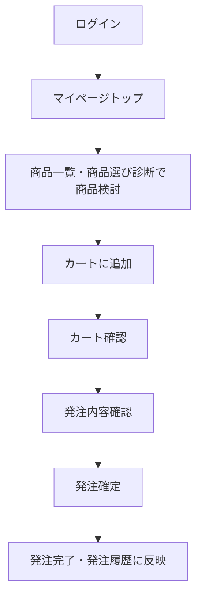
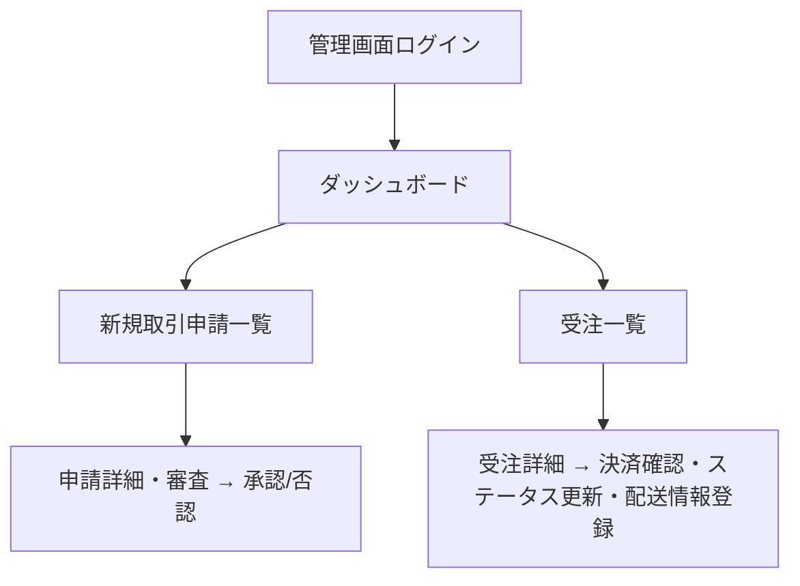
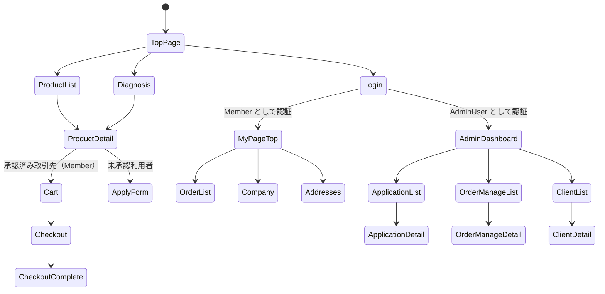

# 04-ui-ux-design.md — UI/UX 設計

## このセクションの目的

このドキュメントは、プロダクト体験の設計思想、主要導線、画面一覧、**管理画面の標準構成**、コンポーネント方針、アクセシビリティ基準を定義します。本プロジェクトは管理画面（`apps/admin`）にロール区分を持たない単一種別の AdminUser（GOV-01 D-014）しか存在しないため、多階層の管理者権限（super_admin 専用画面等）は存在せず、管理画面がそのまま運営の唯一の管理面となる。

## 0-H. ハイブリッド編集ガイド（要点）

- 推奨モード: Hybrid（AI 構造化 + PdM 確定）
- 人間確認必須：体験原則、主要導線、管理画面の情報設計、アクセシビリティ
- AI 下書き可：画面一覧整形、フロー図初稿、コンポーネント分類

詳細は 00_README.md §7（文書ステータス）と §8（AI 運用ガイド）を参照。

---

## 1. 設計思想・デザイン原則

| 原則名 | 内容 |
| --- | --- |
| 明快さ優先 | 1 画面 1 目的を徹底し、情報過多を避ける |
| 行動起点 | ユーザーが次に取るべき行動を明示する |
| 状態の可視化 | 進捗、保存結果、エラー理由を即時に伝える |
| 一貫性 | 同じ概念は同じ UI パターンで表現する |
| 専門知識がなくても選べる | 商品選び診断・分かりやすい商品説明で、専門知識が少ない事業者の商品選定を支援する（INTAKE §5 PAIN-01）|
| 卸価格の境界を明確に | 一般公開情報と承認済み取引先限定情報の境界を、UI 上でも常に明示する（例: 「ログインすると卸価格が表示されます」の案内）|
| 誠実な表現 | 医薬品的な効能を断定しない（DEV-06 実装時の文言レビュー観点。§8 ブランド・トーン）|

### 1-1. 公開画面と管理画面の設計トーン

| 領域 | 設計トーン | 重視する体験 |
| --- | --- | --- |
| 公開画面・マイページ（`apps/public`。取引先・一般閲覧者）| 親しみやすく、信頼感のある UI | 商品理解のしやすさ、申請・発注のしやすさ |
| 管理画面（`apps/admin`。運営管理者）| 機能的、効率重視、整然 | 審査・受注対応の処理速度、ミスを起こさない |

---

## 2. ユーザーフロー定義

### 2-1. 初回オンボーディング（新規取引申請〜取引開始）



> オンボーディングの主体は、承認された取引先（Organization）に所属する Member である。AdminUser（運営管理者）のアカウントは招待/シード（`pnpm --filter admin seed -- --table=admin_users --email=… --password=… --name=…`）で作成され、本フローとは別系統（PRD-01 §1-2、DEV-02）。

### 2-2. 日常利用（発注）



### 2-3. 管理者運用（審査・受注対応）



---

## 3. 画面一覧

公開画面・マイページ（`apps/public`。一般閲覧者・承認済み取引先向け）と管理画面（`apps/admin`。運営管理者向け）を分けて管理する。画面名と PRD-03 の機能 ID（F-NN-NN）を対応づける。実装パス（Astro ページ）との対応は DEV-06 §規約に従い、ページ実装時に確認する（Astro のルーティングはファイルパスがそのまま URL になるため、Laravel の `routes/web.php` のような別建てのルート登録ファイルは持たない）。URL 中の可変部は連番 ID ではなく `public_id`（ULID）を使う（DEV-01 §8 アンチパターン一覧）。

### 3-1. 公開画面・マイページ（一般閲覧者・承認済み取引先。`apps/public`）

| 画面 ID | 画面名 | 主目的 | 主な利用者 | 関連機能 |
| --- | --- | --- | --- | --- |
| SCR-01 | トップページ | サービス概要・導線提供 | 全ユーザー | — |
| SCR-02 | 商品一覧 | 商品検索・絞り込み | 全ユーザー | F-03-01, F-03-04〜09 |
| SCR-03 | 商品詳細 | 商品情報閲覧・カート追加 | 全ユーザー | F-03-02, F-03-03, F-04-01 |
| SCR-04 | 商品選び診断 | 質問回答から商品提案 | 全ユーザー | F-03-10, F-03-11 |
| SCR-05 | 新規取引申請フォーム | 新規取引申請の入力 | 一般閲覧者 | F-02-01 |
| SCR-06 | 新規取引申請完了 | 申請受付の完了案内 | 一般閲覧者 | F-02-02 |
| SCR-07 | ログイン | 認証 | 全ユーザー | F-01-01, F-01-02 |
| SCR-08 | 外部ログイン連携コールバック | OAuth 認証 | 全ユーザー | F-01-02 |
| SCR-09 | アカウント有効化 | 承認後の初回パスワード設定等 | 新規承認取引先 | F-01-05 |
| SCR-10 | パスワード再設定申請 | パスワードリセット要求 | 全ユーザー | F-01-04 |
| SCR-11 | パスワード再設定 | パスワードリセット実行 | 全ユーザー | F-01-04 |
| SCR-12 | マイページトップ | 発注状況・お知らせサマリ | Member | F-05-01 |
| SCR-13 | 利用者アカウント情報 | アカウント確認・編集 | Member | F-05-02 |
| SCR-14 | 会社・取引先情報 | 会社情報確認 | Member | F-05-03 |
| SCR-15 | 配送先一覧 | 配送先管理 | Member | F-05-04 |
| SCR-16 | 配送先追加 | 配送先新規登録 | Member | F-05-04 |
| SCR-17 | 配送先編集 | 配送先編集 | Member | F-05-04 |
| SCR-18 | 発注履歴一覧 | 発注履歴の検索・確認 | Member | F-05-05 |
| SCR-19 | 発注詳細 | 発注内容・ステータス確認 | Member | F-05-06 |
| SCR-20 | 退会・取引終了申請 | 取引終了の申請 | Member | F-05-07, F-12-01 |
| SCR-21 | カート | カート内容確認・編集 | Member | F-04-02, F-04-03 |
| SCR-22 | 発注内容確認 | 発注前の最終確認 | Member | F-04-05〜F-04-07 |
| SCR-23 | 発注・決済完了 | 発注完了の案内 | Member | F-04-08〜F-04-11 |
| SCR-24 | 決済失敗・キャンセル | 決済失敗時の案内 | Member | F-04-07 |
| SCR-25 | お知らせ一覧 | お知らせ閲覧 | 全ユーザー | F-09-01 |
| SCR-26 | お知らせ詳細 | お知らせ詳細閲覧 | 全ユーザー | F-09-01 |
| SCR-27 | よくある質問 | FAQ 閲覧 | 全ユーザー | F-09-03 |
| SCR-28 | 利用規約 | 規約閲覧 | 全ユーザー | — |
| SCR-29 | プライバシーポリシー | 個人情報方針閲覧 | 全ユーザー | — |
| SCR-30 | お問い合わせ | 問い合わせ送信 | 全ユーザー | F-09-04 |
| SCR-31 | お問い合わせ完了 | 問い合わせ完了案内 | 全ユーザー | F-09-05 |
| SCR-32 | 特定商取引法に基づく表示 | 法定表示 | 全ユーザー | — |
| SCR-33 | 404 | ページ未存在案内 | 全ユーザー | — |
| SCR-34 | 500 | システムエラー案内 | 全ユーザー | — |
| SCR-35 | ログアウト | ログアウト処理 | 全ユーザー | F-01-03 |

> SCR-07〜SCR-24（Member 関連）は `apps/public/src/styles/global.css`（プレーン Tailwind）で実装し、shadcn-svelte は使わない（DEV-01 §1）。SCR-08（外部ログイン連携コールバック）は API ルート相当（Astro API Route）であり画面を持たない。SCR-33/34 は Astro の標準エラーページとして実装する。公開トップ（`/`）が SCR-01 のため、Member のログインは `/login`（SCR-07）に置く（管理画面と配置が異なる — §3-2 の注記参照）。

#### 3-1-1. 画面ごとのコンテンツ供給元

同じ「公開画面」でも、表示するコンテンツの取得元が 3 種類ある（判断基準は DEV-06 §1-1、置き場所の一覧は PRD-02 §1-4）。実装時にこれを取り違えると、管理画面に存在しない編集機能を作ってしまう、あるいは逆に運営が更新できないページを D1 に作ってしまう。

| 画面 ID | コンテンツ供給元 | 更新者 |
| --- | --- | --- |
| SCR-02, SCR-03 | D1（商品カタログ）| 運営（ADM-02/03） |
| SCR-04 | `packages/content`（診断ルール）+ D1（推奨商品の商品情報）| 開発者（ルール）/ 運営（商品情報） |
| SCR-25, SCR-26 | D1（お知らせ）| 運営（ADM-19〜21） |
| SCR-27 | ページ直書き | 開発者 |
| SCR-28, SCR-29, SCR-32 | ページ直書き（文面は法務レビュー）| 開発者 |
| SCR-01 | ページ直書き（新着お知らせ・注目商品の一覧のみ D1）| 開発者 + 運営 |

> SCR-27〜SCR-32 には管理画面が存在しない。運営から「文面を直したい」と依頼された場合は開発タスクとして受け、デプロイまでを 1 つの作業単位として扱う（OPS-02、PRD-03 §6-3）。

### 3-2. 管理画面（運営管理者。`apps/admin`）

| 画面 ID | 画面名 | 主目的 | 主な利用者 | 関連機能 |
| --- | --- | --- | --- | --- |
| ADM-00 | ログイン | 管理画面への認証 | AdminUser | F-01-01 |
| ADM-01 | 管理ダッシュボード | 未審査申請・要確認注文・入金/出荷待ち件数等の概要 | AdminUser | — |
| ADM-02 | 商品一覧 | 商品検索・表示順変更 | AdminUser | F-06-01, F-06-06 |
| ADM-03 | 商品追加・詳細・編集 | 商品情報の追加・編集 | AdminUser | F-06-01〜F-06-05 |
| ADM-04 | メーカー一覧 | メーカー管理 | AdminUser | F-06-07 |
| ADM-05 | メーカー追加・詳細・編集 | メーカー情報編集 | AdminUser | F-06-07 |
| ADM-06 | ブランド一覧 | ブランド管理 | AdminUser | F-06-08 |
| ADM-07 | ブランド追加・詳細・編集 | ブランド情報編集 | AdminUser | F-06-08 |
| ADM-08 | 商品カテゴリー一覧 | カテゴリー管理 | AdminUser | F-06-09 |
| ADM-09 | 商品カテゴリー追加・編集 | カテゴリー編集 | AdminUser | F-06-09 |
| ADM-10 | 気になる点分類一覧 | 分類管理 | AdminUser | F-06-10 |
| ADM-11 | 気になる点分類追加・編集 | 分類編集 | AdminUser | F-06-10 |
| ADM-12 | 新規取引申請一覧 | 申請検索・一覧 | AdminUser | F-07-01 |
| ADM-13 | 申請詳細・審査 | 審査・承認・否認 | AdminUser | F-07-02 |
| ADM-14 | 取引先一覧 | 取引先検索・一覧 | AdminUser | F-07-03 |
| ADM-15 | 取引先詳細・編集 | 取引先情報・個別卸価格設定・発注可否・停止/再開 | AdminUser | F-07-04, F-07-06〜F-07-10 |
| ADM-16 | 取引先所属 Member 一覧 | 所属 Member 確認 | AdminUser | F-07-05 |
| ADM-17 | 受注一覧 | 受注検索・一覧 | AdminUser | F-08-01 |
| ADM-18 | 受注詳細・編集 | 決済確認・ステータス変更・配送登録・キャンセル | AdminUser | F-08-02〜F-08-07 |
| ADM-19 | お知らせ一覧 | お知らせ管理 | AdminUser | F-09-02 |
| ADM-20 | お知らせ追加 | お知らせ新規作成 | AdminUser | F-09-02 |
| ADM-21 | お知らせ編集 | お知らせ編集 | AdminUser | F-09-02 |
| ADM-22 | お問い合わせ一覧 | 問い合わせ検索・一覧 | AdminUser | F-09-06 |
| ADM-23 | お問い合わせ詳細 | 対応状況・担当者・メモ | AdminUser | F-09-06 |
| ADM-24 | 管理操作履歴 | 監査ログ確認 | AdminUser | F-11-01 |

> ADM-00〜24 は shadcn-svelte（`apps/admin/src/styles/admin.css`）で実装する（DEV-01 §1）。**多階層の管理画面（super_admin 専用のプラットフォーム管理画面等）は存在しない** — AdminUser はロール区分を持たない単一種別のため（PRD-01 §1-2、GOV-01 D-014）。ADM-16（取引先所属 Member 一覧）は参照のみとし、Member の新規作成・編集・削除・パスワード変更等は持たせない（Member は AdminUser と完全に別系統のアカウントであるため）。
>
> **URL に `/admin` 接頭辞は付けない。** `apps/admin` はサブドメイン（例: `admin.example.com`）に丸ごとデプロイされるため、`/` 自体が ADM-00（ログイン）、`/dashboard` が ADM-01 になる（DEV-01 §1、DEV-06 §1）。公開画面と違いログインを `/login` に分離しない。
>
> **診断ルール・FAQ・法務ページの管理画面は存在しない**（PRD-03 §1 の注記）。サイドナビにこれらの項目を追加しないこと — 追加すると「編集できるはずの画面が無い」という不整合になる。

---

## 4. 管理画面の標準構成

### 4-1. 共通レイアウト

管理画面は **サイドナビ + ヘッダー + コンテンツエリア** の 3 ペイン構造を標準とする。

```
┌──────────────────────────────────────────────────────────┐
│ Header: ロゴ / 検索 / 通知 / ユーザーメニュー              │
├────────────┬─────────────────────────────────────────────┤
│            │                                               │
│  Sidebar   │   Content Area                                │
│  (ナビ)    │   - ページタイトル                             │
│            │   - アクションボタン                           │
│  - ダッシュ│   - フィルタ / 検索                            │
│  - 商品    │   - メインコンテンツ                           │
│  - メーカー│     （テーブル / フォーム / カード）          │
│  - ブランド│                                               │
│  - カテゴリ│                                               │
│  - 気になる点│                                             │
│  - 取引申請│                                               │
│  - 取引先  │                                               │
│  - 受注    │                                               │
│  - お知らせ│                                               │
│  - 問い合わせ│                                             │
│  - 監査ログ│                                               │
│            │                                               │
└────────────┴─────────────────────────────────────────────┘
```

### 4-2. 必須画面パターン（管理画面に必ず含めるべき 5 タイプ）

| パターン | 必須要素 | 例 |
| --- | --- | --- |
| **ダッシュボード** | KPI カード × 4〜6、直近イベント一覧 | ADM-01 |
| **一覧画面** | 検索、フィルタ、ソート、ページネーション、行ごとの詳細リンク | ADM-02 商品一覧、ADM-17 受注一覧 |
| **詳細画面** | タイトル、ステータス、メタ情報、アクション、関連データタブ | ADM-13 申請詳細、ADM-18 受注詳細 |
| **フォーム画面** | 段階入力、バリデーション、保存 / キャンセル、確認ステップ | ADM-03 商品編集 |
| **設定画面** | カテゴリ別タブ、変更時の保存ボタン、危険操作の確認モーダル | ADM-15 取引先詳細（個別卸価格・停止等）|

### 4-3. ASCII モックアップ例

#### 4-3-1. ダッシュボード（ADM-01）

```
┌──────────────────────────────────────────────────────────────┐
│ ペット漢方 卸売サイト（管理画面）  🔍 検索  🔔 (3)  👤 管理者 │
├────────────┬─────────────────────────────────────────────────┤
│            │  ダッシュボード                                   │
│ ⊞ ホーム   │  ── ── ── ── ── ── ── ── ── ── ── ── ── ──     │
│            │                                                   │
│ 📦 商品    │  ┌─────────┐ ┌─────────┐ ┌─────────┐ ┌─────────┐│
│            │  │未審査申請│ │要確認注文│ │入金待ち  │ │出荷待ち  ││
│ 📋 取引申請│  │   4     │ │   2     │ │   3     │ │   5     ││
│            │  └─────────┘ └─────────┘ └─────────┘ └─────────┘│
│ 🏢 取引先  │                                                   │
│            │  ┌─ 直近の受注 ─────────────────────────────┐  │
│ 🧾 受注    │  │ • [A 社] 発注 #0001（5 分前）               │  │
│            │  │ • [B 社] 入金確認済み                       │  │
│ 📢 お知らせ│  └────────────────────────────────────────────┘  │
│            │                                                   │
│ 💬 問い合わせ│                                                 │
│            │                                                   │
│ 📋 監査ログ │                                                  │
└────────────┴─────────────────────────────────────────────────┘
```

#### 4-3-2. 一覧画面（ADM-17 受注一覧）

```
┌──────────────────────────────────────────────────────────────┐
│ 受注管理                                                       │
│ ── ── ── ── ── ── ── ── ── ── ── ── ── ── ── ── ── ── ── ──│
│                                                                │
│ [🔍 注文番号 / 取引先検索]  ステータス: [すべて ▼]  決済: [すべて ▼]│
│                                                                │
│ ┌─────────────────────────────────────────────────────────┐  │
│ │ 注文番号 │ 取引先   │ 注文日     │ ステータス │ 決済状況 │操作│  │
│ ├─────────────────────────────────────────────────────────┤  │
│ │ #0001   │ A 社     │ 2026/08/10 │ 出荷準備中 │ 決済済み │ ⋯  │  │
│ │ #0002   │ B 社     │ 2026/08/11 │ 確認中     │ 入金待ち │ ⋯  │  │
│ │ ...                                                       │  │
│ └─────────────────────────────────────────────────────────┘  │
│                                                                │
│            << 前へ   1  2  3  ...  10   次へ >>                │
└──────────────────────────────────────────────────────────────┘
```

#### 4-3-3. 詳細・編集画面（ADM-13 申請詳細・審査）

```
┌──────────────────────────────────────────────────────────────┐
│ ← 申請一覧へ戻る                                              │
│                                                                │
│ [A 社 からの新規取引申請]                [承認] [否認] [差戻し]│
│ ── ── ── ── ── ── ── ── ── ── ── ── ── ── ── ── ── ── ── ──│
│                                                                │
│ [会社情報] [担当者情報] [取引希望内容] [審査履歴]              │
│                                                                │
│ 会社情報                                                       │
│   法人名     A 株式会社                                       │
│   所在地     東京都〇〇区...                                  │
│   代表者名   山田 太郎                                        │
│                                                                │
│ 審査担当者・管理メモ                                           │
│   [__________________________________]                        │
│                                                                │
│ ステータス: 審査中                                             │
└──────────────────────────────────────────────────────────────┘
```

### 4-4. 管理画面の操作原則

| 原則 | 内容 |
| --- | --- |
| 検索・フィルタは即時反映 | debounce 300ms、確定後 500ms 以内に結果反映 |
| 一括操作には確認ステップ | 削除等の不可逆操作は必ず確認モーダル |
| 危険操作の色分け | 取引停止・削除・否認等は赤系の色 + 確認文言 |
| 楽観的 UI 更新は避ける | 管理画面では保存完了まで状態を変えない |
| 操作完了はトースト | 成功・失敗を画面右上のトーストで通知 |
| キーボード操作対応 | テーブル行移動・モーダル開閉等は Tab / Enter / Esc で操作可能 |
| パンくず or 戻るリンク | 階層が深い画面では必ず戻り導線を提供 |

### 4-5. 管理画面のレスポンシブ方針

| ブレークポイント | 挙動 |
| --- | --- |
| デスクトップ（≥ 1280px）| 標準 3 ペイン |
| タブレット（768〜1279px）| サイドナビをアイコンのみに圧縮 |
| モバイル（≤ 767px）| サイドナビをドロワー化、コンテンツ全幅 |

管理画面はモバイル対応「最小限」（緊急対応・確認程度）。本格作業はデスクトップ前提とする。

---

## 5. 画面遷移図



> 図中の `Login` は 2 系統ある（`apps/public` の `/` 配下 `/login` と `apps/admin` の `/`）。AdminUser と Member はセッション・クッキーを共有しないため、実際には別アプリの別画面である（DEV-02 §1-2）。

---

## 6. コンポーネント設計方針

> 本節は管理画面（shadcn-svelte）を主対象とする。公開画面・マイページ（Member 向けを含む）はプレーン Tailwind を採用し、コンポーネントライブラリは導入しない（DEV-01 §1、§3-1）。

| 項目 | 方針 |
| --- | --- |
| 採用アプローチ | 管理画面は標準 UI コンポーネントライブラリ（DEV-01 §1、shadcn-svelte）を最優先で使用、不足分のみカスタムコンポーネント |
| 再利用対象 | データテーブル / フォーム入力 / カード / モーダル / ドロワー / トースト |
| 命名規則 | コンポーネント名は機能を表す（`ProductListTable`、`ApplicationReviewForm` 等） |
| 禁止事項 | 画面固有スタイルのベタ書き、同一意味の別名コンポーネント乱立 |
| デザイントークン | 色・余白・角丸・タイポグラフィをデザイントークンとして一元管理（実装方式は DEV-01 §1） |

---

## 7. アクセシビリティ方針

| 項目 | 方針 |
| --- | --- |
| 準拠基準 | WCAG 2.2 |
| 対応レベル | AA 相当 |
| キーボード操作 | 主要操作は Tab / Enter / Space / Esc で実行可能 |
| コントラスト | 通常テキスト 4.5:1、大きいテキスト 3:1 以上 |
| 代替テキスト | 商品画像等、意味を持つ画像に必ず付与 |
| フォーカスリング | `:focus-visible` を必ず可視化 |
| ステータス | 色のみで状態を表現しない（アイコン + 色 + テキストの 3 要素）|
| スクリーンリーダー | 主要なランドマーク（`<nav>`、`<main>`、`<aside>`）を使い分け |

---

## 8. ブランド・トーン

| 項目 | 方針 |
| --- | --- |
| プライマリーカラー | 未確定 `[Open]`。自然・健康を想起させる緑〜アース系を軸に検討 |
| アクセントカラー | 未確定 `[Open]` |
| フォント | Inter（英字）+ Noto Sans JP（日本語）|
| アイコン | Lucide（線画。`components.json` の `iconLibrary` で固定、DEV-01 §1）|
| 言葉遣い | 断定的な効能表現を避け、「健康維持をサポートする」「選択肢を案内する」といった表現に統一（INTAKE §7 表現規制。出典: 依頼者仕様書 §18）|

---

## 9. 記入時チェックポイント

- 公開画面と管理画面が分けて整理されているか
- 管理画面の必須 5 パターン（ダッシュボード / 一覧 / 詳細 / フォーム / 設定）が網羅されているか
- 画面名と機能 ID が対応しているか
- 各画面のコンテンツ供給元（§3-1-1）が D1 / Content Collections / 直書きのどれか明示されているか
- 管理画面のサイドナビに、対応する管理機能が存在しない項目（診断・FAQ・法務）を入れていないか
- 卸価格・発注操作の表示境界（承認済み取引先限定）が UI 上でも明示されているか
- アクセシビリティが後付けでなく原則として書かれているか
- 主要 3 導線（新規取引申請〜取引開始 / 日常利用 / 管理者運用）が説明されているか
- ASCII モックアップ等で「整った管理画面」が視覚的に伝わるか
- Member 向け画面（SCR-07〜SCR-24）がプレーン Tailwind で設計され、shadcn-svelte が誤って使われていないか（DEV-01 §1、§6）
- Member 管理のための編集機能が AdminUser 側（ADM-16 等）に意図せず追加されていないか（参照専用であることの明記）
