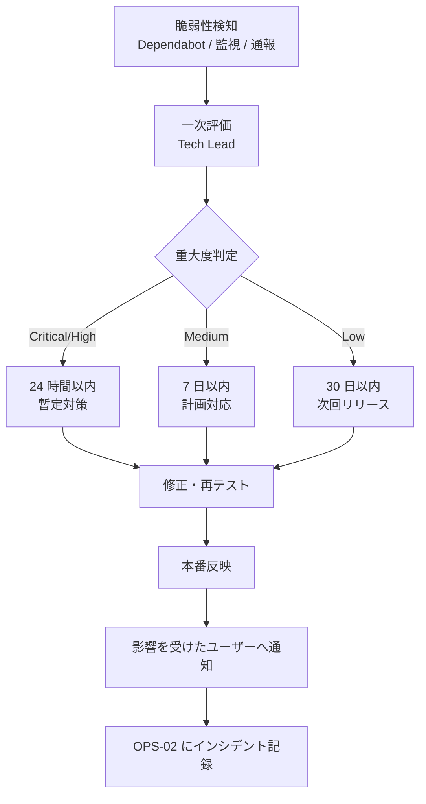

# 02-security-policy.md — セキュリティポリシー

## このセクションの目的

認証・認可・暗号化・脆弱性対応・機密情報保護に関する方針を集約する正仕様書。本プロジェクトの **AdminUser（ロール区分なし）・Member（`client_user`、Organization に所属）という 2 系統の認証構造** と、**テナント境界（発注関連データのみ Organization スコープ、PRD-02 §2）** を定義する。

## 0-H. ハイブリッド編集ガイド（要点）

- 推奨モード: Hybrid（AI 草案 + Tech Lead 確認。個人情報・開示条件は必要に応じ法務確認）
- 人間確認必須: 認証・認可、個人情報、開示条件、鍵管理
- 詳細は 00_README.md §6〜8

---

## 1. 認証・認可モデル

### 1-1. 認証方式（AdminUser・確定済み）

認証方式は DEV-01 §1・§2 で決定済み（Confirmed）。`jose` / JWT は不採用 — 用途がステートレス API ではなく管理画面ログインのみのため、失効可能な D1 セッション方式を採用する。いずれも `admin_users`（DEV-07 §4-1）に紐づく認証であり、Member 側の認証（§1-2）とは完全に別系統（DEV-01 §2「API 提供（認証）」）。

| 経路 | 認証方式 | セッション / トークン保持 |
| --- | --- | --- |
| 管理画面（Web） | D1 の `admin_sessions` テーブル（DEV-07 §3-1）でセッションを管理し、`httpOnly` + `Secure` + `SameSite=Lax` クッキー（クッキー名 `admin_session`）でセッション ID を保持する（クッキー属性の正本は本表。DEV-04 §2 はこれを参照する）。**クッキー値の署名は行わない**: セッション ID は 32 バイトの CSPRNG 値（`crypto.getRandomValues`）で、正当性は毎リクエストの `admin_sessions` 照合そのものが担保する。署名を足しても DB 照合を省けるわけではないため、鍵管理を増やさない判断（HMAC を使うのは下記の招待・リセットトークン）。JWT は使わない（DEV-01 §2） | D1（`admin_sessions`）。ログアウト・強制失効は行削除で即時反映される |
| メール認証 | AdminUser は招待制（ロール区分を持たない単一種別で、自己登録がないため）。メール確認自体は不要（`[Assumed]`） | — |
| パスワードリセット | 自前実装（`admin_password_reset_tokens` テーブル、DEV-07 §3-1）。リセットリンクのトークンは Web Crypto の HMAC 署名（`crypto.subtle.sign`）で発行・検証する。`jose` は使わない（DEV-01 §2） | リンク 60 分有効 |
| パスワードハッシュ化 | Web Crypto API の PBKDF2（`crypto.subtle`）。Workers ランタイムに標準実装済みで追加パッケージ不要。`@node-rs/argon2` 等のネイティブ Node アドオン系ライブラリは Workers で動作しないため不採用（DEV-01 §1・§3）。実装は `packages/server-kit` に集約する | — |
| SAML / OIDC | **本テンプレ標準対象外** | 本プロジェクトでは不採用（DEV-01 §0） |

### 1-2. Member 認証（`apps/public`。PRD-03 FG-01・FG-05）

**AdminUser とは完全に別系統の認証**であり、テーブル・クッキー名・セッション実装・パスワードハッシュのコードパスをすべて分離する（PRD-01 §1-1・§1-2、DEV-01 §2）。信頼レベルが異なる（社内の少数スタッフ vs 不特定多数の取引先担当者）ことに加え、モノレポ構成（CLAUDE.md の D1/R2 共有ルール）上 AdminUser 認証が `apps/admin`、Member 認証が `apps/public` に存在し、そもそも同一アプリのコードベースに両方が存在しない。

| 項目 | AdminUser（§1-1） | Member（本節） |
| --- | --- | --- |
| テーブル | `admin_users` / `admin_sessions` | `members` / `member_sessions`（DEV-07 §5-3 で定義。別テーブル、共有しない） |
| クッキー名 | `admin_session` | `member_session`（AdminUser と異なる名前。同一クッキー名の使い回しは禁止） |
| セッション実装 | D1 セッション + httpOnly クッキー（値は無署名の CSPRNG トークン — §1-1） | 同じ技術（D1 セッション + httpOnly クッキー）だが、**実装コードは別**（`apps/public/src/lib/server/auth/` 配下に置き、`apps/admin` の AdminUser 用とは共有しない） |
| パスワードハッシュ | Web Crypto PBKDF2 | 同じ技術（Web Crypto PBKDF2）|
| OAuth | 不採用（管理画面はメール認証のみ） | Arctic（DEV-01 §2）。LINE / Google / Facebook（INTAKE §4-4） |
| 権限モデル | ロール区分なし（単一種別、§2-1） | ロール階層なし。所属 Organization を通じて `client_user`（Membership.role、§2-2）を持つ |
| アカウント有効化 | 招待制（自己登録なし） | 新規取引申請（Application）の承認後にメールで有効化案内を送る（PRD-03 F-01-05）。**OAuth 認証に成功しただけでは取引先として承認しない**（INTAKE §7 審査制）。承認フローは PRD-03 FG-02、状態遷移は DEV-09 §2 Application を参照 |
| 招待・リセットトークン | Web Crypto HMAC 署名（`admin_password_reset_tokens`） | 同じ技術（Web Crypto HMAC 署名。`member_password_reset_tokens`） |

> **禁止事項**: AdminUser と Member が同一のセッションテーブル・同一のクッキー名・同一の認証コードパスを共有すること。これは実装の手間を惜しんだ結果の見落としではなく、意図的な多重防御（一方の認証システムに脆弱性があっても他方に波及しない）である。レビュー時は §10・§14 のチェックリストで確認する。
>
> **唯一の共有部分**: パスワードハッシュ関数・ロックアウトのカウンタ操作・セッション TTL の算出と期限/状態の判定は `packages/server-kit/src/auth/` に置き、両系統が同じ実装を呼ぶ（DEV-01 §5-3）。ここを二重に実装すると「片方だけ TTL 検証が抜ける」形の劣化が起きるため、共有するのは意図的である。分離するのはその上の**認証フローとセッションの持ち主**（どのテーブル・どのクッキーか）であって、暗号処理そのものではない。

### 1-3. アカウントと Organization の状態の掛け合わせ

発注可否は「Member がログインできるか」だけでなく「所属 Organization が `active`（取引停止・取引終了でない）か」の 2 条件で判定する（PRD-02 §2-3）。取引停止中（`suspended`）の Organization に所属する Member はログインできても発注操作は拒否する。

---

## 2. ロールモデル（最小構成）

### 2-1. AdminUser（ロール区分なし・単一種別）

```
AdminUser（管理画面ログインユーザー。ロール区分を持たない単一種別 — DEV-07 §4-1）
  └─ 商品・メーカー・ブランド管理、新規取引申請審査、取引先管理、受注管理、お知らせ・問い合わせ対応、監査ログ確認
```

> テンプレート標準の `admin`/`editor` ロール分けは本プロジェクトでは採用しない（少人数運営のため、GOV-01 D-014、PRD-01 §1-2）。`admin_users` テーブルに `role` カラムは持たず、spatie/laravel-permission のような専用ライブラリも不要。認可は Service 層に置くセッション検証関数（`requireSession(cookies, db)`。DEV-05 参照）が「有効な AdminUser セッションか」だけを確認すれば足りる（DEV-01 §1「Permission」・§4「認可チェックの徹底」）。
>
> テンプレート標準のリソース実装スキル（`scaffold`）は `readRole` / `writeRole` を分けて判断する前提で書かれているが、本プロジェクトにはロールが無いため、どちらも「有効な AdminUser セッション」に落ちる。生成物にロール分岐が残っていたら削る。

### 2-2. Member ロール（Organization に所属）

```
Member（apps/public のマイページログインユーザー）
  └─ Organization への所属（Membership 経由）
       └─ client_user   ← 卸価格確認、カート・発注、発注履歴確認、会社情報/配送先管理
```

> ロール数は最小構成（`client_user` の 1 種類のみ）。取引先側に権限差（例: 発注担当者は発注のみ、管理担当者は会社情報変更も可能）を設ける場合は、`client_admin` ロールを追加し、`memberships.role` カラムに値を追加するのみで対応できるようスキーマを設計する（DEV-07 参照、`[Open: TBD-05]`）。追加時は本書 §2 と PRD-01 §1-2 を同時に更新する。

### 2-3. 権限マトリクス

| 操作 | AdminUser | Member（`client_user`） |
| --- | :---: | :---: |
| 全取引先・全受注一覧 | ○ | ✕ |
| 商品・メーカー・ブランド・カテゴリー・気になる点管理 | ○ | ✕ |
| 新規取引申請の審査（承認・否認・差し戻し）| ○ | ✕ |
| 自社（自 Organization）の会社情報閲覧 | ✕（運営は全取引先を閲覧可、後述）| ○ |
| 自社の会社情報変更申請 | ✕ | ○（運営確認が必要な項目あり。PRD-03 F-05-03）|
| 卸価格閲覧 | ○（管理目的）| ○（自社の卸価格のみ）|
| カート・発注 | ✕ | ○ |
| 発注履歴閲覧 | ○（全取引先分、受注管理として）| ○（自社分のみ）|
| 配送先管理 | ✕ | ○（自社分のみ）|
| 受注ステータス変更・入金確認 | ○ | ✕ |
| お知らせ・お問い合わせ管理 | ○ | ✕（問い合わせ送信のみ可、閲覧は公開お知らせに限る）|
| 監査ログ閲覧 | ○ | ✕ |
| 商品選び診断のルール変更 | ✕（管理画面を持たない）| ✕ |
| FAQ・法務ページの文面変更 | ✕（管理画面を持たない）| ✕ |

> AdminUser は全 Organization を横断管理する前提のため、テナント境界の「越権アクセス」の対象外（Platform 相当の操作として監査ログに記録される。§3-3）。
>
> 最後の 2 行は権限の欠落ではなく設計である。診断ルール・FAQ・法務ページは `packages/content` またはページ直書きにあり、更新経路はリポジトリへのコミットとデプロイのみ（GOV-01 D-015 / D-016、DEV-06 §1-1）。したがってこれらの変更権限は「アプリの認可」ではなく **リポジトリの書き込み権限とデプロイ権限**で制御される。運用上は、規約文面の変更が法務レビューを経ずにマージされないよう、PR レビューを必須とする（OPS-01 §5）。

---

## 3. 認可チェックの徹底

### 3-1. 権限チェック方針

| 対象 | 実装方法 |
| --- | --- |
| 管理系操作全般（`apps/admin`）| Service 層の入口で `requireSession(cookies, db)` を必ず通す（ロールによる分岐はなし。DEV-01 §4） |
| 発注関連操作（`apps/public`）| Service 層の入口で「Member としてログイン済みか」に加え「所属 Organization が `active` か」「操作対象が自身の所属 Organization と一致するか」を必ず検証する（PRD-02 §2-2） |
| 商品カタログ閲覧 | 全ユーザーに許可。卸価格・発注単位等の限定情報のみ、Member としてのログイン + Organization が `active` かで出し分ける（PRD-02 §2-3） |
| 商品選び診断（`packages/content` + D1）| 認証不要の公開機能。診断ルール自体はビルドに含まれてクライアントから到達可能になり得るため、**卸価格・取引条件等の非公開情報をルールの frontmatter に書いてはならない**。推奨商品の商品情報は公開済み（`published_status = 'published'`）かつ取扱中（`handling_status = 'active'`）のものだけを D1 から取得する — ルールが下書き商品の slug を指していても結果に出さない |
| セッション/トークンと権限の紐付け | AdminUser はセッションの有効性のみで認可される（ロールの埋め込みなし）。Member はログイン時に所属 Organization ID・Membership.role をセッションに埋め込み、リクエストごとに検証する |

### 3-2. 権限チェック漏れ防止のコーディング規約

D1 には Eloquent の Global Scope のような自動適用機構がないため、Service 層の入口で明示的にセッション・Organization スコープを検証する（DEV-01 §4「認可チェックの徹底」）。

```ts
// ❌ Bad: Organization スコープなしで発注データを取得
async function getOrder(db: D1Database, orderId: string) {
  return db.prepare("SELECT * FROM orders WHERE public_id = ?").bind(orderId).first();
}

// ✅ Good: Service の入口で必ず所属 Organization を検証してから取得する
async function getOrderForMember(db: D1Database, session: MemberSession, orderId: string) {
  requireActiveOrganization(session); // Organization が active でなければ例外
  return db
    .prepare("SELECT * FROM orders WHERE public_id = ? AND organization_id = ?")
    .bind(orderId, session.organizationId)
    .first();
}

// 商品カタログは共有データのため Organization スコープを持たない
async function listPublishedProducts(db: D1Database) {
  return db.prepare("SELECT * FROM products WHERE published_status = 'published'").all(); // ✅ Good
}

// requireSession の実装例（apps/admin/src/lib/server/auth/session.ts）
// ロール区分を持たないため、有効なセッションの存在のみを確認する（GOV-01 D-014）
async function requireSession(cookies: AstroCookies, db: DrizzleD1Database): Promise<AdminSession> {
  const token = cookies.get("admin_session")?.value;
  if (!token) throw new UnauthorizedError();
  const session = await findAdminSessionByToken(db, token);
  if (!session || session.expiresAt < new Date()) throw new UnauthorizedError();
  return session;
}
```

### 3-3. 権限チェック漏れの検出

- テスト（Vitest — DEV-01 §1「Testing」）で、発注関連 Service 関数が必ず `organizationId` を受け取り検証することを検証する
- 診断結果に未公開商品・取扱終了商品が混入しないことを Vitest で検証する（ルールの slug は D1 の外部キー制約で守られないため、テストが唯一の防御線 — PRD-02 §7）
- Pull Request レビューで「発注関連データに Organization スコープあり？」「admin 専用操作に `requireSession` によるセッション検証があるか？」を必須チェック項目に
- 監査ログ（`activity_log`）で管理操作を記録し、誰がどの操作を行ったかを事後追跡できるようにする

---

## 4. 入力検証

| 経路 | 検証方法 |
| --- | --- |
| Web（`apps/public` / `apps/admin`）| Astro API Route / Service 層の入口で Zod（DEV-01 §2、決定済み。Drizzle スキーマから `drizzle-zod` で導出）により検証する。フォーム値を検証せず直接 D1 へ書き込むことを禁止 |
| Content Collections（診断ルール）| `packages/content/src/schema.ts` の Zod スキーマでビルド時に検証する。スキーマ違反はビルドを失敗させる（実行時に不正なルールが読み込まれる経路を作らない） |
| 決済 Webhook | 署名検証必須（DEV-10 §2） |
| ファイルアップロード（商品画像等）| MIME / 拡張子 / サイズ / 実バイトの 4 重チェック（保存先は Cloudflare R2、DEV-01 §1） |
| 新規取引申請フォーム | 法人番号・郵便番号等の形式検証、Bot 対策（§7 参照） |

---

## 5. 暗号化方針

| 項目 | 方針 |
| --- | --- |
| 通信時 | HTTPS 必須（TLS 1.2 以上） |
| 保存時（DB）| Cloudflare D1 標準の保存時暗号化（基盤側で提供。DEV-01 参照） |
| 保存時（ファイル）| Cloudflare R2 標準の保存時暗号化（DEV-01 参照） |
| 秘密情報 | ローカル開発は `.dev.vars`（gitignored）、本番は Cloudflare Workers Secrets（`wrangler secret put`）で管理。Git にコミット禁止 |
| 機密カラム | 決済関連 ID 等、アプリ層で暗号化してから D1 へ書き込む方式は **Open**（案件実装時に確定） |
| 鍵管理 | Cloudflare Workers Secrets 単位で個別に管理し、ローテーション時は影響範囲を OPS-02 に記録する |

> `packages/content` はリポジトリにコミットされビルドに含まれるため、**秘密情報の置き場所ではない**。診断ルールに API キー・卸価格・内部メモを書かないこと（§3-1）。

---

## 6. CSRF / XSS / SQL Injection 対策

| 攻撃区分 | 対策 |
| --- | --- |
| CSRF | Astro 組み込みの Origin チェック（`security.checkOrigin`、既定で有効。DEV-01 §2 で決定済み）で対応する。追加ライブラリ・自前実装は不要。AdminUser・Member はこの機構を共有してよい（アプリケーションではなく Astro 自体の機構のため、§1-2 の実装分離ルールの対象外） |
| XSS | Astro は `{式}` 展開でデフォルトエスケープ、Svelte も `{式}` 展開でデフォルトエスケープ。生 HTML を挿入する Astro の `set:html` ディレクティブ／Svelte の `{@html ...}` はサニタイズ済みの値以外に使用禁止。**お知らせ本文（`news.body`）は運営が管理画面から入力する値であり、そのまま `set:html` に渡してはならない**（Markdown レンダリング + サニタイズを経由する） |
| SQL Injection | D1 へのアクセスは必ずプレースホルダ付きプリペアドステートメント（`env.DB.prepare(sql).bind(...)`）または Drizzle 経由を使用。文字列連結による SQL 構築を禁止（DEV-01 §3） |
| ファイルアップロード | MIME / 拡張子 / サイズ / 実バイトの 4 重チェック（保存先 R2） |
| マスアサインメント | Service 層で書き込み対象のフィールドを明示的にホワイトリスト指定する |
| フォーム自動送信・Bot 対策 | 新規取引申請・お問い合わせフォームに honeypot + レート制限（§7）を実装。reCAPTCHA 等の追加導入は必要になった時点で GOV-01 決定 |

---

## 7. レート制限

| 対象 | 制限 |
| --- | --- |
| ログイン / パスワードリセット | 5 回 / 分 / IP |
| 新規取引申請フォーム送信 | 5 回 / 時 / IP |
| お問い合わせフォーム送信 | 5 回 / 時 / IP |
| 発注確定 | 10 回 / 時 / Member（誤操作・二重発注防止）|
| ファイルアップロード（管理画面の商品画像等）| 20 回 / 時 / AdminUser |

実装方式は役割分担で確定済み（`Confirmed`）。**IP ベースの汎用レート制限は Cloudflare の WAF / Rate Limiting Rules**（Dashboard または Terraform でのエッジ設定。アプリケーションコードには実装しない — DEV-04 §2 と整合）。IP 単位のエッジ制限だけでは不十分な**アカウント単位のブルートフォース対策のみアプリ側で実装**する。

**ログイン等の認証エンドポイントへの実装（必須）**

ログイン / パスワード再設定など認証に関わるエンドポイントは、IP + アカウント単位で失敗回数を記録し、一定回数を超えたらロックアウトしてブルートフォース攻撃を防ぐこと。カウンタの保管先は **Cloudflare KV**（`Confirmed`。TTL 付きキーで自動失効させる）。AdminUser・Member それぞれ別のキー空間で管理する。

- 失敗時: カウンタを加算し、上限（5 回 / 分 / IP を基準値とする）を超えたら一定時間ロックアウト
- 成功時: カウンタをリセット
- メール送信を伴う操作（パスワードリセット再送等）も同様に制限すること

**フェイルクローズと処理時間の均一化（実装上の必須事項）**

- ロックアウトの閾値・期間・セッション TTL を環境変数から読むとき、**未設定なら例外を投げる**。`Number(undefined)` は `NaN` で、`NaN` との比較はすべて false になるため、ロックアウトが黙って無効化される（DEV-03 §4 で単体テストの必須項目とする）
- 「存在しないメールアドレス」「無効化済みアカウント」でも、パスワード検証と同等の計算を必ず実行してから失敗を返す。早期 return すると応答時間の差がアカウント存在の判定材料になる（列挙オラクル）

---

## 8. 個人情報・機密情報の取扱い

### 8-1. 取得項目と保存期限

| データ項目 | 取得根拠 | 保存期限 | 第三者提供 |
| --- | --- | --- | --- |
| 担当者氏名・メールアドレス・電話番号（Member）| サービス提供（取引先の担当者情報）| 取引終了後 1 年（PRD-02 §8）| なし |
| 会社情報（法人名・所在地・代表者名等、Organization / Application）| 新規取引申請・取引の主体確認 | 取引終了後 1 年 | なし |
| 配送先情報（ShippingAddress）| 発注商品の配送 | 取引終了後 1 年 | 配送会社（決定後、DEV-10 §9 に追記）|
| 決済情報（カード番号）| 取得しない（決済代行事業者へ委託。DEV-01 §2 Stripe）| — | 決済代行事業者のみ |
| 発注・決済履歴（Order / OrderItem / Payment）| 会計・税務上の保存義務 | PRD-02 §8（5 年、`[Assumed]`）| なし |
| 操作ログ（AuditLog）| サービス改善・障害調査 | 永続 | なし |
| お問い合わせ内容（会社名・氏名・メール・電話、Inquiry）| 問い合わせ対応 | 対応完了後 1 年 | なし |
| 同意した利用規約バージョン（`applications.agreed_terms_version`）| 契約成立の立証 | Application の保存期限に準ずる | なし |

### 8-2. プライバシー法令対応

| 法令 | 適用条件 | 対応 |
| --- | --- | --- |
| 個人情報保護法（日本）| 全プロジェクト | 必須 |
| GDPR | EU 圏ユーザー受付時 | 想定なし（国内 BtoB 取引が前提。`[Assumed]`）|
| 電気通信事業法（外部送信規律）| Cookie / 外部 API 連携時 | 要対応 |
| 特定商取引法 | BtoB 卸売のため直接適用外だが、参考として `/law` ページに事業者情報を明示（PRD-04 §3-1 SCR-32）| 要対応 |

---

## 9. 脆弱性対応フロー



---

## 10. セキュリティレビュー基準（PR 時チェック）

- [ ] 認証・認可：Service 層のセッション検証関数（`requireSession(cookies, db)` 等）・Organization スコープ検証経由でアクセス制御しているか
- [ ] テナント境界：発注関連データを `organization_id` でスコープしているか（商品カタログには付与していないか）
- [ ] 入力検証：Zod による検証を Service 層の入口（または API Route）で通しているか（§4）
- [ ] フェイルクローズ：ロックアウト閾値・セッション TTL の env 未設定時に例外を投げるか（§7）
- [ ] 処理時間：未知のメールアドレス・無効化済みアカウントでもパスワード検証相当の計算を通しているか（§7）
- [ ] 機密情報：ログに個人情報・トークンが出ていないか
- [ ] `packages/content`：診断ルールに卸価格・内部情報・秘密情報が含まれていないか（§5）
- [ ] 診断結果：未公開・取扱終了の商品が結果に出ないか（§3-1）
- [ ] SQL Injection：`env.DB.prepare(...).bind(...)` または Drizzle を使い、文字列連結の Raw SQL を使っていないか
- [ ] XSS：Astro の `set:html` / Svelte の `{@html}` を未サニタイズの値に使っていないか（お知らせ本文を含む）
- [ ] ファイル：MIME / 拡張子 / サイズ検証あるか（保存先 R2）
- [ ] レート制限：新規フォーム・認証系エンドポイントに制限（エッジ設定 or アプリ側カウンタ、§7）が適用されているか
- [ ] 決済 Webhook：署名検証・冪等性チェックがあるか（DEV-10 §2）
- [ ] Member 認証：AdminUser のセッションテーブル・クッキー名（`admin_session`）・認証コードと Member 側（`member_session`）が一切共有されていないか（§1-2。共有してよいのは `packages/server-kit` の暗号処理・セッション規則のみ）

---

## 11. 個人情報インシデント対応

OPS-02（運用ハンドブック）のインシデント対応と連動。

| 区分 | 対応内容 | 対応期限 |
| --- | --- | --- |
| 内部報告 | 検知者 → Tech Lead / PdM（兼務前提）| 検知後 24 時間以内 |
| 行政報告 | 個人情報保護委員会への報告（要件該当時）| 法令期限内 |
| 本人通知 | 影響を受けた取引先へメール通知 | 72 時間以内目安 |
| 再発防止 | OPS-02 に記録、原因分析・対策実装 | 30 日以内 |

---

## 12. プレリリース・セキュリティ監査

- `security-review` スキルで自動チェック（PR 時・リリース前）
- メジャーリリース前は本書 §10 の観点に基づく全体監査を実施
- 実装規約の正本: `CLAUDE.md`（技術固有のコーディングパターン・コード例はここに集約。DEV-01 §9 参照）

---

## 13. プライバシー対応チェックリスト

- [ ] 取得する個人情報の洗い出しが完了している
- [ ] 利用目的・保存期限・第三者提供の有無が §8-1 に記載されている
- [ ] ユーザーの権利行使（開示・訂正・削除・利用停止）に応じる手順が存在する
- [ ] Cookie 同意管理の実装方針が確定している
- [ ] 外部サービス（決済・配送等）への情報送信が把握されている
- [ ] 個人情報インシデント発生時の報告先・対応期限が明確
- [ ] GDPR 対応要否が確認されている

---

## 14. 記入時チェックポイント

- ロール・権限の定義が PRD-01 §1-2（構造の正本）と一致しているか
- テナント境界の強制箇所（発注関連 Service）が漏れなく特定できているか、商品カタログに誤って適用していないか
- 認証・レート制限の要件が DEV-05 の実装規約と接続されているか
- 個人情報の取得項目・保存期限が §8-1 に具体的に列挙されているか
- 技術名を選定として書いていないか（選定の正本は DEV-01）
- AdminUser と Member の認証が一切共有されていないか（§1-2）
- 管理画面を持たないコンテンツ（診断・FAQ・法務）の変更権限が、アプリの認可ではなくリポジトリ/デプロイ権限で説明されているか（§2-3）
