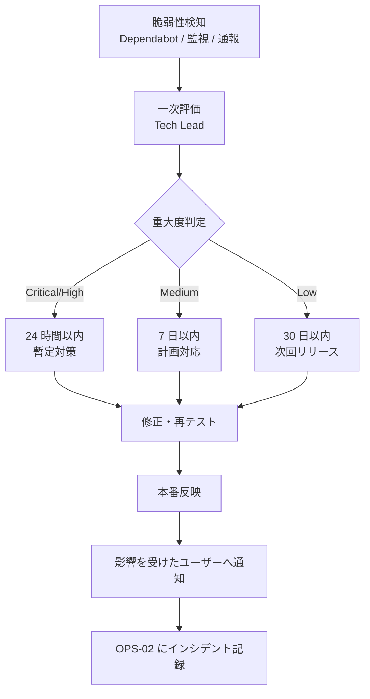

# 02-security-policy.md — セキュリティポリシー

## このセクションの目的

認証・認可・暗号化・脆弱性対応・機密情報保護に関する方針を集約する正仕様書。本プロジェクトの **AdminUser（ロール区分なし）・Member（`client_user`、Organization に所属）という 2 系統の認証構造** と、**テナント境界（発注関連データのみ Organization スコープ、PRD-02 §2）** を定義する。

## 0-H. ハイブリッド編集ガイド（要点）

- 推奨モード: Hybrid（AI 草案 + Tech Lead 確認。個人情報・開示条件は必要に応じ法務確認）
- 人間確認必須: 認証・認可、個人情報、開示条件、鍵管理
- 詳細は 00_README.md §6〜8

---

## 1. 認証・認可モデル

### 1-1. 認証方式（AdminUser・確定済み）

**管理画面の認証はアプリで実装せず、Cloudflare Access に委ねる**（GOV-01 D-022）。`apps/admin` はログイン画面・セッションテーブル・パスワードハッシュ・ロックアウトのいずれも持たない。Member 側の認証（§1-2）とは完全に別系統である。

| 経路 | 認証方式 | セッション / トークン保持 |
| --- | --- | --- |
| 管理画面（Web） | **Cloudflare Access**。Access Application は**ホスト名やルートではなく Worker を対象**に作成し、Preview deployments も含める（GOV-01 D-029）。ルート単位の設定漏れと、`workers.dev` / Preview URL からの迂回が構造的に消える | Access が管理（セッション寿命は Access 側の設定）。アプリ側はクッキーを発行しない |
| identity の取得（第 1 経路） | `ctx.access`（Astro では `Astro.locals.cfContext.access`）の有無を fail-closed で確認し、`getIdentity()` から `email` を得る。Access が認証済みのリクエストにのみ付くため、**JWT の手動検証は不要**。`email` を持たない identity（サービストークン）は拒否する — 監査ログに紐づける相手がいないため | — |
| identity の取得（第 2 経路） | **`ctx.access` が無い場合のみ**、`Cf-Access-Jwt-Assertion` を検証する。チームの公開鍵（`https://<team>.cloudflareaccess.com/cdn-cgi/access/certs`）と **AUD tag** で署名・`aud`・`iss`・`exp` を検証し、`alg` は RS256 に固定する。**本プロジェクトではこちらが本番の実行経路**である（静的アセットを配信する Worker は内部ルーターの背後で動き、ルーターは `ctx.access` を渡さない — D-029） | — |
| ユーザー台帳 | 取得した `email` に対応する `admin_users`（DEV-07 §4-1）の行が無ければ作成する（自動プロビジョニング）。`status = inactive` の行はアプリ側で拒否する — Access のポリシーから外す運用が漏れた場合の二重の歯止め | — |
| パスワード・リセット・ロックアウト・MFA | **アプリ側に存在しない。** すべて Access と背後の ID プロバイダの責務。MFA は IdP 側で必須化する | — |
| ローカル開発・E2E | `wrangler.jsonc` の `access.dev` ブロックが擬似 identity を供給する（`wrangler dev` と Cloudflare Vite プラグインの両方で有効）。**env によるバイパスは持たない** — `identity` を外すと 403 になることを実地で確認する | — |
| SAML / OIDC | Access の ID プロバイダ設定として利用可能（アプリ側の実装は不要） | 具体的なプロバイダは GOV-02 TBD-32 |

> **この変更で消えた攻撃面**: 管理画面へのパスワード総当たり・リセットトークンの漏洩・セッション固定。代わりに**増えた責務**が Access のポリシー管理（誰を許可するか）と identity 取得の正しさである。前者は運用手順として OPS-02 に、後者はテストとして DEV-03 に置く。
>
> **Access が届かない経路が 2 つある。** `ctx.access` は Service Binding / RPC 越しに伝播しない（呼ばれる側の信頼根拠は「バインディングを宣言した Worker からしか呼べない」ことであって Access ではない）。**Cron Triggers も Access の対象外**で、`scheduled()` ハンドラは Access が不通でも動く — 止まるのは人間の操作経路だけである。
>
> **運用上の唯一のリスクはポリシー誤設定による締め出し。** 主ポリシーと独立した経路（別 IdP かサービストークン）のブレークグラスを常設し、復旧は Cloudflare ダッシュボード側で行う。**コードに迂回路を作らない。**

### 1-2. Member 認証（`apps/public`。PRD-03 FG-01・FG-05）

**AdminUser とは完全に別系統の認証**である（PRD-01 §1-1・§1-2、DEV-01 §2）。信頼レベルが異なる（社内の少数スタッフ vs 不特定多数の取引先担当者）うえ、AdminUser 側はそもそもアプリに認証実装を持たない（§1-1、GOV-01 D-022）。本節で定義するのは `apps/public` の Member 認証のみである。

| 項目 | AdminUser（§1-1） | Member（本節） |
| --- | --- | --- |
| テーブル | `admin_users` のみ（**認証情報を持たない台帳**） | `members` / `member_sessions`（DEV-07 §5-3 で定義） |
| クッキー名 | アプリは発行しない（Access が管理） | `member_session` |
| セッション実装 | **Cloudflare Access**（アプリ側の実装なし） | D1 セッション + httpOnly クッキー（`apps/public/src/lib/server/auth/` 配下） |
| パスワードハッシュ | **保持しない** | Web Crypto PBKDF2 |
| OAuth | Access の ID プロバイダ設定に委ねる | Arctic（DEV-01 §2）。LINE / Google / Facebook（INTAKE §4-4） |
| 権限モデル | ロール区分なし（単一種別、§2-1） | ロール階層なし。所属 Organization を通じて `client_user`（Membership.role、§2-2）を持つ |
| アカウント有効化 | Access のポリシーに email を追加する（アプリ側の招待機能なし） | 新規取引申請（Application）の承認後にメールで有効化案内を送る（PRD-03 F-01-05）。**OAuth 認証に成功しただけでは取引先として承認しない**（INTAKE §7 審査制）。承認フローは PRD-03 FG-02、状態遷移は DEV-09 §2 Application を参照 |
| 招待・リセットトークン | **存在しない** | Web Crypto HMAC 署名（`member_password_reset_tokens`） |
| ロックアウト | Access 側（アプリの KV カウンタは使わない） | KV カウンタ（§7） |

> **禁止事項**: Member の認証コードパスを `apps/admin` から流用すること、および `apps/admin` に独自のログイン機能を再導入すること。**認証の入口が 2 つある状態が最も危険**で、Access のポリシーを厳しくしてもアプリ側のログインが残っていれば迂回できる。レビュー時は §10・§14 のチェックリストで確認する。
>
> **共有部分は Member 側だけになった**: パスワードハッシュ関数・ロックアウトのカウンタ操作・セッション TTL の算出と期限/状態の判定は `packages/server-kit/src/auth/` にあるが、**現在の利用者は `apps/public` のみ**である（GOV-01 D-022）。汎用の共有基盤として残すが、「両側が使う前提」の記述を実装に持ち込まないこと。

### 1-3. アカウントと Organization の状態の掛け合わせ

発注可否は「Member がログインできるか」だけでなく「所属 Organization が `active`（取引停止・取引終了でない）か」の 2 条件で判定する（PRD-02 §2-3）。取引停止中（`suspended`）の Organization に所属する Member はログインできても発注操作は拒否する。

---

## 2. ロールモデル（最小構成）

### 2-1. AdminUser（ロール区分なし・単一種別）

```
AdminUser（Cloudflare Access で認証される運営メンバー。ロール区分を持たない単一種別 — DEV-07 §4-1）
  └─ 新規取引申請審査、取引先管理、受注管理、問い合わせ対応、監査ログ確認
```

> **コンテンツ管理は含まれない**（GOV-01 D-017・D-018）。商品・お知らせの更新は開発者がリポジトリで行うため、AdminUser の権限範囲は業務データの処理のみである。
>
> テンプレート標準の `admin`/`editor` ロール分けは本プロジェクトでは採用しない（少人数運営のため、GOV-01 D-014、PRD-01 §1-2）。`admin_users` テーブルに `role` カラムは持たず、spatie/laravel-permission のような専用ライブラリも不要。認可は Service 層に置く `requireAdminUser(context)`（DEV-05 参照）が「Access の JWT を検証済みで、対応する `admin_users` が `active` か」だけを確認すれば足りる（DEV-01 §1「Permission」・§4「認可チェックの徹底」）。
>
> テンプレート標準のリソース実装スキル（`scaffold`）は `readRole` / `writeRole` を分けて判断する前提で書かれているが、本プロジェクトにはロールが無いため、どちらも「有効な AdminUser セッション」に落ちる。生成物にロール分岐が残っていたら削る。

### 2-2. Member ロール（Organization に所属）

```
Member（apps/public のマイページログインユーザー）
  └─ Organization への所属（Membership 経由）
       └─ client_user   ← 卸価格確認、カート・発注、発注履歴確認、会社情報/配送先管理
```

> ロール数は最小構成（`client_user` の 1 種類のみ）。取引先側に権限差（例: 発注担当者は発注のみ、管理担当者は会社情報変更も可能）を設ける場合は、`client_admin` ロールを追加し、`memberships.role` カラムに値を追加するのみで対応できるようスキーマを設計する（DEV-07 参照、`[Open: TBD-05]`）。追加時は本書 §2 と PRD-01 §1-2 を同時に更新する。

### 2-3. 権限マトリクス

| 操作 | AdminUser | Member（`client_user`） |
| --- | :---: | :---: |
| 全取引先・全受注一覧 | ○ | ✕ |
| 商品・メーカー・ブランド・カテゴリー・気になる点管理 | ✕（管理画面を持たない）| ✕ |
| 新規取引申請の審査（承認・否認・差し戻し）| ○ | ✕ |
| 自社（自 Organization）の会社情報閲覧 | ✕（運営は全取引先を閲覧可、後述）| ○ |
| 自社の会社情報変更申請 | ✕ | ○（運営確認が必要な項目あり。PRD-03 F-05-03）|
| 卸価格閲覧 | ○（管理目的）| ○（自社の卸価格のみ）|
| カート・発注 | ✕ | ○ |
| 発注履歴閲覧 | ○（全取引先分、受注管理として）| ○（自社分のみ）|
| 配送先管理 | ✕ | ○（自社分のみ）|
| 受注ステータス変更・入金確認 | ○ | ✕ |
| お問い合わせ管理 | ○ | ✕（送信のみ可）|
| 監査ログ閲覧 | ○ | ✕ |
| お知らせの作成・編集 | ✕（管理画面を持たない）| ✕ |
| 商品選び診断のルール変更 | ✕（管理画面を持たない）| ✕ |
| FAQ・法務ページの文面変更 | ✕（管理画面を持たない）| ✕ |

> AdminUser は全 Organization を横断管理する前提のため、テナント境界の「越権アクセス」の対象外（Platform 相当の操作として監査ログに記録される。§3-3）。
>
> **✕（管理画面を持たない）の 4 行は権限の欠落ではなく設計である。** 商品カタログ・お知らせ・診断ルール・FAQ・法務ページは `packages/content`・定数・ページ直書きにあり、更新経路はリポジトリへのコミットとデプロイのみ（GOV-01 D-015〜D-018・D-024、DEV-06 §1-1）。したがってこれらの変更権限は「アプリの認可」ではなく **リポジトリの書き込み権限とデプロイ権限**で制御される。運用上は、規約文面と卸価格の変更がレビューを経ずにマージされないよう、PR レビューを必須とする（OPS-01 §5）。

---

## 3. 認可チェックの徹底

### 3-1. 権限チェック方針

| 対象 | 実装方法 |
| --- | --- |
| 管理系操作全般（`apps/admin`）| middleware で Access の JWT を検証し、Service 層の入口で `requireAdminUser(context)` を必ず通す（ロールによる分岐はなし。DEV-01 §4、GOV-01 D-022）|
| 発注関連操作（`apps/public`）| Service 層の入口で「Member としてログイン済みか」に加え「所属 Organization が `active` か」「操作対象が自身の所属 Organization と一致するか」を必ず検証する（PRD-02 §2-2） |
| 商品カタログ閲覧 | 全ユーザーに許可。卸価格・発注単位等の限定情報のみ、Member としてのログイン + Organization が `active` かで出し分ける（PRD-02 §2-3）。**ページを静的化しないこと**が前提条件になる（GOV-01 D-021）|
| 取引先別卸価格 | ビルド成果物に全取引先分が含まれる（GOV-01 D-019）。**ログイン中の Organization の `org_code` に一致するエントリだけを描画する。** 他社の価格を HTML・JSON・アイランドの props のいずれにも出力しない |
| お知らせ | `visibility: client_only` は Member としてログイン済みの場合のみ描画する。**一覧・詳細・サイトマップの 3 か所すべてで除外する** — 一覧から消しただけでは詳細 URL が生きたまま残る（DEV-07 §7-1）|
| 商品選び診断（`packages/content`）| 認証不要の公開機能。ルールはビルドに含まれクライアントから到達可能になり得るため、**卸価格・取引条件等の非公開情報をルールの frontmatter に書いてはならない**。推奨商品は `draft` でなく `discontinued` でもないものに限る — ルールが下書き商品の slug を指していても結果に出さない（MVP では診断自体が Coming soon — GOV-01 D-023）|
| セッション/トークンと権限の紐付け | AdminUser は Access の JWT の検証結果と `admin_users.status` のみで認可される（ロールの埋め込みなし）。Member はログイン時に所属 Organization ID・Membership.role をセッションに埋め込み、リクエストごとに検証する |

### 3-2. 権限チェック漏れ防止のコーディング規約

D1 には Eloquent の Global Scope のような自動適用機構がないため、Service 層の入口で明示的にセッション・Organization スコープを検証する（DEV-01 §4「認可チェックの徹底」）。

```ts
// ❌ Bad: Organization スコープなしで発注データを取得
async function getOrder(db: D1Database, orderId: string) {
  return db.prepare("SELECT * FROM orders WHERE public_id = ?").bind(orderId).first();
}

// ✅ Good: Service の入口で必ず所属 Organization を検証してから取得する
async function getOrderForMember(db: D1Database, session: MemberSession, orderId: string) {
  requireActiveOrganization(session); // Organization が active でなければ例外
  return db
    .prepare("SELECT * FROM orders WHERE public_id = ? AND organization_id = ?")
    .bind(orderId, session.organizationId)
    .first();
}

// 商品カタログは D1 に無い（GOV-01 D-017）。Content Collections から読む
async function listPublishedProducts() {
  return (await getCollection("products")).filter((p) => !p.data.draft); // ✅ Good
}

// requireAdminUser の実装例（apps/admin/src/lib/server/auth/access.ts）
// ロール区分を持たないため、Access の検証結果と台帳の状態のみを確認する（GOV-01 D-014・D-022）
async function requireAdminUser(context: APIContext): Promise<AdminUser> {
  // middleware が検証済みの JWT から詰めた値。未検証のヘッダーを直接読まない
  const email = context.locals.accessEmail;
  if (!email) throw new UnauthorizedError();
  const user = await findOrCreateAdminUserByEmail(context.locals.db, email);
  if (user.status !== "active") throw new ForbiddenError();
  return user;
}
```

> **`Cf-Access-Jwt-Assertion` を各ハンドラで直接読まない。** 検証は middleware の 1 か所に集約し、結果を `Astro.locals` 経由で渡す。ヘッダーを読むコードが増えるほど「検証せずに `email` だけ取り出す」実装が紛れ込む余地が増える（GOV-01 D-022）。

### 3-3. 権限チェック漏れの検出

- テスト（Vitest — DEV-01 §1「Testing」）で、発注関連 Service 関数が必ず `organizationId` を受け取り検証することを検証する
- **他社の卸価格が応答に混入しないことを Vitest で検証する**（Content Collections には全社分がある — §3-1）
- 診断結果に未公開商品・取扱終了商品が混入しないことを Vitest で検証する（slug は外部キー制約で守られないため、テストが唯一の防御線 — PRD-02 §7）
- **Access の JWT 検証が本番でバイパスできないことを Vitest で固定する**（ローカル/E2E 用フォールバックが本番環境で無効になること。GOV-01 D-022）
- Pull Request レビューで「発注関連データに Organization スコープあり？」「admin 側の操作が middleware の Access 検証を経ているか？」を必須チェック項目に
- 監査ログ（`activity_log`）で管理操作を記録し、誰がどの操作を行ったかを事後追跡できるようにする

---

## 4. 入力検証

| 経路 | 検証方法 |
| --- | --- |
| Web（`apps/public` / `apps/admin`）| Astro API Route / Service 層の入口で Zod（DEV-01 §2、決定済み。Drizzle スキーマから `drizzle-zod` で導出）により検証する。フォーム値を検証せず直接 D1 へ書き込むことを禁止 |
| Content Collections（商品・メーカー・ブランド・取引先別価格・お知らせ・診断ルール）| `packages/content/src/schema.ts` の Zod スキーマでビルド時に検証する。スキーマ違反はビルドを失敗させる（実行時に不正なデータが読み込まれる経路を作らない）。**価格が数値であること・負数でないことも含める** — 型を落とすと注文金額に直結する |
| 決済 Webhook | 署名検証必須（DEV-10 §2） |
| ファイルアップロード | **経路を持たない**（GOV-01 D-020）|
| 新規取引申請フォーム | 法人番号・郵便番号等の形式検証、Bot 対策（§7 参照） |

---

## 5. 暗号化方針

| 項目 | 方針 |
| --- | --- |
| 通信時 | HTTPS 必須（TLS 1.2 以上） |
| 保存時（DB）| Cloudflare D1 標準の保存時暗号化（基盤側で提供。DEV-01 参照） |
| 保存時（ファイル）| **該当なし** — R2 を使わない（GOV-01 D-020）。画像はリポジトリ内の静的アセット |
| 秘密情報 | ローカル開発は `.dev.vars`（gitignored）、本番は Cloudflare Workers Secrets（`wrangler secret put`）で管理。Git にコミット禁止 |
| 機密カラム | 決済関連 ID 等、アプリ層で暗号化してから D1 へ書き込む方式は **Open**（案件実装時に確定） |
| 鍵管理 | Cloudflare Workers Secrets 単位で個別に管理し、ローテーション時は影響範囲を OPS-02 に記録する |

> `packages/content` はリポジトリにコミットされビルドに含まれるため、**秘密情報の置き場所ではない**。API キー・内部メモを書かないこと（§3-1）。
>
> **卸価格は例外的にここに置く**（GOV-01 D-017・D-019）。秘密情報ではあるが、コンテンツとして管理する判断をした。したがって次の 2 点が防御線になる: (a) リポジトリを公開しない、(b) **ページを静的化せず、ログイン中の取引先に該当する価格だけをサーバー側で描画する**（GOV-01 D-021、PRD-02 §2-3）。ビルド成果物には全取引先分の価格が含まれるため、`prerender = true` を付けた瞬間に全社の価格が公開される。

---

## 6. CSRF / XSS / SQL Injection 対策

| 攻撃区分 | 対策 |
| --- | --- |
| CSRF | Astro 組み込みの Origin チェック（`security.checkOrigin`、既定で有効。DEV-01 §2 で決定済み）で対応する。追加ライブラリ・自前実装は不要。AdminUser・Member はこの機構を共有してよい（アプリケーションではなく Astro 自体の機構のため、§1-2 の実装分離ルールの対象外） |
| XSS | Astro は `{式}` 展開でデフォルトエスケープ、Svelte も `{式}` 展開でデフォルトエスケープ。生 HTML を挿入する Astro の `set:html` ディレクティブ／Svelte の `{@html ...}` はサニタイズ済みの値以外に使用禁止。**利用者入力を画面に戻す箇所（問い合わせ内容・管理メモ・申請内容）に `set:html` を使わない。** お知らせ本文は開発者が書く Markdown であり（GOV-01 D-018）、Astro のレンダラを通す限り外部入力ではない |
| SQL Injection | D1 へのアクセスは必ずプレースホルダ付きプリペアドステートメント（`env.DB.prepare(sql).bind(...)`）または Drizzle 経由を使用。文字列連結による SQL 構築を禁止（DEV-01 §3） |
| ファイルアップロード | **機能を持たない**（GOV-01 D-020）。アップロードを受けるエンドポイントを追加しないこと |
| マスアサインメント | Service 層で書き込み対象のフィールドを明示的にホワイトリスト指定する |
| フォーム自動送信・Bot 対策 | 新規取引申請・お問い合わせフォームに honeypot + レート制限（§7）を実装。reCAPTCHA 等の追加導入は必要になった時点で GOV-01 決定 |

---

## 7. レート制限

| 対象 | 制限 |
| --- | --- |
| ログイン / パスワードリセット（**Member のみ**）| 5 回 / 分 / IP |
| 新規取引申請フォーム送信 | 5 回 / 時 / IP |
| お問い合わせフォーム送信 | 5 回 / 時 / IP |
| 発注確定 | 10 回 / 時 / Member（誤操作・二重発注防止）|

> 管理画面側のレート制限は不要（GOV-01 D-022）。そもそも認証エンドポイントを持たず、Access を通過しない限りアプリに到達しない。ファイルアップロードも存在しない（GOV-01 D-020）。

実装方式は役割分担で確定済み（`Confirmed`）。**IP ベースの汎用レート制限は Cloudflare の WAF / Rate Limiting Rules**（Dashboard または Terraform でのエッジ設定。アプリケーションコードには実装しない — DEV-04 §2 と整合）。IP 単位のエッジ制限だけでは不十分な**アカウント単位のブルートフォース対策のみアプリ側で実装**する。

**ログイン等の認証エンドポイントへの実装（必須）**

Member 側のログイン / パスワード再設定は、IP + アカウント単位で失敗回数を記録し、一定回数を超えたらロックアウトしてブルートフォース攻撃を防ぐこと。カウンタの保管先は **Cloudflare KV**（`Confirmed`。TTL 付きキーで自動失効させる）。**KV バインディングを持つのは `apps/public` だけ**である（GOV-01 D-022）。

- 失敗時: カウンタを加算し、上限（5 回 / 分 / IP を基準値とする）を超えたら一定時間ロックアウト
- 成功時: カウンタをリセット
- メール送信を伴う操作（パスワードリセット再送等）も同様に制限すること

**フェイルクローズと処理時間の均一化（実装上の必須事項）**

- ロックアウトの閾値・期間・セッション TTL を環境変数から読むとき、**未設定なら例外を投げる**。`Number(undefined)` は `NaN` で、`NaN` との比較はすべて false になるため、ロックアウトが黙って無効化される（DEV-03 §4 で単体テストの必須項目とする）
- 「存在しないメールアドレス」「無効化済みアカウント」でも、パスワード検証と同等の計算を必ず実行してから失敗を返す。早期 return すると応答時間の差がアカウント存在の判定材料になる（列挙オラクル）

---

## 8. 個人情報・機密情報の取扱い

### 8-1. 取得項目と保存期限

| データ項目 | 取得根拠 | 保存期限 | 第三者提供 |
| --- | --- | --- | --- |
| 担当者氏名・メールアドレス・電話番号（Member）| サービス提供（取引先の担当者情報）| 取引終了後 1 年（PRD-02 §8）| なし |
| 会社情報（法人名・所在地・代表者名等、Organization / Application）| 新規取引申請・取引の主体確認 | 取引終了後 1 年 | なし |
| 配送先情報（ShippingAddress）| 発注商品の配送 | 取引終了後 1 年 | 配送会社（決定後、DEV-10 §9 に追記）|
| 決済情報（カード番号）| 取得しない（決済代行事業者へ委託。DEV-01 §2 Stripe）| — | 決済代行事業者のみ |
| 発注・決済履歴（Order / OrderItem / Payment）| 会計・税務上の保存義務 | PRD-02 §8（5 年、`[Assumed]`）| なし |
| 操作ログ（AuditLog）| サービス改善・障害調査 | 永続 | なし |
| お問い合わせ内容（会社名・氏名・メール・電話、Inquiry）| 問い合わせ対応 | 対応完了後 1 年 | なし |
| 同意した利用規約バージョン（`applications.agreed_terms_version`）| 契約成立の立証 | Application の保存期限に準ずる | なし |

### 8-2. プライバシー法令対応

| 法令 | 適用条件 | 対応 |
| --- | --- | --- |
| 個人情報保護法（日本）| 全プロジェクト | 必須 |
| GDPR | EU 圏ユーザー受付時 | 想定なし（国内 BtoB 取引が前提。`[Assumed]`）|
| 電気通信事業法（外部送信規律）| Cookie / 外部 API 連携時 | 要対応 |
| 特定商取引法 | BtoB 卸売のため直接適用外だが、参考として `/law` ページに事業者情報を明示（PRD-04 §3-1 SCR-32）| 要対応 |

---

## 9. 脆弱性対応フロー



---

## 10. セキュリティレビュー基準（PR 時チェック）

- [ ] 認証・認可：`requireAdminUser(context)`（admin）・Organization スコープ検証（public）経由でアクセス制御しているか
- [ ] Access：`Cf-Access-Jwt-Assertion` を middleware で検証しているか。ハンドラが未検証のヘッダーを直接読んでいないか（§3-2）
- [ ] Access のバイパス：ローカル/E2E 用フォールバックが本番で無効か。テストで固定されているか（§1-1）
- [ ] テナント境界：発注関連データを `organization_id` でスコープしているか
- [ ] **卸価格：`prerender = true` が付いていないか。他社の価格が応答・アイランドの props に混入していないか（§3-1、GOV-01 D-021）**
- [ ] **お知らせ：`draft` / `client_only` を一覧・詳細・サイトマップの 3 か所で除外しているか（§3-1）**
- [ ] 入力検証：Zod による検証を Service 層の入口（または API Route）で通しているか（§4）
- [ ] フェイルクローズ：ロックアウト閾値・セッション TTL の env 未設定時に例外を投げるか（§7）
- [ ] 処理時間：未知のメールアドレス・無効化済みアカウントでもパスワード検証相当の計算を通しているか（§7）
- [ ] 機密情報：ログに個人情報・トークンが出ていないか
- [ ] `packages/content`：API キー・内部情報が含まれていないか（§5。卸価格は例外的に置く）
- [ ] 診断結果：未公開・取扱終了の商品が結果に出ないか（§3-1）
- [ ] SQL Injection：`env.DB.prepare(...).bind(...)` または Drizzle を使い、文字列連結の Raw SQL を使っていないか
- [ ] XSS：Astro の `set:html` / Svelte の `{@html}` を未サニタイズの値に使っていないか（問い合わせ内容・管理メモを含む）
- [ ] レート制限：新規フォーム・Member の認証系エンドポイントに制限（エッジ設定 or アプリ側カウンタ、§7）が適用されているか
- [ ] 決済 Webhook：署名検証・冪等性チェックがあるか（DEV-10 §2）
- [ ] Member 認証：`apps/admin` にログイン機能を再導入していないか。Member の認証コードを流用していないか（§1-2）

---

## 11. 個人情報インシデント対応

OPS-02（運用ハンドブック）のインシデント対応と連動。

| 区分 | 対応内容 | 対応期限 |
| --- | --- | --- |
| 内部報告 | 検知者 → Tech Lead / PdM（兼務前提）| 検知後 24 時間以内 |
| 行政報告 | 個人情報保護委員会への報告（要件該当時）| 法令期限内 |
| 本人通知 | 影響を受けた取引先へメール通知 | 72 時間以内目安 |
| 再発防止 | OPS-02 に記録、原因分析・対策実装 | 30 日以内 |

---

## 12. プレリリース・セキュリティ監査

- `security-review` スキルで自動チェック（PR 時・リリース前）
- メジャーリリース前は本書 §10 の観点に基づく全体監査を実施
- 実装規約の正本: `CLAUDE.md`（技術固有のコーディングパターン・コード例はここに集約。DEV-01 §9 参照）

---

## 13. プライバシー対応チェックリスト

- [ ] 取得する個人情報の洗い出しが完了している
- [ ] 利用目的・保存期限・第三者提供の有無が §8-1 に記載されている
- [ ] ユーザーの権利行使（開示・訂正・削除・利用停止）に応じる手順が存在する
- [ ] Cookie 同意管理の実装方針が確定している
- [ ] 外部サービス（決済・配送等）への情報送信が把握されている
- [ ] 個人情報インシデント発生時の報告先・対応期限が明確
- [ ] GDPR 対応要否が確認されている

---

## 14. 記入時チェックポイント

- ロール・権限の定義が PRD-01 §1-2（構造の正本）と一致しているか
- テナント境界の強制箇所（発注関連 Service）が漏れなく特定できているか
- 認証・レート制限の要件が DEV-05 の実装規約と接続されているか
- 個人情報の取得項目・保存期限が §8-1 に具体的に列挙されているか
- 技術名を選定として書いていないか（選定の正本は DEV-01）
- `apps/admin` にアプリ側の認証実装が残っていないか（§1-1、GOV-01 D-022）
- 卸価格の表示境界が「SSR 固定 + サーバー側判定」で説明されているか（§3-1、GOV-01 D-021）
- 管理画面を持たないコンテンツ（商品・お知らせ・診断・FAQ・法務）の変更権限が、アプリの認可ではなくリポジトリ/デプロイ権限で説明されているか（§2-3）
