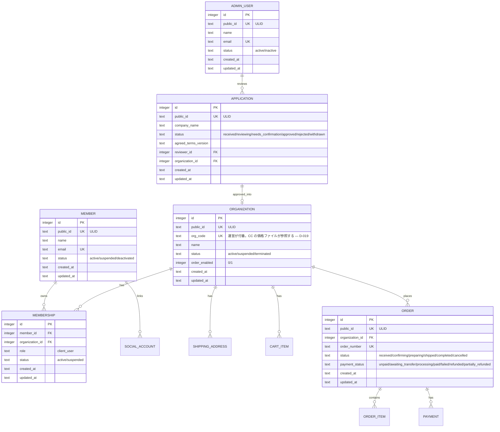

# 07-database-schema.md — データベース物理設計

## このセクションの目的

PRD-02（論理設計）を受けた物理 DB 設計。**D1 が持つのは取引データだけ**であり、新規取引申請・取引先（Organization）・会員（Member）・発注・決済・お問い合わせ・監査ログがその範囲になる（GOV-01 D-017）。

**公開コンテンツは 1 件も D1 に無い。** 商品カタログ・お知らせ・診断ルール・FAQ・法務文面は Content Collections か TypeScript 定数であり、置き場所の正本は DEV-06 §1-1、本書での扱いは §3-9 にまとめてある。チャット・AI 機能も採用しないため（DEV-01 §0、PRD-05）`ai_jobs` 等も持たない。

管理画面の認証は Cloudflare Access に委ねるため、AdminUser 側のセッション・パスワード関連テーブルも存在しない（GOV-01 D-022、§3-1）。

## 0-H. ハイブリッド編集ガイド（要点）

- 推奨モード: Hybrid（AI 下書き + Tech Lead 確定）
- 人間確認必須: 制約の妥当性、書き込み負荷影響、無停止変更可否

---

## 1. 全体方針

- **DBMS**: Cloudflare D1（SQLite 互換。バインディング名は必ず `DB`。選定理由は DEV-01 §1 参照）
- **文字コード**: SQLite は UTF-8 固定
- **PK**: `INTEGER PRIMARY KEY AUTOINCREMENT`（SQLite の rowid エイリアス）
- **外部公開 ID**: `public_id TEXT`（ULID、26 文字）を URL・API に露出するテーブルにのみ付与
- **型の扱い**: SQLite は動的型付け（type affinity）。列は `TEXT` で宣言し、想定される最大長は備考欄にコメントとして残す。真偽値は `INTEGER`（0/1）、日時は `TEXT`（ISO 8601）で統一する
- **タイムスタンプ**: `created_at` / `updated_at` を全テーブルに。`created_at` は `DEFAULT (strftime('%Y-%m-%dT%H:%M:%fZ','now'))` で付与し、`updated_at` は Service 層が更新時に明示的にセットする。追記型テーブル（`payment_event_logs` 等）は `created_at` のみで可
- **テナント境界**: 発注関連テーブル（`shipping_addresses` / `cart_items` / `orders` / `order_items` / `payments` / `memberships`）にのみ `organization_id` を必須化する（PRD-02 §2）。**例外はない** — 商品カタログが D1 から外れたことで、旧 `organization_product_prices`（唯一の例外だった）も消えた（GOV-01 D-017・D-019）
- **論理削除**: 原則使わない（明示的な `status` カラムで管理）
- **D1 に置くのは取引データだけ**: 公開コンテンツ（商品・メーカー・ブランド・分類・お知らせ・診断ルール・FAQ・法務文面）は 1 件も D1 に持たない（GOV-01 D-017・D-018、DEV-06 §1-1 が判断の正本）
- **更新経路のないテーブルを作らない**: テーブルを追加するときは、管理画面（PRD-04 の ADM 画面）・利用者自身の操作・シーダー（§9）のいずれかで更新できることを必ず確認する。運営が更新しないデータは D1 ではなく Content Collections か定数に置く（DEV-01 §3 の禁止リスト最終行）
- **スキーマ管理・ORM**: Drizzle（`drizzle-orm` + `drizzle-kit`、D1/SQLite dialect。決定は DEV-01 §1）。**本書（DEV-07）の Markdown テーブル定義がスキーマの正本**であり、直接 TypeScript の Drizzle スキーマを手書きしない。`schema-build` スキル（`.claude/skills/schema-build/`）が本書の記述から Drizzle スキーマ（`packages/schema/src/schema.ts`）を生成し、そこから `drizzle-kit generate`（`pnpm db:generate`）が migration SQL（§9）を生成する 2 段階パイプラインとする
- **マイグレーション**: 前方互換優先。`drizzle-kit generate` が生成する migration SQL、無停止で完了できる範囲の ALTER に限定する

---

## 2. ERD（Mermaid）

<!-- ERD:START -->

<!-- ERD:END -->

> **同期ルール**: 上記の `<!-- ERD:START -->` ～ `<!-- ERD:END -->` ブロックは `packages/schema/migrations/` 配下の SQL と完全に対応すること。テーブル追加・カラム変更・リレーション変更があれば AI が両方を同時に更新する。
>
> **商品・メーカー・ブランド・分類・商品画像・取引先別価格・お知らせ・商品選び診断は本図に現れない**（§3-9）。いずれも Content Collections または定数であり（GOV-01 D-017〜D-020・D-023・D-024）、D1 に行を持たない。`cart_items` / `order_items` から商品への参照は `product_slug` の文字列一致で、外部キー制約が存在しないため ERD 上の線にもならない。同じ理由で取引先別価格ファイルから `organizations.org_code` への参照も線にならない。

---

## 3. テーブル一覧

### 3-1. 認証関連（決定済み — DEV-01 §1・§2、DEV-02 §1-1・§1-2）

**AdminUser の認証は D1 を使わない。** Cloudflare Access に委ねるため、セッションテーブルもパスワードリセットテーブルも持たない（GOV-01 D-022）。Member 側は従来どおり D1 セッションであり、両者はテーブル・クッキー名・実装コードを一切共有しない（DEV-02 §1-2 の禁止事項）。

| テーブル | 役割 |
| --- | --- |
| `member_sessions` | `members` 向けセッション管理。`member_session` クッキーで session token を保持する（DEV-02 §1-2）。列定義は §5-3 |
| `member_password_reset_tokens` | パスワードリセット（`members` 向け） |

> **廃止**: `admin_sessions` / `admin_password_reset_tokens`（GOV-01 D-022）。管理者のパスワード・セッション・ロックアウトはすべて Cloudflare Access 側の責務になった。

### 3-2. AdminUser 標準テーブル

| テーブル | 役割 | 公開 ID |
| --- | --- | :---: |
| `admin_users` | **認証情報を持たないユーザー台帳**（ロール区分なし・単一種別 — GOV-01 D-014・D-022） | ○ |

> `admin_users` を残すのは、`activity_log.causer_id`・`inquiries.assignee_id`・`applications.reviewer_id` が参照するためである。認証そのものは Access が行い、アプリは JWT の `email` でこの表を引く（初回アクセス時に自動プロビジョニング）。`password_hash` 列は持たない。

### 3-3. 監査ログ

| テーブル | 役割 | 公開 ID |
| --- | --- | :---: |
| `activity_log` | 管理操作の監査ログ（自前テーブル — §8-1）。`organization_id` は商品カタログ操作等では NULL |  |

### 3-4. 新規取引申請テーブル

| テーブル | 役割 | 公開 ID |
| --- | --- | :---: |
| `applications` | 新規取引申請（承認前は Organization ではない） | ○ |

### 3-5. Organization・Member テーブル

| テーブル | 役割 | 公開 ID |
| --- | --- | :---: |
| `organizations` | 承認済み取引先 | ○ |
| `members` | `apps/public` のマイページログインユーザー | ○ |
| `memberships` | Member × Organization の所属 |  |
| `social_accounts` | Member の OAuth ログイン方法（LINE / Google / Facebook） |  |
| `shipping_addresses` | 配送先 | ○ |

### 3-6. 商品カタログテーブル — 全廃

**商品カタログは D1 に存在しない**（GOV-01 D-017）。`manufacturers` / `brands` / `product_categories` / `concerns` / `products` / `product_concerns` / `product_images` の 7 テーブルは設けない。実体は §3-9 を参照。

### 3-7. カート・発注・決済テーブル（`organization_id` を持つ）

| テーブル | 役割 | 公開 ID |
| --- | --- | :---: |
| `cart_items` | カート内商品。商品は `product_slug` の文字列参照（外部キーなし） |  |
| `orders` | 発注（受注） | ○ |
| `order_items` | 発注明細（**商品名・単価を確定時にスナップショット保持**） |  |
| `payments` | 決済記録 |  |
| `payment_event_logs` | 決済 Webhook 冪等性 |  |

> `organization_product_prices` は廃止（GOV-01 D-019）。取引先別の個別卸価格は `packages/content/prices/*.md` が持ち、`organizations.org_code` を参照する。

### 3-8. お問い合わせテーブル

| テーブル | 役割 | 公開 ID |
| --- | --- | :---: |
| `inquiries` | お問い合わせ | ○ |

> `news`（お知らせ）は廃止（GOV-01 D-018）。実体は `packages/content/news/*.md`。

### 3-9. テーブルを持たないコンテンツ

以下は D1 に置かない（DEV-06 §1-1 が正本、GOV-01 D-015〜D-020・D-023・D-024）。**過去の設計との差分なので、実装時に「テーブルが無い」ことを欠落と誤認しないこと。**

| コンテンツ | 置き場所 | 旧設計のテーブル |
| --- | --- | --- |
| 商品（説明・原材料・使用方法・標準卸価格・発注単位）| `packages/content/products/*.md` | `products` |
| メーカー・ブランド | `packages/content/{manufacturers,brands}/*.md` | `manufacturers` / `brands` |
| 商品カテゴリー・気になる点の分類 | `apps/public/src/lib/catalog.ts`（定数）| `product_categories` / `concerns` / `product_concerns` |
| 商品画像 | `apps/public/src/assets/img/`（静的アセット）| `product_images` / `media` |
| 取引先別の個別卸価格 | `packages/content/prices/*.md` | `organization_product_prices` |
| お知らせ | `packages/content/news/*.md` | `news` |
| 商品選び診断のルールセット | `packages/content/diagnosis/*.md`（§7-3） | `diagnosis_*` 4 テーブル |
| よくある質問（FAQ）| `apps/public/src/lib/faq.ts`（定数）| — |
| 送料・税率・最低発注金額・支払方法 | `apps/public/src/lib/commerce.ts`（定数）| — |
| 利用規約・プライバシーポリシー・特商法表示 | ページ直書き（バージョン文字列のみ定数で保持し、`applications.agreed_terms_version` に記録 — §5-1） | — |

**この構成が持ち込む制約**

- 商品・取引先コード・診断の推奨商品への参照に**外部キーを張れない**。Service 層での存在検証だけが歯止めになる（DEV-06 §1-1 の表）
- **注文明細は商品名・単価をスナップショットする**（§7-2）。Markdown 側の価格を書き換えると過去の注文金額が変わってしまうため、表示は必ず `order_items` の保存値から行う
- 商品の公開/非公開・取扱終了は frontmatter の `draft` / `discontinued` で表現する。過去の注文はスナップショットで保持されるので、取扱終了商品を Markdown から削除しても注文履歴は壊れない

---

## 4. AdminUser 標準テーブル定義

### 4-1. admin_users

| カラム | 型 | NULL | 備考 |
| --- | --- | --- | --- |
| id | INTEGER | NO | PK |
| public_id | TEXT | NO | UNIQUE（ULID） |
| name | TEXT | NO | 最大 255 文字を想定 |
| email | TEXT | NO | UNIQUE。**Cloudflare Access の JWT の `email` と突き合わせる唯一のキー**（GOV-01 D-022） |
| status | TEXT | NO | active / inactive |
| last_login_at | TEXT | YES | ISO 8601。Access 通過後の初回リクエスト時に更新 |
| created_at | TEXT | NO |  |
| updated_at | TEXT | NO |  |

**Index**: UNIQUE(`public_id`), UNIQUE(`email`), `status`

> `role` カラムは持たない（ロール区分なしの単一種別 — GOV-01 D-014、DEV-02 §2-1）。
>
> **`password_hash` も持たない**（GOV-01 D-022）。認証は Cloudflare Access が行い、本表は「誰が操作したか」を記録するための台帳である。Access を通過した email に対応する行が無ければ、その場で作成する（自動プロビジョニング）。`status = inactive` の行は Access を通過していてもアプリ側で拒否する — Access のポリシーから外す運用が漏れた場合の二重の歯止めになる。

### 4-2. activity_log

専用パッケージは使わず、自前スキーマで管理する（DEV-01 §2）。

| カラム | 型 | NULL | 備考 |
| --- | --- | --- | --- |
| id | INTEGER | NO | PK |
| log_name | TEXT | YES | ログ種別（application / order / organization 等） |
| description | TEXT | NO | 操作の説明 |
| subject_type | TEXT | YES | 操作対象の種別 |
| subject_id | INTEGER | YES | 操作対象の ID |
| event | TEXT | YES | application.approved / order.cancelled 等 |
| causer_type | TEXT | YES | 操作者の種別（`AdminUser` / `Member`） |
| causer_id | INTEGER | YES | 操作者の ID（システム処理時 NULL — DEV-05 §9-1） |
| properties | TEXT | YES | JSON 文字列。変更前後と ip_address / user_agent 等 |
| batch_id | TEXT | YES | 一括操作のグルーピング（UUID） |
| organization_id | INTEGER | YES | 取引先に紐づかない操作（問い合わせ対応等）では NULL |
| created_at | TEXT | NO |  |

**Index**: `subject_type, subject_id`、`causer_type, causer_id`、`log_name`、`organization_id`

---

## 5. Member・Organization テーブル定義

### 5-1. applications

| カラム | 型 | NULL | 備考 |
| --- | --- | --- | --- |
| id | INTEGER | NO | PK |
| public_id | TEXT | NO | UNIQUE（ULID） |
| company_name | TEXT | NO |  |
| corporate_number | TEXT | YES | 法人番号 |
| business_type | TEXT | YES | 事業者種別 |
| industry | TEXT | YES | 業種 |
| postal_code | TEXT | NO |  |
| address | TEXT | NO |  |
| representative_name | TEXT | NO |  |
| contact_name | TEXT | NO | 担当者名 |
| contact_department | TEXT | YES |  |
| phone | TEXT | NO |  |
| email | TEXT | NO |  |
| website | TEXT | YES |  |
| sns | TEXT | YES |  |
| has_physical_store | INTEGER | NO | 0/1 DEFAULT 0 |
| planned_sales_channels | TEXT | YES |  |
| desired_products | TEXT | YES |  |
| desired_payment_method | TEXT | YES |  |
| notes | TEXT | YES | 備考・相談内容 |
| agreed_to_terms | INTEGER | NO | 0/1。利用規約・プライバシーポリシー同意 |
| agreed_terms_version | TEXT | NO | 同意した利用規約のバージョン文字列（例 `"2026-09-01"`）|
| status | TEXT | NO | received / reviewing / needs_confirmation / approved / rejected / withdrawn |
| reviewer_id | INTEGER | YES | FK → admin_users.id |
| review_memo | TEXT | YES |  |
| applied_at | TEXT | NO |  |
| reviewed_at | TEXT | YES |  |
| organization_id | INTEGER | YES | FK → organizations.id（承認時に設定） |
| created_at | TEXT | NO |  |
| updated_at | TEXT | NO |  |

**Index**: UNIQUE(`public_id`), `status`, `email`

> `status` の遷移は状態遷移関数経由で行う（DEV-09 参照）。
>
> **`agreed_terms_version` が必要な理由**: 利用規約はページ直書きで管理され（§3-9、DEV-06 §1-1）、DB にレコードが存在しない。`agreed_to_terms` の 0/1 だけでは「いつの版に同意したのか」を後から特定できず、規約改定後に契約成立時点の条項を立証できない。現行バージョンはアプリ側の定数 1 箇所で保持し、申請時にサーバー側で一致を検証してからこの列へ記録する（DEV-04 §6-1、OPS-01 §5）。

### 5-2. organizations

| カラム | 型 | NULL | 備考 |
| --- | --- | --- | --- |
| id | INTEGER | NO | PK |
| public_id | TEXT | NO | UNIQUE（ULID） |
| org_code | TEXT | NO | UNIQUE。運営が付番する安定コード（例: `ORG-A001`）|
| name | TEXT | NO | 会社名（Application からコピー） |
| status | TEXT | NO | active / suspended / terminated |
| order_enabled | INTEGER | NO | 0/1 DEFAULT 1。発注可否（停止中は 0） |
| billing_postal_code | TEXT | YES |  |
| billing_address | TEXT | YES |  |
| application_id | INTEGER | YES | FK → applications.id（生成元） |
| created_at | TEXT | NO |  |
| updated_at | TEXT | NO |  |

**Index**: UNIQUE(`public_id`), UNIQUE(`org_code`), `status`

> **`org_code` は取引先別卸価格ファイル（`packages/content/prices/*.md`）からの参照キー**である（GOV-01 D-019）。`public_id`（ULID）は承認処理まで採番されず Markdown に書けないため、承認時に運営が決める短いコードを別に持つ。**採番後は変更しない** — 変更すると価格ファイルの参照が切れ、外部キー制約では守られないため標準卸価格に黙って戻る。承認画面（ADM-13）で採番し、重複は UNIQUE 制約で弾く。

### 5-3. members

| カラム | 型 | NULL | 備考 |
| --- | --- | --- | --- |
| id | INTEGER | NO | PK |
| public_id | TEXT | NO | UNIQUE（ULID） |
| name | TEXT | NO |  |
| email | TEXT | NO | UNIQUE |
| password_hash | TEXT | YES | Web Crypto PBKDF2。OAuth のみの Member は NULL 許容 |
| phone | TEXT | YES |  |
| status | TEXT | NO | active / suspended / deactivated |
| last_login_at | TEXT | YES |  |
| created_at | TEXT | NO |  |
| updated_at | TEXT | NO |  |

**Index**: UNIQUE(`public_id`), UNIQUE(`email`), `status`

> セッション管理は `member_sessions` を参照（DEV-02 §1-2）。**D1 セッションを持つのは Member だけ**であり、AdminUser 側は Cloudflare Access が担う（GOV-01 D-022）。片方の実装をもう片方から流用しない。

**member_sessions**

| カラム | 型 | NULL | 備考 |
| --- | --- | --- | --- |
| id | INTEGER | NO | PK |
| member_id | INTEGER | NO | FK → members.id |
| session_token | TEXT | NO | UNIQUE。`member_session` クッキーに保持する値 |
| expires_at | TEXT | NO |  |
| created_at | TEXT | NO |  |

**Index**: UNIQUE(`session_token`), `member_id`, `expires_at`

**member_password_reset_tokens**

| カラム | 型 | NULL | 備考 |
| --- | --- | --- | --- |
| id | INTEGER | NO | PK |
| member_id | INTEGER | NO | FK → members.id |
| token | TEXT | NO | UNIQUE |
| expires_at | TEXT | NO | 発行から 60 分 |
| used_at | TEXT | YES |  |
| created_at | TEXT | NO |  |

**Index**: UNIQUE(`token`), `member_id`, `expires_at`

### 5-4. social_accounts

| カラム | 型 | NULL | 備考 |
| --- | --- | --- | --- |
| id | INTEGER | NO | PK |
| member_id | INTEGER | NO | FK → members.id |
| provider | TEXT | NO | line / google / facebook |
| provider_user_id | TEXT | NO |  |
| created_at | TEXT | NO |  |
| updated_at | TEXT | NO |  |

**Index**: UNIQUE(`provider`, `provider_user_id`), `member_id`

### 5-5. memberships

| カラム | 型 | NULL | 備考 |
| --- | --- | --- | --- |
| id | INTEGER | NO | PK |
| member_id | INTEGER | NO | FK → members.id |
| organization_id | INTEGER | NO | FK → organizations.id |
| role | TEXT | NO | `client_user`（DEV-02 §2-2 の拡張余地あり） |
| status | TEXT | NO | active / suspended |
| joined_at | TEXT | NO |  |
| left_at | TEXT | YES | 退会時の記録 |
| created_at | TEXT | NO |  |
| updated_at | TEXT | NO |  |

**Index**: UNIQUE(`member_id`, `organization_id`), `organization_id`

### 5-6. shipping_addresses

| カラム | 型 | NULL | 備考 |
| --- | --- | --- | --- |
| id | INTEGER | NO | PK |
| public_id | TEXT | NO | UNIQUE（ULID） |
| organization_id | INTEGER | NO | FK → organizations.id |
| recipient_name | TEXT | NO |  |
| postal_code | TEXT | NO |  |
| address | TEXT | NO |  |
| phone | TEXT | NO |  |
| is_default | INTEGER | NO | 0/1 DEFAULT 0 |
| created_at | TEXT | NO |  |
| updated_at | TEXT | NO |  |

**Index**: UNIQUE(`public_id`), `organization_id`

---

## 6. カート・発注テーブル定義

> **商品カタログのテーブル定義は本書に存在しない**（GOV-01 D-017）。商品・メーカー・ブランド・分類・商品画像・取引先別価格はすべて Content Collections か定数であり、スキーマの正本は `packages/content/src/schema.ts` の Zod 定義になる（DEV-06 §1-1）。

### 6-0. 商品の参照方法（カート・発注に共通）

カートと発注明細は商品を **`product_slug` の文字列**で参照する。外部キー制約は張れない。

| 場面 | 解決方法 |
| --- | --- |
| カート表示・数量変更 | 都度 Content Collections から解決する（価格も都度解決）|
| 発注確定 | その時点の商品名・単価を `order_items` に**スナップショット保存**する（§6-3） |
| 過去の発注の表示 | **必ず `order_items` の保存値を使う。** Markdown を読み直してはならない |

> 読み直すと、価格改定のたびに過去の注文金額・請求金額が書き換わる。単価の解決順は「`packages/content/prices/*.md` に当該取引先（`org_code`）のエントリがあればその価格、無ければ商品の標準卸価格」（BIZ-03 §2-2、GOV-01 D-019）。この分岐は単体テストの必須項目（DEV-03 §3-5）。
>
> Markdown 側から商品が削除された場合、カートは解決できずエラーになるが、**過去の注文はスナップショットがあるため壊れない**。取扱終了は削除ではなく `discontinued: true` で表現する（PRD-03 F-06-03）。

### 6-1. cart_items

| カラム | 型 | NULL | 備考 |
| --- | --- | --- | --- |
| id | INTEGER | NO | PK |
| organization_id | INTEGER | NO | FK → organizations.id |
| member_id | INTEGER | NO | FK → members.id |
| product_slug | TEXT | NO | Content Collections の商品 slug（外部キーなし — §6-0） |
| quantity | INTEGER | NO |  |
| created_at | TEXT | NO |  |
| updated_at | TEXT | NO |  |

**Index**: UNIQUE(`organization_id`, `member_id`, `product_slug`), `organization_id`

### 6-2. orders

| カラム | 型 | NULL | 備考 |
| --- | --- | --- | --- |
| id | INTEGER | NO | PK |
| public_id | TEXT | NO | UNIQUE（ULID） |
| organization_id | INTEGER | NO | FK → organizations.id |
| member_id | INTEGER | NO | FK → members.id（発注担当者） |
| order_number | TEXT | NO | UNIQUE。採番方式は Service 実装時に確定 |
| status | TEXT | NO | received / confirming / preparing / shipped / completed / cancelled |
| payment_status | TEXT | NO | unpaid / awaiting_transfer / processing / paid / failed / refunded / partially_refunded |
| subtotal | INTEGER | NO | 税抜小計（円） |
| tax | INTEGER | NO |  |
| shipping_fee | INTEGER | NO |  |
| total | INTEGER | NO | 税込合計 |
| shipping_address_snapshot | TEXT | NO | JSON 文字列。発注時点の配送先スナップショット |
| payment_method | TEXT | NO | credit_card / bank_transfer |
| notes | TEXT | YES |  |
| placed_at | TEXT | NO |  |
| created_at | TEXT | NO |  |
| updated_at | TEXT | NO |  |

**Index**: UNIQUE(`public_id`), UNIQUE(`order_number`), `organization_id, status`, `payment_status`

### 6-3. order_items

| カラム | 型 | NULL | 備考 |
| --- | --- | --- | --- |
| id | INTEGER | NO | PK |
| order_id | INTEGER | NO | FK → orders.id |
| product_slug | TEXT | NO | 参照のみ（外部キーなし — §6-0）。Markdown 側から消えても行は残る |
| product_name_snapshot | TEXT | NO | 発注時点の商品名（PRD-02 §8） |
| product_code_snapshot | TEXT | YES | 発注時点の商品コード / SKU |
| unit_price_snapshot | INTEGER | NO | 発注時点の卸単価 |
| tax_rate_snapshot | TEXT | NO | 発注時点の税率（例: "0.08"） |
| quantity | INTEGER | NO |  |
| subtotal | INTEGER | NO |  |
| created_at | TEXT | NO |  |
| updated_at | TEXT | NO |  |

**Index**: `order_id`, `product_slug`

> **表示は必ずこのスナップショット列から行う**（§6-0）。`product_slug` は再注文導線と集計のための参照であり、金額の再計算に使ってはならない。

### 6-4. payments

| カラム | 型 | NULL | 備考 |
| --- | --- | --- | --- |
| id | INTEGER | NO | PK |
| organization_id | INTEGER | NO | FK → organizations.id |
| order_id | INTEGER | NO | FK → orders.id |
| method | TEXT | NO | credit_card / bank_transfer |
| status | TEXT | NO | unpaid / awaiting_transfer / processing / paid / failed / refunded / partially_refunded |
| amount | INTEGER | NO | 税込円 |
| stripe_payment_intent_id | TEXT | YES | カード決済時（DEV-10 §2） |
| paid_at | TEXT | YES |  |
| refunded_at | TEXT | YES |  |
| created_at | TEXT | NO |  |
| updated_at | TEXT | NO |  |

**Index**: `organization_id`, `order_id`, `status`

### 6-5. payment_event_logs

| カラム | 型 | NULL | 備考 |
| --- | --- | --- | --- |
| id | INTEGER | NO | PK |
| provider_event_id | TEXT | NO | UNIQUE（決済サービス側のイベント ID） |
| event_type | TEXT | NO |  |
| payload | TEXT | NO | JSON 文字列 |
| processed_at | TEXT | YES |  |
| created_at | TEXT | NO |  |

**Index**: UNIQUE(`provider_event_id`)

> UNIQUE 制約が Webhook の冪等性の実体である（DEV-04 §5-6、DEV-10 §2）。同じイベントが再送されても 2 度目の INSERT が失敗するため、二重に決済状態を更新しない。

---

## 7. お問い合わせテーブル定義

### 7-1. お知らせ（テーブルを持たない）

**お知らせは D1 テーブルを持たない**（GOV-01 D-018）。実体は `packages/content/news/*.md` で、frontmatter に `title` / `publishedDate` / `visibility`（`public` / `client_only`）/ `draft` を持つ。スキーマの正本は `packages/content/src/schema.ts`。

`visibility` による出し分けはリクエストごとのセッション検証で行うため、**お知らせの一覧・詳細は静的化できない**（GOV-01 D-021、PRD-02 §9）。`draft` と `client_only` は**一覧・詳細ページ・サイトマップの 3 か所すべて**で除外する。

### 7-2. inquiries

| カラム | 型 | NULL | 備考 |
| --- | --- | --- | --- |
| id | INTEGER | NO | PK |
| public_id | TEXT | NO | UNIQUE（ULID） |
| company_name | TEXT | YES |  |
| name | TEXT | NO |  |
| email | TEXT | NO |  |
| phone | TEXT | YES |  |
| inquiry_type | TEXT | YES | `lib/inquiry.ts` の定数の **id のみを保存**（表示ラベルは保存しない — GOV-01 D-024） |
| content | TEXT | NO |  |
| status | TEXT | NO | new / in_progress / resolved |
| assignee_id | INTEGER | YES | FK → admin_users.id |
| memo | TEXT | YES |  |
| created_at | TEXT | NO |  |
| updated_at | TEXT | NO |  |

**Index**: UNIQUE(`public_id`), `status`, `assignee_id`

> `status` は**サーバーが決め打ちする**（新規作成時は必ず `new`）。フォームから受け取ってはならない — 訪問者が最初から `resolved` にできる受信箱は受信箱ではない。`assignee_id` / `memo` も公開側の入力対象外で、ADM-23 からのみ更新する（DEV-04 §5-8）。
>
> 種別マスタを D1 に持たないのは、選択肢が「カテゴリで絞る構造化データ」であり運営が増やす対象でもないため（GOV-01 D-024）。ラベルを保存すると文言を直した瞬間に過去データと食い違う。

### 7-3. 商品選び診断（テーブルを持たない）

**診断は D1 テーブルを持たない**（GOV-01 D-015）。質問・選択肢・推奨商品のマッピングは `packages/content/diagnosis/*.md` の frontmatter で管理し、`packages/content/src/schema.ts` の Zod スキーマで検証する（DEV-06 §1-1、PRD-01 §1-5）。

当初の設計には `diagnosis_sets` / `diagnosis_questions` / `diagnosis_choices` / `diagnosis_rules` の 4 テーブルがあったが、**対応する管理画面が存在せず、テーブルはあるのに誰も更新できない状態だった**ため設けないことにした。診断ルールの更新は開発者のコミットとデプロイで行う。

推奨結果の解決先である商品も D1 には無く（GOV-01 D-017）、参照は Markdown 間の `slug` の文字列一致になる。外部キー制約が無いため、slug の変更・非公開化に自動で追従しない（§6-0、DEV-03 §3-5 のテスト観点）。

> **設問と判定ロジックが未確定のため、診断機能自体は MVP に含めない**（GOV-01 D-023）。`/diagnosis` は公開準備中である旨を表示するページとして用意し、`packages/content/diagnosis/` は設問確定後に追加する。

---

## 8. インデックス設計方針

| 区分 | 方針 |
| --- | --- |
| 必須 | 外部キー全カラム、`public_id`、発注関連テーブルの `organization_id`、`status` |
| テナント分離 | 発注関連テーブルは `organization_id` を先頭に配置した複合インデックスを基本 |
| 複合インデックス | クエリパターンを `EXPLAIN QUERY PLAN` で確認しながら追加 |
| 全文検索 | **D1 側に全文検索を持たない。** 検索対象である商品が D1 に存在しないため（GOV-01 D-017）、商品のキーワード検索・絞り込みは Content Collections の全件をサーバー側でフィルタして行う（商品数十〜百点規模。DEV-06 §1-1、GOV-01 D-012） |

### 8-1. 標準命名規則

- `idx_<table>_<column>` ：単一カラム
- `idx_<table>_<col1>_<col2>` ：複合カラム
- `uq_<table>_<column>` ：UNIQUE
- 外部キーは SQLite の `FOREIGN KEY` 制約として定義（D1 は既定で外部キー制約が有効）

---

## 9. マイグレーション運用

| 項目 | 方針 |
| --- | --- |
| ツール | 手書きの migration SQL は作らない。**本書（DEV-07）のテーブル定義が正本** → `schema-build` スキルが Drizzle スキーマ（`packages/schema/src/schema.ts`）を生成 → `pnpm db:generate`（`drizzle-kit generate`）が migration SQL（`packages/schema/migrations/`）を生成 → `pnpm db:migrate` で適用する 3 段階のパイプライン |
| 実行元 | `apps/admin` からのみ実行する（`CLAUDE.md` の D1 ルール参照）。wrangler の CLI 呼び出しには必ず `--persist-to ../../.wrangler-state` を付ける — 外すと空の別データベースが黙って作られる |
| 命名規則 | `drizzle-kit generate` が振る連番プレフィックス + 内容を表す名前 |
| 環境差分 | 全環境で同一 migration を順に適用（drift 禁止） |
| ロールバック | D1 migrations は前方適用のみ。取り消しが必要な場合は本書のテーブル定義を戻した上で再生成し、打ち消し用の新しい migration を追加する |
| 大きな変更 | ALTER の実行時間を試算し、無停止で完了できる範囲に分割する |
| シーダー | 投入対象のマスタが D1 に存在しないため（GOV-01 D-017）、マスタ用シーダーは設けない。初期 AdminUser も Access 通過時に自動プロビジョニングされるため不要（GOV-01 D-022）。Member 側の動作確認用シードのみ `pnpm --filter admin seed -- --table=members --email=… --password=… --name=…` を残す（`apps/admin/scripts/seed-user.mjs`。値は `=` で渡す — 空白区切りは不可） |

> **`packages/schema/migrations/` はリポジトリに同梱されない生成物である。** 初回 `pnpm db:generate` で作られ、以降はコミットする。2 つの落とし穴：
>
> - `migrations/` を消すなら `.wrangler-state/` も消す。再生成すると新しいランダムなファイル名になり、`d1_migrations` の記録と一致せず次の適用が `table already exists` で失敗する
> - `.sql` だけ消すと `meta/` が残り、drizzle-kit は「変更なし」と判断して何も生成しない

---

## 10. データ保管期限の運用

| データ | 期限 | 削除方式 |
| --- | --- | --- |
| Application（否認・取消） | 1 年 | 日次バッチ（Cron Triggers）で物理削除 |
| Organization（terminated） | 取引終了後 1 年 | 日次バッチで物理削除 |
| Order / OrderItem / Payment | 契約終了後 5 年（`[Assumed]`。PRD-02 §8） | 保存期間経過後に検討 |
| 監査ログ（activity_log） | 永続 | 削除不可 |
| お問い合わせ（Inquiry） | 対応完了後 1 年 | 日次バッチで物理削除 |
| member_sessions（期限切れ） | 有効期限切れ後速やかに | 日次バッチで物理削除。ログアウト・強制失効は即時の行削除で対応 |

> **商品カタログ・お知らせ・診断ルール・FAQ・法務ページの文面は DB に存在しないため、この表の対象外**（GOV-01 D-017・D-018）。履歴は Git が持つ（PRD-02 §8）。取扱終了商品も Markdown 側に `discontinued: true` で残り、過去の注文は `order_items` のスナップショットで保持される（§6-0）。
>
> `admin_sessions` は廃止（GOV-01 D-022）。管理者セッションの寿命は Cloudflare Access 側の設定で決まる。

---

## 11. D1 アクセス規約

- ORM は Drizzle。全クエリは Drizzle のクエリビルダ経由で発行し、文字列連結による SQL 構築を禁止する（DEV-01 §3）。特殊なクエリに限り `env.DB.prepare(sql).bind(...)` の直書きを許容するが、プレースホルダ必須
- AdminUser の識別（Access JWT → `admin_users`。ロール区分なし — GOV-01 D-014・D-022）・Organization スコープ検証は Service 層の共通ヘルパー（`requireAdminUser` / `requireActiveOrganization` 等）で明示的に強制する（DEV-01 §4「認可チェックの徹底」、DEV-02 §3）
- 型安全性は Drizzle が `$inferSelect` / `$inferInsert` から自動導出する TypeScript の型で確保する。入力検証（Zod）も `drizzle-zod` でこの型から導出することを優先する
- JSON 列は `json_extract()` / `json_set()` 等の SQLite JSON1 関数でアクセスする
- 状態（`status`）を持つテーブルは、遷移を単一の遷移関数経由に限定する（DEV-01 §4、DEV-09）
- Drizzle スキーマ（`packages/schema/src/schema.ts`）は本書の生成物であり、直接手で書き換えない

---

## 12. 記入時チェックポイント

- AdminUser 台帳（§3-2）・Organization/Member テーブル（§3-5）・発注関連（§3-7）が全て揃っているか
- **公開コンテンツのテーブルを復活させていないか**（商品・メーカー・ブランド・分類・商品画像・取引先別価格・お知らせ。§3-6・§3-9、GOV-01 D-017・D-018）
- 追加したテーブルに更新経路（管理画面 or 利用者操作）があるか。無いなら Content Collections か定数に移すべきではないか（§1、§3-9、DEV-06 §1-1）
- 発注関連テーブルに `organization_id` があるか。**例外は 1 つも無い**（§1）
- Content Collections への参照（`product_slug` / `org_code`）に外部キーを張っていないか、Service 層の存在検証とテストがあるか（§6-0）
- `order_items` のスナップショット列が揃っているか。表示がスナップショットから行われる設計になっているか（§6-0・§6-3）
- インデックスがテナント境界を考慮した複合構成になっているか
- 状態を持つテーブルの状態値が DEV-09 と整合しているか（applications / organizations / orders / payments 含む）
- マイグレーション運用ルールが OPS-02（運用ハンドブック）と整合しているか
- 型が SQLite の affinity（INTEGER / TEXT）で一貫しているか（MySQL 型の書き残しがないか）
- Member 用（`member_sessions`）のセッション・パスワードリセットテーブルが AdminUser 側と混ざっていないか。**AdminUser 側はそもそも存在しない**（§3-1、GOV-01 D-022）
- Drizzle スキーマ（`packages/schema/src/schema.ts`）が本書のテーブル定義と完全に一致しているか
