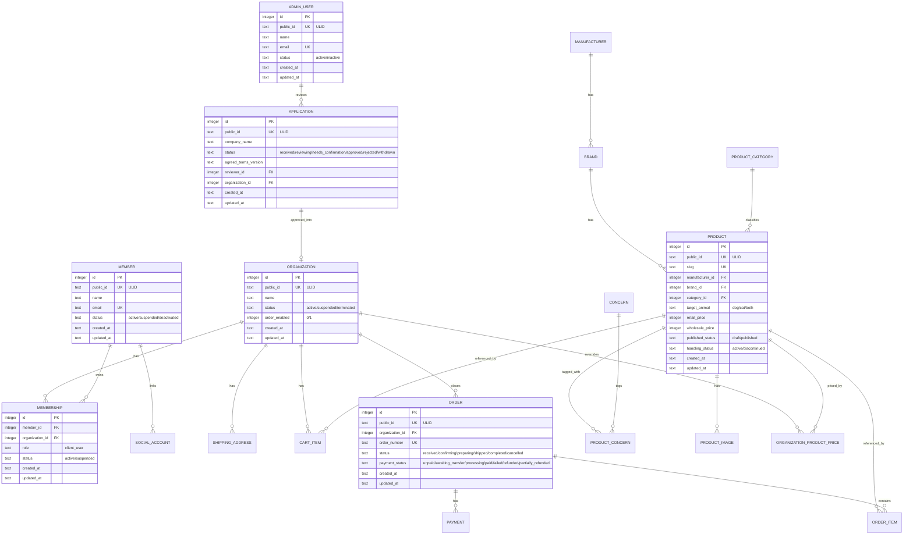

# 07-database-schema.md — データベース物理設計

## このセクションの目的

PRD-02（論理設計）を受けた物理 DB 設計。**AdminUser（`apps/admin`）標準テーブルと、Member（`apps/public`）・Organization を軸にした卸売サイト固有テーブル（商品カタログ・新規取引申請・発注）の並列構造** を提供する。本プロジェクトはチャット・AI 機能を採用しないため（DEV-01 §0、PRD-05）、`ai_jobs` 等のテーブルは持たない。商品選び診断もテーブルを持たない（§7-3）。

## 0-H. ハイブリッド編集ガイド（要点）

- 推奨モード: Hybrid（AI 下書き + Tech Lead 確定）
- 人間確認必須: 制約の妥当性、書き込み負荷影響、無停止変更可否

---

## 1. 全体方針

- **DBMS**: Cloudflare D1（SQLite 互換。バインディング名は必ず `DB`。選定理由は DEV-01 §1 参照）
- **文字コード**: SQLite は UTF-8 固定
- **PK**: `INTEGER PRIMARY KEY AUTOINCREMENT`（SQLite の rowid エイリアス）
- **外部公開 ID**: `public_id TEXT`（ULID、26 文字）を URL・API に露出するテーブルにのみ付与
- **型の扱い**: SQLite は動的型付け（type affinity）。列は `TEXT` で宣言し、想定される最大長は備考欄にコメントとして残す。真偽値は `INTEGER`（0/1）、日時は `TEXT`（ISO 8601）で統一する
- **タイムスタンプ**: `created_at` / `updated_at` を全テーブルに。`created_at` は `DEFAULT (strftime('%Y-%m-%dT%H:%M:%fZ','now'))` で付与し、`updated_at` は Service 層が更新時に明示的にセットする。追記型テーブル（`payment_event_logs` 等）は `created_at` のみで可
- **テナント境界**: 発注関連テーブル（`shipping_addresses` / `cart_items` / `orders` / `order_items` / `payments` / `memberships`）にのみ `organization_id` を必須化。商品カタログ系テーブルには付与しない（PRD-02 §2）。唯一の例外は `organization_product_prices`（§6-7）
- **論理削除**: 原則使わない（明示的な `status` / `handling_status` カラムで管理）
- **更新経路のないテーブルを作らない**: テーブルを追加するときは、管理画面（PRD-04 の ADM 画面）かシーダー（§9）のどちらかで更新できることを必ず確認する。運営が更新しないデータは D1 ではなく Content Collections かページ直書きに置く（DEV-06 §1-1 が判断の正本、DEV-01 §3 の禁止リスト最終行）
- **スキーマ管理・ORM**: Drizzle（`drizzle-orm` + `drizzle-kit`、D1/SQLite dialect。決定は DEV-01 §1）。**本書（DEV-07）の Markdown テーブル定義がスキーマの正本**であり、直接 TypeScript の Drizzle スキーマを手書きしない。`schema-build` スキル（`.claude/skills/schema-build/`）が本書の記述から Drizzle スキーマ（`packages/schema/src/schema.ts`）を生成し、そこから `drizzle-kit generate`（`pnpm db:generate`）が migration SQL（§9）を生成する 2 段階パイプラインとする
- **マイグレーション**: 前方互換優先。`drizzle-kit generate` が生成する migration SQL、無停止で完了できる範囲の ALTER に限定する

---

## 2. ERD（Mermaid）

<!-- ERD:START -->

<!-- ERD:END -->

> **同期ルール**: 上記の `<!-- ERD:START -->` ～ `<!-- ERD:END -->` ブロックは `packages/schema/migrations/` 配下の SQL と完全に対応すること。テーブル追加・カラム変更・リレーション変更があれば AI が両方を同時に更新する。
>
> 商品選び診断は本図に現れない（§7-3）。診断ルールから商品への参照は `products.slug` の文字列一致であり、外部キー制約が存在しないため ERD 上の線にもならない。

---

## 3. テーブル一覧

### 3-1. 認証関連（決定済み — DEV-01 §1・§2、DEV-02 §1-1・§1-2）

**AdminUser と Member は完全に別系統**（別テーブル・別クッキー名・別実装コード）とする（DEV-02 §1-2 の禁止事項）。

| テーブル | 役割 |
| --- | --- |
| `admin_sessions` | `admin_users` 向けセッション管理。`admin_session` クッキーで session token を保持する（DEV-02 §1-1）。列定義は §4-2 |
| `admin_password_reset_tokens` | パスワードリセット（`admin_users` 向け）。トークンは Web Crypto の HMAC 署名（DEV-01 §2、DEV-02 §1-1） |
| `member_sessions` | `members` 向けセッション管理。`member_session` クッキーで session token を保持し、`admin_sessions` とテーブル・クッキー名・実装コードを一切共有しない（DEV-02 §1-2）。列定義は §5-3 |
| `member_password_reset_tokens` | パスワードリセット（`members` 向け）。同様に別テーブル |

### 3-2. AdminUser 標準テーブル

| テーブル | 役割 | 公開 ID |
| --- | --- | :---: |
| `admin_users` | 管理画面ログインユーザー（ロール区分なし・単一種別 — GOV-01 D-014） | ○ |

### 3-3. 監査ログ

| テーブル | 役割 | 公開 ID |
| --- | --- | :---: |
| `activity_log` | 管理操作の監査ログ（自前テーブル — §8-1）。`organization_id` は商品カタログ操作等では NULL |  |

### 3-4. 新規取引申請テーブル

| テーブル | 役割 | 公開 ID |
| --- | --- | :---: |
| `applications` | 新規取引申請（承認前は Organization ではない） | ○ |

### 3-5. Organization・Member テーブル

| テーブル | 役割 | 公開 ID |
| --- | --- | :---: |
| `organizations` | 承認済み取引先 | ○ |
| `members` | `apps/public` のマイページログインユーザー | ○ |
| `memberships` | Member × Organization の所属 |  |
| `social_accounts` | Member の OAuth ログイン方法（LINE / Google / Facebook） |  |
| `shipping_addresses` | 配送先 | ○ |

### 3-6. 商品カタログテーブル（共有マスタ。`organization_id` を持たない）

| テーブル | 役割 | 公開 ID |
| --- | --- | :---: |
| `manufacturers` | メーカー |  |
| `brands` | ブランド |  |
| `product_categories` | 商品カテゴリー |  |
| `concerns` | 対象となる状態・気になる点の分類 |  |
| `products` | 商品 | ○ |
| `product_concerns` | Product × Concern 中間テーブル |  |
| `product_images` | 商品画像（複数枚。Product の `images` 属性の実体。PRD-01 §3-2） |  |

### 3-7. カート・発注・決済テーブル（`organization_id` を持つ）

| テーブル | 役割 | 公開 ID |
| --- | --- | :---: |
| `organization_product_prices` | 取引先別卸価格の上書き（商品カタログ関連で唯一 `organization_id` を持つテーブル。GOV-01 D-009） |  |
| `cart_items` | カート内商品 |  |
| `orders` | 発注（受注） | ○ |
| `order_items` | 発注明細（商品情報スナップショット保持） |  |
| `payments` | 決済記録 |  |
| `payment_event_logs` | 決済 Webhook 冪等性 |  |

### 3-8. お知らせ・お問い合わせテーブル

| テーブル | 役割 | 公開 ID |
| --- | --- | :---: |
| `news` | お知らせ | ○ |
| `inquiries` | お問い合わせ | ○ |

### 3-9. テーブルを持たないコンテンツ

以下は D1 に置かない（DEV-06 §1-1 が正本、GOV-01 D-015 / D-016）。**過去の設計との差分なので、実装時に「テーブルが無い」ことを欠落と誤認しないこと。**

| コンテンツ | 置き場所 |
| --- | --- |
| 商品選び診断のルールセット（質問・選択肢・推奨商品）| `packages/content/diagnosis/*.md`（§7-3） |
| よくある質問（FAQ）| `apps/public/src/pages/faq.astro` に直書き |
| 利用規約・プライバシーポリシー・特商法表示 | 同様にページ直書き（バージョン文字列のみ定数で保持し、`applications.agreed_terms_version` に記録 — §5-1） |

---

## 4. AdminUser 標準テーブル定義

### 4-1. admin_users

| カラム | 型 | NULL | 備考 |
| --- | --- | --- | --- |
| id | INTEGER | NO | PK |
| public_id | TEXT | NO | UNIQUE（ULID） |
| name | TEXT | NO | 最大 255 文字を想定 |
| email | TEXT | NO | UNIQUE |
| password_hash | TEXT | NO | Web Crypto PBKDF2（DEV-01 §2） |
| status | TEXT | NO | active / inactive |
| last_login_at | TEXT | YES | ISO 8601 |
| created_at | TEXT | NO |  |
| updated_at | TEXT | NO |  |

**Index**: UNIQUE(`public_id`), UNIQUE(`email`), `status`

> `role` カラムは持たない（ロール区分なしの単一種別 — GOV-01 D-014、DEV-02 §2-1）。

### 4-2. admin_sessions

| カラム | 型 | NULL | 備考 |
| --- | --- | --- | --- |
| id | INTEGER | NO | PK |
| admin_user_id | INTEGER | NO | FK → admin_users.id |
| session_token | TEXT | NO | UNIQUE。`admin_session` クッキーに保持する値（32 バイトの CSPRNG。無署名 — DEV-02 §1-1） |
| expires_at | TEXT | NO | ISO 8601 |
| created_at | TEXT | NO |  |

**Index**: UNIQUE(`session_token`), `admin_user_id`, `expires_at`

### 4-3. admin_password_reset_tokens

| カラム | 型 | NULL | 備考 |
| --- | --- | --- | --- |
| id | INTEGER | NO | PK |
| admin_user_id | INTEGER | NO | FK → admin_users.id |
| token | TEXT | NO | UNIQUE |
| expires_at | TEXT | NO | 発行から 60 分 |
| used_at | TEXT | YES |  |
| created_at | TEXT | NO |  |

**Index**: UNIQUE(`token`), `admin_user_id`, `expires_at`

### 4-4. activity_log

専用パッケージは使わず、自前スキーマで管理する（DEV-01 §2）。

| カラム | 型 | NULL | 備考 |
| --- | --- | --- | --- |
| id | INTEGER | NO | PK |
| log_name | TEXT | YES | ログ種別（application / order / organization 等） |
| description | TEXT | NO | 操作の説明 |
| subject_type | TEXT | YES | 操作対象の種別 |
| subject_id | INTEGER | YES | 操作対象の ID |
| event | TEXT | YES | application.approved / order.cancelled 等 |
| causer_type | TEXT | YES | 操作者の種別（`AdminUser` / `Member`） |
| causer_id | INTEGER | YES | 操作者の ID（システム処理時 NULL — DEV-05 §9-1） |
| properties | TEXT | YES | JSON 文字列。変更前後と ip_address / user_agent 等 |
| batch_id | TEXT | YES | 一括操作のグルーピング（UUID） |
| organization_id | INTEGER | YES | 商品カタログ操作等では NULL |
| created_at | TEXT | NO |  |

**Index**: `subject_type, subject_id`、`causer_type, causer_id`、`log_name`、`organization_id`

---

## 5. Member・Organization テーブル定義

### 5-1. applications

| カラム | 型 | NULL | 備考 |
| --- | --- | --- | --- |
| id | INTEGER | NO | PK |
| public_id | TEXT | NO | UNIQUE（ULID） |
| company_name | TEXT | NO |  |
| corporate_number | TEXT | YES | 法人番号 |
| business_type | TEXT | YES | 事業者種別 |
| industry | TEXT | YES | 業種 |
| postal_code | TEXT | NO |  |
| address | TEXT | NO |  |
| representative_name | TEXT | NO |  |
| contact_name | TEXT | NO | 担当者名 |
| contact_department | TEXT | YES |  |
| phone | TEXT | NO |  |
| email | TEXT | NO |  |
| website | TEXT | YES |  |
| sns | TEXT | YES |  |
| has_physical_store | INTEGER | NO | 0/1 DEFAULT 0 |
| planned_sales_channels | TEXT | YES |  |
| desired_products | TEXT | YES |  |
| desired_payment_method | TEXT | YES |  |
| notes | TEXT | YES | 備考・相談内容 |
| agreed_to_terms | INTEGER | NO | 0/1。利用規約・プライバシーポリシー同意 |
| agreed_terms_version | TEXT | NO | 同意した利用規約のバージョン文字列（例 `"2026-09-01"`）|
| status | TEXT | NO | received / reviewing / needs_confirmation / approved / rejected / withdrawn |
| reviewer_id | INTEGER | YES | FK → admin_users.id |
| review_memo | TEXT | YES |  |
| applied_at | TEXT | NO |  |
| reviewed_at | TEXT | YES |  |
| organization_id | INTEGER | YES | FK → organizations.id（承認時に設定） |
| created_at | TEXT | NO |  |
| updated_at | TEXT | NO |  |

**Index**: UNIQUE(`public_id`), `status`, `email`

> `status` の遷移は状態遷移関数経由で行う（DEV-09 参照）。
>
> **`agreed_terms_version` が必要な理由**: 利用規約はページ直書きで管理され（§3-9、DEV-06 §1-1）、DB にレコードが存在しない。`agreed_to_terms` の 0/1 だけでは「いつの版に同意したのか」を後から特定できず、規約改定後に契約成立時点の条項を立証できない。現行バージョンはアプリ側の定数 1 箇所で保持し、申請時にサーバー側で一致を検証してからこの列へ記録する（DEV-04 §6-1、OPS-01 §5）。

### 5-2. organizations

| カラム | 型 | NULL | 備考 |
| --- | --- | --- | --- |
| id | INTEGER | NO | PK |
| public_id | TEXT | NO | UNIQUE（ULID） |
| name | TEXT | NO | 会社名（Application からコピー） |
| status | TEXT | NO | active / suspended / terminated |
| order_enabled | INTEGER | NO | 0/1 DEFAULT 1。発注可否（停止中は 0） |
| billing_postal_code | TEXT | YES |  |
| billing_address | TEXT | YES |  |
| application_id | INTEGER | YES | FK → applications.id（生成元） |
| created_at | TEXT | NO |  |
| updated_at | TEXT | NO |  |

**Index**: UNIQUE(`public_id`), `status`

### 5-3. members

| カラム | 型 | NULL | 備考 |
| --- | --- | --- | --- |
| id | INTEGER | NO | PK |
| public_id | TEXT | NO | UNIQUE（ULID） |
| name | TEXT | NO |  |
| email | TEXT | NO | UNIQUE |
| password_hash | TEXT | YES | Web Crypto PBKDF2。OAuth のみの Member は NULL 許容 |
| phone | TEXT | YES |  |
| status | TEXT | NO | active / suspended / deactivated |
| last_login_at | TEXT | YES |  |
| created_at | TEXT | NO |  |
| updated_at | TEXT | NO |  |

**Index**: UNIQUE(`public_id`), UNIQUE(`email`), `status`

> セッション管理は `member_sessions` を参照（DEV-02 §1-2）。`admin_sessions` と一切共有しない。

**member_sessions**

| カラム | 型 | NULL | 備考 |
| --- | --- | --- | --- |
| id | INTEGER | NO | PK |
| member_id | INTEGER | NO | FK → members.id |
| session_token | TEXT | NO | UNIQUE。`member_session` クッキーに保持する値 |
| expires_at | TEXT | NO |  |
| created_at | TEXT | NO |  |

**Index**: UNIQUE(`session_token`), `member_id`, `expires_at`

**member_password_reset_tokens**

| カラム | 型 | NULL | 備考 |
| --- | --- | --- | --- |
| id | INTEGER | NO | PK |
| member_id | INTEGER | NO | FK → members.id |
| token | TEXT | NO | UNIQUE |
| expires_at | TEXT | NO | 発行から 60 分 |
| used_at | TEXT | YES |  |
| created_at | TEXT | NO |  |

**Index**: UNIQUE(`token`), `member_id`, `expires_at`

### 5-4. social_accounts

| カラム | 型 | NULL | 備考 |
| --- | --- | --- | --- |
| id | INTEGER | NO | PK |
| member_id | INTEGER | NO | FK → members.id |
| provider | TEXT | NO | line / google / facebook |
| provider_user_id | TEXT | NO |  |
| created_at | TEXT | NO |  |
| updated_at | TEXT | NO |  |

**Index**: UNIQUE(`provider`, `provider_user_id`), `member_id`

### 5-5. memberships

| カラム | 型 | NULL | 備考 |
| --- | --- | --- | --- |
| id | INTEGER | NO | PK |
| member_id | INTEGER | NO | FK → members.id |
| organization_id | INTEGER | NO | FK → organizations.id |
| role | TEXT | NO | `client_user`（DEV-02 §2-2 の拡張余地あり） |
| status | TEXT | NO | active / suspended |
| joined_at | TEXT | NO |  |
| left_at | TEXT | YES | 退会時の記録 |
| created_at | TEXT | NO |  |
| updated_at | TEXT | NO |  |

**Index**: UNIQUE(`member_id`, `organization_id`), `organization_id`

### 5-6. shipping_addresses

| カラム | 型 | NULL | 備考 |
| --- | --- | --- | --- |
| id | INTEGER | NO | PK |
| public_id | TEXT | NO | UNIQUE（ULID） |
| organization_id | INTEGER | NO | FK → organizations.id |
| recipient_name | TEXT | NO |  |
| postal_code | TEXT | NO |  |
| address | TEXT | NO |  |
| phone | TEXT | NO |  |
| is_default | INTEGER | NO | 0/1 DEFAULT 0 |
| created_at | TEXT | NO |  |
| updated_at | TEXT | NO |  |

**Index**: UNIQUE(`public_id`), `organization_id`

---

## 6. 商品カタログ・カート・発注テーブル定義

### 6-1. manufacturers

| カラム | 型 | NULL | 備考 |
| --- | --- | --- | --- |
| id | INTEGER | NO | PK |
| name | TEXT | NO |  |
| description | TEXT | YES |  |
| logo_key | TEXT | YES | R2 オブジェクトキー |
| created_at | TEXT | NO |  |
| updated_at | TEXT | NO |  |

**Index**: `name`

### 6-2. brands

| カラム | 型 | NULL | 備考 |
| --- | --- | --- | --- |
| id | INTEGER | NO | PK |
| manufacturer_id | INTEGER | YES | FK → manufacturers.id（必須ではない。PRD-01 §3-2） |
| name | TEXT | NO | 例: 「Uchinoko」 |
| description | TEXT | YES |  |
| created_at | TEXT | NO |  |
| updated_at | TEXT | NO |  |

**Index**: `manufacturer_id`, `name`

### 6-3. product_categories / concerns

| カラム | 型 | NULL | 備考 |
| --- | --- | --- | --- |
| id | INTEGER | NO | PK |
| name | TEXT | NO |  |
| slug | TEXT | NO | UNIQUE |
| display_order | INTEGER | NO | DEFAULT 0 |
| created_at | TEXT | NO |  |
| updated_at | TEXT | NO |  |

> `concerns` テーブルも同一カラム構成（対象となる状態・気になる点の分類）。

**Index**: UNIQUE(`slug`), `display_order`

### 6-4. products

| カラム | 型 | NULL | 備考 |
| --- | --- | --- | --- |
| id | INTEGER | NO | PK |
| public_id | TEXT | NO | UNIQUE（ULID） |
| slug | TEXT | NO | UNIQUE（URL 用。診断ルールからの参照キーでもある — §7-3） |
| manufacturer_id | INTEGER | NO | FK → manufacturers.id |
| brand_id | INTEGER | YES | FK → brands.id |
| category_id | INTEGER | NO | FK → product_categories.id |
| target_animal | TEXT | NO | dog / cat / both |
| name | TEXT | NO |  |
| description | TEXT | YES |  |
| features | TEXT | YES | 商品の特徴 |
| ingredients | TEXT | YES | 原材料 |
| content_amount | TEXT | YES | 内容量 |
| usage_instructions | TEXT | YES | 使用方法・与え方 |
| precautions | TEXT | YES | 使用上の注意 |
| retail_price | INTEGER | NO | 希望小売価格（税抜・円） |
| wholesale_price | INTEGER | NO | 標準卸価格（税抜・円。BIZ-03 §2-2） |
| tax_category | TEXT | NO | standard / reduced 等 |
| order_unit | TEXT | YES | 発注単位（例: 1 箱 = 12 個入） |
| sku | TEXT | YES | UNIQUE |
| published_status | TEXT | NO | draft / published |
| handling_status | TEXT | NO | active / discontinued（削除せず状態管理。PRD-03 F-06-03） |
| display_order | INTEGER | NO | DEFAULT 0 |
| created_at | TEXT | NO |  |
| updated_at | TEXT | NO |  |

**Index**: UNIQUE(`public_id`), UNIQUE(`slug`), UNIQUE(`sku`), `manufacturer_id`, `brand_id`, `category_id`, `published_status`, `handling_status`, `target_animal`

> **`slug` は変更しない前提で運用する。** 診断ルール（`packages/content`）が `slug` で商品を参照しており、DB の外部キー制約では守られない。変更すると診断の推奨商品が解決できなくなるため、管理画面では変更を禁止するか警告を出す（DEV-04 §5-2、DEV-06 §1-1）。

### 6-5. product_concerns

| カラム | 型 | NULL | 備考 |
| --- | --- | --- | --- |
| product_id | INTEGER | NO | FK → products.id |
| concern_id | INTEGER | NO | FK → concerns.id |

**PK**: (`product_id`, `concern_id`)
**Index**: `concern_id`

### 6-6. product_images（商品画像。PRD-03 F-06-04）

| カラム | 型 | NULL | 備考 |
| --- | --- | --- | --- |
| id | INTEGER | NO | PK |
| product_id | INTEGER | NO | FK → products.id |
| key | TEXT | NO | R2 オブジェクトキー。公開 URL は署名付きで発行（DEV-01 §8） |
| display_order | INTEGER | NO | DEFAULT 0 |
| created_at | TEXT | NO |  |

**Index**: `product_id, display_order`

> 追加は R2 に書いてから INSERT、削除は R2 を消してから DELETE の順で行う（DEV-05 §3）。行がバイトの無いキーを指すと画面が壊れる。

### 6-7. organization_product_prices

取引先ごとの個別卸価格の上書き（GOV-01 D-009）。「商品カタログは共有・`organization_id` を持たない」という原則の唯一の例外（§1・PRD-02 §2）。

| カラム | 型 | NULL | 備考 |
| --- | --- | --- | --- |
| id | INTEGER | NO | PK |
| organization_id | INTEGER | NO | FK → organizations.id |
| product_id | INTEGER | NO | FK → products.id |
| wholesale_price | INTEGER | NO | この取引先に適用する卸価格（税抜・円） |
| created_at | TEXT | NO |  |
| updated_at | TEXT | NO |  |

**Index**: UNIQUE(`organization_id`, `product_id`), `product_id`

> 価格解決ロジック（Service 層）: 発注時の単価は「該当 `organization_id` + `product_id` の行があればその `wholesale_price`、無ければ `products.wholesale_price`」の順で解決する（DEV-05 参照、BIZ-03 §2-2）。この分岐は単体テストの必須項目（DEV-03 §3-5）。

### 6-8. cart_items

| カラム | 型 | NULL | 備考 |
| --- | --- | --- | --- |
| id | INTEGER | NO | PK |
| organization_id | INTEGER | NO | FK → organizations.id |
| member_id | INTEGER | NO | FK → members.id |
| product_id | INTEGER | NO | FK → products.id |
| quantity | INTEGER | NO |  |
| created_at | TEXT | NO |  |
| updated_at | TEXT | NO |  |

**Index**: UNIQUE(`organization_id`, `member_id`, `product_id`), `organization_id`

### 6-9. orders

| カラム | 型 | NULL | 備考 |
| --- | --- | --- | --- |
| id | INTEGER | NO | PK |
| public_id | TEXT | NO | UNIQUE（ULID） |
| organization_id | INTEGER | NO | FK → organizations.id |
| member_id | INTEGER | NO | FK → members.id（発注担当者） |
| order_number | TEXT | NO | UNIQUE。採番方式は Service 実装時に確定 |
| status | TEXT | NO | received / confirming / preparing / shipped / completed / cancelled |
| payment_status | TEXT | NO | unpaid / awaiting_transfer / processing / paid / failed / refunded / partially_refunded |
| subtotal | INTEGER | NO | 税抜小計（円） |
| tax | INTEGER | NO |  |
| shipping_fee | INTEGER | NO |  |
| total | INTEGER | NO | 税込合計 |
| shipping_address_snapshot | TEXT | NO | JSON 文字列。発注時点の配送先スナップショット |
| payment_method | TEXT | NO | credit_card / bank_transfer |
| notes | TEXT | YES |  |
| placed_at | TEXT | NO |  |
| created_at | TEXT | NO |  |
| updated_at | TEXT | NO |  |

**Index**: UNIQUE(`public_id`), UNIQUE(`order_number`), `organization_id, status`, `payment_status`

### 6-10. order_items

| カラム | 型 | NULL | 備考 |
| --- | --- | --- | --- |
| id | INTEGER | NO | PK |
| order_id | INTEGER | NO | FK → orders.id |
| product_id | INTEGER | YES | FK → products.id（参照のみ。商品削除後も NULL のまま残す） |
| product_name_snapshot | TEXT | NO | 発注時点の商品名（PRD-02 §8） |
| product_code_snapshot | TEXT | YES | 発注時点の商品コード / SKU |
| unit_price_snapshot | INTEGER | NO | 発注時点の卸単価 |
| tax_rate_snapshot | TEXT | NO | 発注時点の税率（例: "0.08"） |
| quantity | INTEGER | NO |  |
| subtotal | INTEGER | NO |  |
| created_at | TEXT | NO |  |
| updated_at | TEXT | NO |  |

**Index**: `order_id`, `product_id`

### 6-11. payments

| カラム | 型 | NULL | 備考 |
| --- | --- | --- | --- |
| id | INTEGER | NO | PK |
| organization_id | INTEGER | NO | FK → organizations.id |
| order_id | INTEGER | NO | FK → orders.id |
| method | TEXT | NO | credit_card / bank_transfer |
| status | TEXT | NO | unpaid / awaiting_transfer / processing / paid / failed / refunded / partially_refunded |
| amount | INTEGER | NO | 税込円 |
| stripe_payment_intent_id | TEXT | YES | カード決済時（DEV-10 §2） |
| paid_at | TEXT | YES |  |
| refunded_at | TEXT | YES |  |
| created_at | TEXT | NO |  |
| updated_at | TEXT | NO |  |

**Index**: `organization_id`, `order_id`, `status`

### 6-12. payment_event_logs

| カラム | 型 | NULL | 備考 |
| --- | --- | --- | --- |
| id | INTEGER | NO | PK |
| provider_event_id | TEXT | NO | UNIQUE（決済サービス側のイベント ID） |
| event_type | TEXT | NO |  |
| payload | TEXT | NO | JSON 文字列 |
| processed_at | TEXT | YES |  |
| created_at | TEXT | NO |  |

**Index**: UNIQUE(`provider_event_id`)

> UNIQUE 制約が Webhook の冪等性の実体である（DEV-04 §5-6、DEV-10 §2）。同じイベントが再送されても 2 度目の INSERT が失敗するため、二重に決済状態を更新しない。

---

## 7. お知らせ・お問い合わせテーブル定義

### 7-1. news

| カラム | 型 | NULL | 備考 |
| --- | --- | --- | --- |
| id | INTEGER | NO | PK |
| public_id | TEXT | NO | UNIQUE（ULID） |
| slug | TEXT | NO | UNIQUE |
| title | TEXT | NO |  |
| body | TEXT | NO | 運営が管理画面から入力する。表示時はサニタイズを経由する（DEV-02 §6） |
| visibility | TEXT | NO | public / client_only |
| status | TEXT | NO | draft / published |
| published_at | TEXT | YES |  |
| published_until | TEXT | YES |  |
| created_at | TEXT | NO |  |
| updated_at | TEXT | NO |  |

**Index**: UNIQUE(`public_id`), UNIQUE(`slug`), `visibility`, `status`, `published_at`

> お知らせを D1 に置くのは、運営が日常的に更新し管理画面（ADM-19〜21）を持つため（DEV-06 §1-1）。`visibility` による出し分けはリクエストごとのセッション検証で行うため、この一覧は静的化できない（PRD-02 §9）。

### 7-2. inquiries

| カラム | 型 | NULL | 備考 |
| --- | --- | --- | --- |
| id | INTEGER | NO | PK |
| public_id | TEXT | NO | UNIQUE（ULID） |
| company_name | TEXT | YES |  |
| name | TEXT | NO |  |
| email | TEXT | NO |  |
| phone | TEXT | YES |  |
| inquiry_type | TEXT | YES |  |
| content | TEXT | NO |  |
| status | TEXT | NO | new / in_progress / resolved |
| assignee_id | INTEGER | YES | FK → admin_users.id |
| memo | TEXT | YES |  |
| created_at | TEXT | NO |  |
| updated_at | TEXT | NO |  |

**Index**: UNIQUE(`public_id`), `status`, `assignee_id`

### 7-3. 商品選び診断（テーブルを持たない）

**診断は D1 テーブルを持たない**（GOV-01 D-015）。質問・選択肢・推奨商品のマッピングは `packages/content/diagnosis/*.md` の frontmatter で管理し、`packages/content/src/schema.ts` の Zod スキーマで検証する（DEV-06 §1-1、PRD-01 §1-5）。

当初の設計には `diagnosis_sets` / `diagnosis_questions` / `diagnosis_choices` / `diagnosis_rules` の 4 テーブルがあったが、**対応する管理画面が存在せず、テーブルはあるのに誰も更新できない状態だった**ため設けないことにした。診断ルールの更新は開発者のコミットとデプロイで行う。

D1 に残るのは推奨結果の解決先（`products`）だけで、参照は `products.slug` の文字列一致である。外部キー制約が無いため、slug の変更・商品の非公開化に自動で追従しない（§6-4 の注記、DEV-03 §3-5 のテスト観点）。

---

## 8. インデックス設計方針

| 区分 | 方針 |
| --- | --- |
| 必須 | 外部キー全カラム、`public_id`、発注関連テーブルの `organization_id`、`status` |
| テナント分離 | 発注関連テーブルは `organization_id` を先頭に配置した複合インデックスを基本 |
| 複合インデックス | クエリパターンを `EXPLAIN QUERY PLAN` で確認しながら追加 |
| 全文検索 | D1 の FTS5 virtual table を第一候補とする（DEV-01 §2）。対応状況は導入時に要確認。自前の `LIKE` 全文検索実装は避ける |

### 8-1. 標準命名規則

- `idx_<table>_<column>` ：単一カラム
- `idx_<table>_<col1>_<col2>` ：複合カラム
- `uq_<table>_<column>` ：UNIQUE
- 外部キーは SQLite の `FOREIGN KEY` 制約として定義（D1 は既定で外部キー制約が有効）

---

## 9. マイグレーション運用

| 項目 | 方針 |
| --- | --- |
| ツール | 手書きの migration SQL は作らない。**本書（DEV-07）のテーブル定義が正本** → `schema-build` スキルが Drizzle スキーマ（`packages/schema/src/schema.ts`）を生成 → `pnpm db:generate`（`drizzle-kit generate`）が migration SQL（`packages/schema/migrations/`）を生成 → `pnpm db:migrate` で適用する 3 段階のパイプライン |
| 実行元 | `apps/admin` からのみ実行する（`CLAUDE.md` の D1/R2 ルール参照）。wrangler の CLI 呼び出しには必ず `--persist-to ../../.wrangler-state` を付ける — 外すと空の別データベースが黙って作られる |
| 命名規則 | `drizzle-kit generate` が振る連番プレフィックス + 内容を表す名前 |
| 環境差分 | 全環境で同一 migration を順に適用（drift 禁止） |
| ロールバック | D1 migrations は前方適用のみ。取り消しが必要な場合は本書のテーブル定義を戻した上で再生成し、打ち消し用の新しい migration を追加する |
| 大きな変更 | ALTER の実行時間を試算し、無停止で完了できる範囲に分割する |
| シーダー | 初期データ（商品カテゴリー・気になる点分類等のマスタ）投入用スクリプトを `apps/admin/scripts/` に用意する。初期 AdminUser の投入は `pnpm --filter admin seed -- --table=admin_users --email=… --password=… --name=…`（`apps/admin/scripts/seed-user.mjs`。Member 側は `--table=members`。値は `=` で渡す — 空白区切りは不可） |

> **`packages/schema/migrations/` はリポジトリに同梱されない生成物である。** 初回 `pnpm db:generate` で作られ、以降はコミットする。2 つの落とし穴：
>
> - `migrations/` を消すなら `.wrangler-state/` も消す。再生成すると新しいランダムなファイル名になり、`d1_migrations` の記録と一致せず次の適用が `table already exists` で失敗する
> - `.sql` だけ消すと `meta/` が残り、drizzle-kit は「変更なし」と判断して何も生成しない

---

## 10. データ保管期限の運用

| データ | 期限 | 削除方式 |
| --- | --- | --- |
| Application（否認・取消） | 1 年 | 日次バッチ（Cron Triggers）で物理削除 |
| Organization（terminated） | 取引終了後 1 年 | 日次バッチで物理削除 |
| Order / OrderItem / Payment | 契約終了後 5 年（`[Assumed]`。PRD-02 §8） | 保存期間経過後に検討 |
| 商品カタログ（Product 等） | 取扱終了後も参照保持 | 物理削除しない（`handling_status` で管理） |
| 監査ログ（activity_log） | 永続 | 削除不可 |
| お問い合わせ（Inquiry） | 対応完了後 1 年 | 日次バッチで物理削除 |
| admin_sessions / member_sessions（期限切れ） | 有効期限切れ後速やかに | 日次バッチで物理削除。ログアウト・強制失効は即時の行削除で対応 |

> 診断ルール・FAQ・法務ページの文面は DB に存在しないため、この表の対象外（履歴は Git が持つ — PRD-02 §8）。

---

## 11. D1 アクセス規約

- ORM は Drizzle。全クエリは Drizzle のクエリビルダ経由で発行し、文字列連結による SQL 構築を禁止する（DEV-01 §3）。特殊なクエリに限り `env.DB.prepare(sql).bind(...)` の直書きを許容するが、プレースホルダ必須
- AdminUser のセッション検証（ロール区分なし — GOV-01 D-014）・Organization スコープ検証は Service 層の共通ヘルパー（`requireSession` / `requireActiveOrganization` 等）で明示的に強制する（DEV-01 §4「認可チェックの徹底」、DEV-02 §3）
- 型安全性は Drizzle が `$inferSelect` / `$inferInsert` から自動導出する TypeScript の型で確保する。入力検証（Zod）も `drizzle-zod` でこの型から導出することを優先する
- JSON 列は `json_extract()` / `json_set()` 等の SQLite JSON1 関数でアクセスする
- 状態（`status`）を持つテーブルは、遷移を単一の遷移関数経由に限定する（DEV-01 §4、DEV-09）
- Drizzle スキーマ（`packages/schema/src/schema.ts`）は本書の生成物であり、直接手で書き換えない

---

## 12. 記入時チェックポイント

- AdminUser 標準テーブル（§3-2）・Organization/Member テーブル（§3-5）・商品カタログ（§3-6）・発注関連（§3-7）が全て揃っているか
- 追加したテーブルに更新経路（管理画面 or シーダー）があるか。無いなら Content Collections かページ直書きに移すべきではないか（§1、§3-9、DEV-06 §1-1）
- 発注関連テーブルに `organization_id` があるか、商品カタログテーブルに誤って付与していないか（唯一の例外は `organization_product_prices`）
- インデックスがテナント境界を考慮した複合構成になっているか
- 状態を持つテーブルの状態値が DEV-09 と整合しているか（applications / organizations / orders / payments 含む）
- マイグレーション運用ルールが OPS-02（運用ハンドブック）と整合しているか
- 型が SQLite の affinity（INTEGER / TEXT）で一貫しているか（MySQL 型の書き残しがないか）
- AdminUser 用（`admin_sessions`）と Member 用（`member_sessions`）のセッション・パスワードリセットテーブルが分離されているか（DEV-02 §1-2 の禁止事項）
- Drizzle スキーマ（`packages/schema/src/schema.ts`）が本書のテーブル定義と完全に一致しているか
