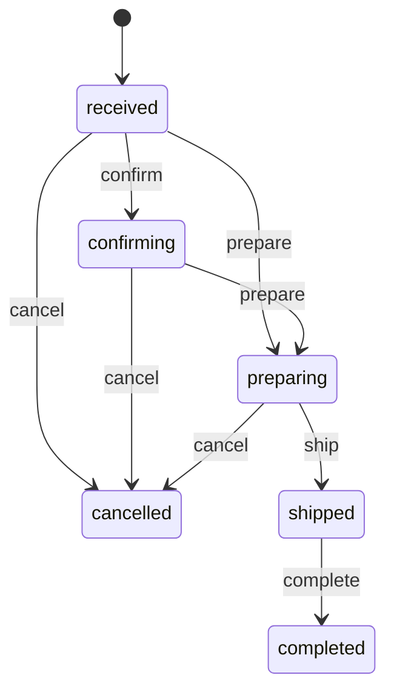

# 09-state-machine-spec.md — 状態遷移仕様

## このセクションの目的

状態を持つエンティティの **状態一覧 / 遷移マトリクス / トリガー / 不正遷移時の挙動** を体系的に定義する。Service 層に集約する状態遷移関数の実装パターンも提供（DEV-01 §4「状態遷移の集約」参照）。

## 0-H. ハイブリッド編集ガイド（要点）

- 推奨モード: Hybrid（AI 整理 + Tech Lead レビュー）
- 人間確認必須: 遷移パスの妥当性、不正遷移時の挙動、監査ログ要件

---

## 1. 状態遷移を持つエンティティ一覧

PRD-01 §7 と整合させる。

| エンティティ | 状態数 | 主な遷移トリガー |
| --- | --- | --- |
| Application | 6 | 申請・審査担当者操作・承認/否認 |
| Organization | 3 | 承認・取引停止/再開・取引終了 |
| Membership | 2 | 初期作成、停止/再開 |
| Member | 3 | 有効化・停止・無効化 |
| Order | 6 | 発注確定・運営操作・出荷・キャンセル |
| Payment | 7 | 決済 Webhook、運営の入金確認操作 |

### 1-1. 状態列を持つが本書の詳細対象としないもの

以下は状態列を持つが、任意の 2 値を往復できる単純な切替であり、前提条件・副作用・不可逆な遷移を持たないため遷移マトリクスを定義しない。**列の値と意味は DEV-07 が正本**で、更新は通常の UPDATE として扱う（状態遷移関数を経由しない — §3 の対象外）。

| エンティティ | 列 | 値 | 根拠 |
| --- | --- | --- | --- |
| AdminUser | `status` | active / inactive | 有効/無効の切替のみ（DEV-07 §4-1）。**Access のポリシーから外す運用と二重管理になる**ため、無効化は両方で行う（GOV-01 D-022）|
| Inquiry | `status` | new / in_progress / resolved | 運営の対応状況を表すだけで、業務上の副作用を持たない（PRD-03 F-09-06、DEV-07 §7-2）|

> Inquiry の `resolved → in_progress`（再オープン）を許すかは未確定（GOV-02 TBD-30）。許さない実装にすると、同一問い合わせの再対応が新規レコード起票になる。

**商品・お知らせ・診断ルールは D1 に状態列を持たない**（GOV-01 D-017・D-018）。公開/非公開は frontmatter の `draft`、取扱終了は `discontinued` で表現し、**「公開」はデプロイと同義**、下書きはブランチ上のコミットで表現する（PRD-01 §7 の注記、DEV-06 §1-1）。したがって状態遷移関数（§3）の対象にもならず、遷移の監査ログも残らない — 履歴は Git が持つ。

---

## 2. エンティティ別の状態遷移定義

### 2-1. Application

#### 2-1-1. 状態一覧

DEV-07 §5-1（`applications.status`）と一致させる。

| 状態 | 説明 |
| --- | --- |
| `received` | 申請受付（初期状態）|
| `reviewing` | 審査中 |
| `needs_confirmation` | 確認・差し戻し（追加情報を申請者に依頼中）|
| `approved` | 承認（Organization + 初期 Member を生成）|
| `rejected` | 否認 |
| `withdrawn` | 申請取消（申請者操作）|

#### 2-1-2. 遷移マトリクス

| 遷移元 → 遷移先 | received | reviewing | needs_confirmation | approved | rejected | withdrawn |
| --- | :---: | :---: | :---: | :---: | :---: | :---: |
| received | — | ✓ | ✗ | ✗ | ✗ | ✓ |
| reviewing | ✗ | — | ✓ | ✓ | ✓ | ✓ |
| needs_confirmation | ✗ | ✓ | — | ✗ | ✓ | ✓ |
| approved | ✗ | ✗ | ✗ | — | ✗ | ✗ |
| rejected | ✗ | ✗ | ✗ | ✗ | — | ✗ |
| withdrawn | ✗ | ✗ | ✗ | ✗ | ✗ | — |

> `approved` / `rejected` / `withdrawn` は終端状態。再申請は新規 Application として扱う。

#### 2-1-3. 遷移トリガー

| 遷移 | トリガー | 実行者 |
| --- | --- | --- |
| received → reviewing | 審査担当者アサイン | AdminUser |
| reviewing → needs_confirmation | 追加確認が必要と判断 | AdminUser |
| needs_confirmation → reviewing | 申請者が追加情報を提出 | 申請者 |
| reviewing / needs_confirmation → approved | 承認決定 | AdminUser |
| reviewing / needs_confirmation → rejected | 否認決定 | AdminUser |
| received / reviewing / needs_confirmation → withdrawn | 申請者による取消 | 申請者 |

#### 2-1-4. 遷移時の副作用

| 遷移 | 副作用 |
| --- | --- |
| → needs_confirmation | 申請者へ追加確認依頼メール送信 |
| → approved | Organization レコード作成、初期 Member 作成、Membership 作成、アカウント有効化案内メール送信、監査ログ記録 |
| → rejected | 申請者へ否認通知メール送信（理由を含む）、監査ログ記録 |
| → withdrawn | 運営へ取消通知（任意）|

> `approved` の副作用は **1 つの `batch()` にまとめる**（`applications` の UPDATE + `organizations` / `members` / `memberships` の INSERT + `activity_log` の INSERT）。途中で失敗して「Organization はできたが所属 Member がいない」状態を作らないため（DEV-05 §3）。メール送信は `batch()` の外、`ctx.waitUntil()` で行う。

---

### 2-2. Organization

#### 2-2-1. 状態一覧

DEV-07 §5-2（`organizations.status`）と一致させる。

| 状態 | 説明 |
| --- | --- |
| `active` | 稼働中。発注可 |
| `suspended` | 取引停止中。ログインは可能だが発注不可 |
| `terminated` | 取引終了。保管期間中（PRD-02 §8）|

#### 2-2-2. 遷移マトリクス

| 遷移元 → 遷移先 | active | suspended | terminated |
| --- | :---: | :---: | :---: |
| active | — | ✓ | ✓ |
| suspended | ✓ | — | ✓ |
| terminated | ✗ | ✗ | — |

> `terminated` は終端状態。再度取引する場合は新規 Application からやり直す。

#### 2-2-3. 遷移トリガー

| 遷移 | トリガー | 実行者 |
| --- | --- | --- |
| （Application 承認）→ active | 新規取引申請の承認（§2-1）| AdminUser |
| active → suspended | 取引停止操作（未入金・規約違反等）| AdminUser |
| suspended → active | 取引再開操作 | AdminUser |
| active / suspended → terminated | 取引終了処理（取引先からの申請 + 運営確認。PRD-03 FG-12）| AdminUser |

#### 2-2-4. 遷移時の副作用

| 遷移 | 副作用 |
| --- | --- |
| → suspended | 所属 Member に通知メール、`order_enabled` を false に、発注操作を UI 上非活性化 |
| → terminated | 全所属 Member の Membership を suspended に、データ保管期限の起点を記録（PRD-02 §8）|
| suspended → active | 所属 Member に通知メール、`order_enabled` を true に |

> `suspended` / `terminated` への遷移は、その Organization に所属する Member の**進行中のセッションを失効させない**（ログイン自体は許可する仕様 — §2-1 の表）。発注の拒否は毎リクエストの `requireActiveOrganization` が担う（DEV-02 §1-3）。セッションを消さない代わりに、この検証を飛ばした経路が 1 つでもあると停止中の取引先が発注できてしまう。

---

### 2-3. Membership

#### 2-3-1. 状態一覧

DEV-07 §5-5（`memberships.status`）と一致させる。

| 状態 | 説明 |
| --- | --- |
| `active` | 所属中 |
| `suspended` | 停止中（担当者退職等。Organization 全体の取引終了とは区別。PRD-03 F-12-04）|

#### 2-3-2. 遷移マトリクス

| 遷移元 → 遷移先 | active | suspended |
| --- | :---: | :---: |
| active | — | ✓ |
| suspended | ✓ | — |

#### 2-3-3. 遷移トリガー

| 遷移 | トリガー | 実行者 |
| --- | --- | --- |
| active → suspended | 担当者退職等による Member 無効化操作 | Member（自社の他担当者。将来 `client_admin` 導入時 `[Open]`）または AdminUser |
| suspended → active | 復職等による再有効化 | 同上 |

> 退会（脱退）は状態遷移ではなく `left_at` の記録で扱う（DEV-07 §5-5）。

---

### 2-4. Member

#### 2-4-1. 状態一覧

DEV-07 §5-3（`members.status`）と一致させる。

| 状態 | 説明 |
| --- | --- |
| `active` | 有効 |
| `suspended` | 停止中 |
| `deactivated` | 無効化（退職等。ログイン不可）|

#### 2-4-2. 遷移マトリクス

| 遷移元 → 遷移先 | active | suspended | deactivated |
| --- | :---: | :---: | :---: |
| active | — | ✓ | ✓ |
| suspended | ✓ | — | ✓ |
| deactivated | ✗ | ✗ | — |

#### 2-4-3. 遷移トリガー

| 遷移 | トリガー | 実行者 |
| --- | --- | --- |
| active → suspended | 不正利用の疑い等 | AdminUser |
| suspended → active | 調査完了・復旧 | AdminUser |
| active / suspended → deactivated | 退職・アカウント削除 | 本人 or AdminUser |

#### 2-4-4. 遷移時の副作用

| 遷移 | 副作用 |
| --- | --- |
| → suspended / deactivated | `member_sessions` の該当行を全削除してログイン中のセッションを即時失効させる（DEV-02 §1-2、DEV-07 §5-3） |

> Member の停止は Organization の停止（§2-2）と扱いが逆で、**セッションを即時削除する**。個人の不正利用や退職が理由であり、その人のアクセスを直ちに止める必要があるため。Organization 側は会社としての取引停止であって担当者個人の排除ではない。この非対称は意図的である。

---

### 2-5. Order

#### 2-5-1. 状態一覧

DEV-07 §6-9（`orders.status`）と一致させる。

| 状態 | 説明 |
| --- | --- |
| `received` | 受付済み（発注確定直後）|
| `confirming` | 確認中（内容・決済等の確認）|
| `preparing` | 出荷準備中 |
| `shipped` | 出荷済み |
| `completed` | 完了 |
| `cancelled` | キャンセル |

#### 2-5-2. 遷移マトリクス

| 遷移元 → 遷移先 | received | confirming | preparing | shipped | completed | cancelled |
| --- | :---: | :---: | :---: | :---: | :---: | :---: |
| received | — | ✓ | ✓ | ✗ | ✗ | ✓ |
| confirming | ✗ | — | ✓ | ✗ | ✗ | ✓ |
| preparing | ✗ | ✗ | — | ✓ | ✗ | ✓ |
| shipped | ✗ | ✗ | ✗ | — | ✓ | ✗ |
| completed | ✗ | ✗ | ✗ | ✗ | — | ✗ |
| cancelled | ✗ | ✗ | ✗ | ✗ | ✗ | — |

> `shipped` 以降のキャンセルは業務上想定しない（返金は Payment 側で `refunded` として処理。§2-6）。これは BIZ-03 §3-3 のキャンセル期限（出荷前まで）と対応する。`completed` / `cancelled` は終端状態。

#### 2-5-3. 遷移トリガー

| 遷移 | トリガー | 実行者 |
| --- | --- | --- |
| （発注確定）→ received | カート確定操作（PRD-03 F-04-08）| Member |
| received → confirming | 運営による内容確認開始 | AdminUser |
| received / confirming → preparing | 出荷準備開始（決済確認後）| AdminUser |
| preparing → shipped | 配送情報登録（PRD-03 F-08-05）| AdminUser |
| shipped → completed | 到着確認・完了処理 | AdminUser |
| received / confirming / preparing → cancelled | キャンセル処理（PRD-03 F-08-06）| AdminUser（取引先からの依頼を受けて）|

#### 2-5-4. 遷移時の副作用

| 遷移 | 副作用 |
| --- | --- |
| → received | 取引先へ発注受付通知、運営へ受注通知（PRD-03 F-04-10, F-04-11）|
| → shipped | 取引先へ出荷完了通知 |
| → cancelled | Payment が `paid` の場合は返金処理を促す（Payment 側で別途 `refunded` へ）、取引先へキャンセル通知 |

---

### 2-6. Payment

#### 2-6-1. 状態一覧

DEV-07 §6-11（`payments.status`）と一致させる。

| 状態 | 説明 |
| --- | --- |
| `unpaid` | 未決済（発注直後、カード決済処理前）|
| `awaiting_transfer` | 入金待ち（銀行振込選択時）|
| `processing` | 決済処理中（カード決済のオーソリ確認中）|
| `paid` | 決済済み |
| `failed` | 決済失敗 |
| `refunded` | 返金済み |
| `partially_refunded` | 一部返金 |

#### 2-6-2. 遷移マトリクス

| 遷移元 → 遷移先 | unpaid | awaiting_transfer | processing | paid | failed | refunded | partially_refunded |
| --- | :---: | :---: | :---: | :---: | :---: | :---: | :---: |
| unpaid | — | ✓ | ✓ | ✗ | ✗ | ✗ | ✗ |
| awaiting_transfer | ✗ | — | ✗ | ✓ | ✗ | ✗ | ✗ |
| processing | ✗ | ✗ | — | ✓ | ✓ | ✗ | ✗ |
| paid | ✗ | ✗ | ✗ | — | ✗ | ✓ | ✓ |
| failed | ✓ | ✓ | ✗ | ✗ | — | ✗ | ✗ |
| refunded | ✗ | ✗ | ✗ | ✗ | ✗ | — | ✗ |
| partially_refunded | ✗ | ✗ | ✗ | ✗ | ✗ | ✓ | — |

> `failed` から `unpaid`/`awaiting_transfer` への遷移は、支払方法を選び直しての再決済を表す。`refunded` は終端状態。

#### 2-6-3. 遷移トリガー（発注時の支払方法選択・決済サービス Webhook ベース）

| 遷移 | トリガー | 実行者 |
| --- | --- | --- |
| （発注確定）→ unpaid | 支払方法にカード決済を選択（Checkout Session 作成直後）| system |
| （発注確定）→ awaiting_transfer | 支払方法に銀行振込を選択 | system |
| unpaid → processing | Checkout 画面への遷移 | system |
| processing → paid | 決済サービスからの決済成功 Webhook | system |
| processing → failed | 決済サービスからの決済失敗 Webhook | system |
| awaiting_transfer → paid | 運営による入金確認操作（PRD-03 F-08-03）| AdminUser |
| paid → refunded / partially_refunded | 返金処理（Order キャンセル等に伴う）| AdminUser |

#### 2-6-4. 副作用

| 遷移 | 副作用 |
| --- | --- |
| → paid | 取引先へ決済完了通知 |
| → failed | 取引先へ決済失敗通知、再決済導線を案内 |
| → refunded / partially_refunded | 取引先へ返金通知 |

> Webhook 起点の遷移（`processing → paid` / `failed`）は **同じイベントが再送される前提**で書く。冪等性は `payment_event_logs.provider_event_id` の UNIQUE 制約で担保し（DEV-07 §6-12）、既に処理済みのイベントは遷移関数を呼ばずに 200 を返す。遷移マトリクスで `paid → paid` が ✗ なので、冪等化を忘れると再送のたびに `InvalidTransitionError` が出て決済サービス側のリトライが延々と失敗する。

---

## 3. Service 層での状態遷移関数実装パターン

状態遷移は DEV-01 §4「状態遷移の集約」の原則に従い、エンティティごとに単一の遷移関数へ集約する。

### 3-1. 設計方針

| 項目 | 方針 |
| --- | --- |
| 配置 | `apps/admin/src/lib/server/services/<entity>.ts`（Order/Payment/Application/Organization）または `apps/public/src/lib/server/services/<entity>.ts`（Member 自身が起こす遷移）に `transition<Entity>(...)` 関数としてエクスポート |
| 責務 | 遷移可否の判定、遷移実行（D1 更新）、副作用の呼び出し |
| 状態の保管 | D1 の `status` 等 `TEXT` カラム。TypeScript 側は文字列リテラルのユニオン型（例 `OrderStatus`）で表現し、Service 層で検証する |
| 不正遷移 | 専用の Error サブクラス（例 `InvalidTransitionError`）を throw する。API Route は 409 `INVALID_STATE_TRANSITION` に変換する（DEV-04 §4） |
| テナントスコープ | Member 側の遷移関数（発注確定等）は `organizationId` を引数に取り、対象レコードが自 Organization のものであることを検証する（PRD-02 §2、DEV-02 §3）。AdminUser 側は全 Organization を横断できるため不要（DEV-02 §2-3） |
| 原子性 | 本体の UPDATE と `activity_log` の INSERT は 1 つの `db.batch()` にまとめる（遷移だけ成功してログが残らない不整合を防ぐ — DEV-05 §3）|
| 副作用 | 遷移関数内から直接関数呼び出し（メール送信等）。レスポンスをブロックする重い副作用は `ctx.waitUntil()` で後処理化する（DEV-01 §4、DEV-05）|

### 3-2. 実装例（Order を例に）

```typescript
// apps/admin/src/lib/server/services/orders.ts

export type OrderStatus = "received" | "confirming" | "preparing" | "shipped" | "completed" | "cancelled";

const TRANSITIONS: Record<OrderStatus, OrderStatus[]> = {
  received: ["confirming", "preparing", "cancelled"],
  confirming: ["preparing", "cancelled"],
  preparing: ["shipped", "cancelled"],
  shipped: ["completed"],
  completed: [],
  cancelled: [],
};

export class InvalidTransitionError extends Error {
  constructor(entity: string, from: string, to: string) {
    super(`Invalid transition for ${entity}: ${from} -> ${to}`);
  }
}

export async function transitionOrder(db: Db, orderId: number, to: OrderStatus, actorId: number): Promise<void> {
  // AdminUser 操作は全 Organization を横断できるため organizationId の一致検証は不要（DEV-02 §2-3）
  const order = await getOrderById(db, orderId);

  const allowed = TRANSITIONS[order.status] ?? [];
  if (!allowed.includes(to)) {
    throw new InvalidTransitionError("Order", order.status, to);
  }

  const from = order.status;

  // 遷移とログを 1 トランザクションにまとめる（DEV-05 §3）
  await db.batch([
    db.update(orders).set({ status: to, updatedAt: new Date().toISOString() }).where(eq(orders.id, orderId)),
    activityLogInsert(db, { subjectType: "Order", subjectId: orderId, from, to, causerId: actorId, organizationId: order.organizationId }),
  ]);

  if (to === "shipped") {
    await notifyOrderShipped(order, from);
  } else if (to === "cancelled") {
    await notifyOrderCancelled(order, from);
  }
}

export function allowedTransitions(status: OrderStatus): OrderStatus[] {
  return TRANSITIONS[status] ?? [];
}
```

> Member 自身が起こす遷移（例: 発注確定 → `received`）は `apps/public` の Service に置き、呼び出し元 API Route が `requireActiveOrganization(session)`（DEV-02 §3-1）で Organization スコープを検証済みであることを前提とする。`actorId` は監査ログ（§3-4）に記録する操作者の `admin_users.id` または `members.id`。
>
> D1 アクセスは Drizzle のクエリビルダ経由に統一する（DEV-01 §3、DEV-07 §11）。上例の `db` は `@app/schema/client` の `createDb(env.DB)` で得たハンドル。

### 3-3. API Route からの呼び出し

`apps/admin` はサブドメインに丸ごと載るため、パスに `/admin` セグメントは付かない（DEV-04 §1-1）。

```typescript
// apps/admin/src/pages/api/v1/orders/[id].ts
import type { APIContext } from "astro";
import { env } from "cloudflare:workers";
import { createDb } from "@app/schema/client";
import { transitionOrder } from "../../../../lib/server/services/orders";

export async function PATCH({ params, request, cookies }: APIContext): Promise<Response> {
  const db = createDb(env.DB);
  const admin = await requireAdminUser(context); // Access JWT 検証済み（ロール区分なし — GOV-01 D-014・D-022）
  const order = await getOrderByPublicId(db, params.id!); // URL キーは public_id（DEV-07 §1）
  const { status } = await request.json();
  await transitionOrder(db, order.id, status, session.adminUserId);
  return new Response(null, { status: 204 });
}
```

> 遷移関数が投げる `InvalidTransitionError` は共通のエラー変換（`toErrorResponse`）で 409 `INVALID_STATE_TRANSITION` になる（DEV-04 §3-3・§4）。API Route 側で個別に catch して整形しない。

### 3-4. 監査ログとの連携

状態遷移は監査ログの必須記録操作（DEV-05 §9-1）。専用パッケージは使わず、遷移関数内から `activity_log` テーブル（DEV-01 §2 / DEV-07 §4-4）へ INSERT する。§3-2 のとおり本体の UPDATE と同じ `batch()` に含める。

記録する内容：

| 列 | 値 |
| --- | --- |
| `log_name` | エンティティ種別（`order` / `application` / `organization` 等） |
| `event` | `<entity>.status_changed`（例 `order.status_changed`） |
| `subject_type` / `subject_id` | 遷移対象のエンティティと ID |
| `causer_type` / `causer_id` | `AdminUser` / `Member` と その ID。system 起点（決済 Webhook・定期バッチ）は **NULL** とし、`properties.source` に `system` を入れる（DEV-05 §9-1。「system ユーザー」を発明しない） |
| `properties` | `{ "old": { "status": from }, "attributes": { "status": to } }` |
| `organization_id` | 発注関連は対象の `organization_id`。取引先に紐づかない操作（問い合わせ対応等）は NULL |

---

## 4. UI 表示

### 4-1. 状態バッジの標準色

| 状態カテゴリ | 色 | アイコン例 |
| --- | --- | --- |
| Active / Approved / Paid / Completed | 緑 | check-circle |
| Reviewing / Confirming / Awaiting Transfer / Preparing | 黄 | clock |
| Suspended / Needs Confirmation | オレンジ | exclamation-triangle |
| Terminated / Withdrawn | グレー | archive-box |
| Rejected / Cancelled / Failed | 赤 | x-circle |
| Refunded / Partially Refunded | 青 | arrow-uturn-left |

色だけで状態を表現せず、アイコン + 色 + テキストの 3 要素で示す（PRD-04 §7、DEV-06 §9）。

### 4-2. 状態遷移ボタンの表示

遷移可否の判定はコンポーネント側で個別実装せず、§3-2 の `allowedTransitions()` の結果を Astro ページ（または API Route）側で取得し、Svelte アイランドに props として渡して描画する。

```svelte
<!-- Svelte island: 許可された遷移のみボタン表示 -->
<script lang="ts">
  import type { OrderStatus } from "../lib/server/services/orders";

  let { allowedTransitions, onSelect }: { allowedTransitions: OrderStatus[]; onSelect: (status: OrderStatus) => void } = $props();
</script>

{#each allowedTransitions as nextStatus}
  <button onclick={() => onSelect(nextStatus)}>{nextStatus}</button>
{/each}
```

遷移の確認は共通の確認モーダルに集約する（ブラウザ標準ダイアログ `confirm()` は使わない — DEV-01 §3 / DEV-06 §5）。管理画面では shadcn-svelte の `AlertDialog` 等、標準の確認 UI コンポーネントを使う（`npx shadcn-svelte add alert-dialog`）。

```svelte
<script lang="ts">
  import * as AlertDialog from "$lib/components/ui/alert-dialog";
  import type { OrderStatus } from "../../lib/server/services/orders";

  let { orderId }: { orderId: string } = $props();
  let pendingStatus: OrderStatus | null = $state(null);

  async function applyTransition(): Promise<void> {
    if (!pendingStatus) return;
    await fetch(`/api/v1/orders/${orderId}`, {
      method: "PATCH",
      body: JSON.stringify({ status: pendingStatus }),
    });
    pendingStatus = null;
  }
</script>

<AlertDialog.Root open={pendingStatus !== null}>
  <AlertDialog.Content>
    <AlertDialog.Title>状態を変更しますか？</AlertDialog.Title>
    <AlertDialog.Action onclick={applyTransition}>変更する</AlertDialog.Action>
  </AlertDialog.Content>
</AlertDialog.Root>
```

> UI 側で遷移ボタンを絞るのは UX のためであり、認可でも整合性の担保でもない。サーバー側の遷移関数が同じ判定を必ず行う（§3-2）。

---

## 5. テスト戦略

テストツールは Vitest に確定済み（DEV-01 §1）。「全ての状態遷移パターンにテストがあること」を目標として維持する（DEV-03 §3-5）。

### 5-1. Unit Test

```typescript
import { describe, it, expect, vi } from "vitest";
import { transitionOrder, InvalidTransitionError } from "../../lib/server/services/orders";

it("allows received to preparing", async () => {
  const order = await createTestOrder({ status: "received" });

  await transitionOrder(db, order.id, "preparing", actorId);

  const updated = await getOrderById(db, order.id);
  expect(updated.status).toBe("preparing");
});

it("rejects shipped to cancelled", async () => {
  const order = await createTestOrder({ status: "shipped" });

  await expect(transitionOrder(db, order.id, "cancelled", actorId)).rejects.toThrow(InvalidTransitionError);
});

it("calls the shipped side-effect on shipped transition", async () => {
  const order = await createTestOrder({ status: "preparing" });
  const spy = vi.spyOn(notifications, "notifyOrderShipped");

  await transitionOrder(db, order.id, "shipped", actorId);

  expect(spy).toHaveBeenCalled();
});

it("writes an activity_log row in the same transaction", async () => {
  const order = await createTestOrder({ status: "received" });

  await transitionOrder(db, order.id, "preparing", actorId);

  const logs = await getActivityLogs(db, { subjectType: "Order", subjectId: order.id });
  expect(logs).toHaveLength(1);
});
```

### 5-2. データセットでマトリクス全網羅

```typescript
it.each([
  ["received", "preparing", true],
  ["received", "shipped", false],
  ["shipped", "completed", true],
  ["completed", "cancelled", false],
  // ... 全組み合わせ
])("transition matrix: %s -> %s (allowed=%s)", async (from, to, allowed) => {
  const order = await createTestOrder({ status: from as OrderStatus });

  if (allowed) {
    await expect(transitionOrder(db, order.id, to as OrderStatus, actorId)).resolves.not.toThrow();
  } else {
    await expect(transitionOrder(db, order.id, to as OrderStatus, actorId)).rejects.toThrow(InvalidTransitionError);
  }
});
```

### 5-3. 決済 Webhook の冪等性

同じ `provider_event_id` を 2 回投げて、2 回目が遷移関数を呼ばずに 200 を返すことを検証する（§2-6-4）。これを落とすと本番で決済サービスのリトライが失敗し続ける。

---

## 6. 状態遷移の可視化

### 6-1. Mermaid 図の標準形（Order の例）



### 6-2. ドキュメント記載順序

各エンティティについて、以下の順序で記載：

1. 状態一覧表
2. 遷移マトリクス表
3. 遷移トリガー（操作主体）
4. 副作用（イベント・通知）
5. Mermaid 状態遷移図（必要に応じて）

---

## 7. 記入時チェックポイント

- 状態を持つエンティティが PRD-01 §7 と整合しているか
- 各エンティティの状態値が DEV-07 の `status` カラム定義（applications / organizations / orders / payments 等）と一致しているか
- 遷移マトリクスで「不可能な遷移」が明示されているか
- 遷移トリガーが明確か（system / Member / AdminUser / Webhook）
- 副作用が網羅されているか（メール通知、関連エンティティへの影響）
- 監査ログとの連携が組み込まれ、本体の更新と同じ `batch()` に入っているか（§3-1）
- Webhook 起点の遷移が冪等化されているか（§2-6-4、§5-3）
- 状態遷移関数が Service 層に集約され、API Route から呼ばれる構造になっているか
- Organization スコープが必要な遷移関数（Member 側）で `organizationId` の検証が行われているか
- 不正遷移時の挙動（409 `INVALID_STATE_TRANSITION`）が明示されているか
