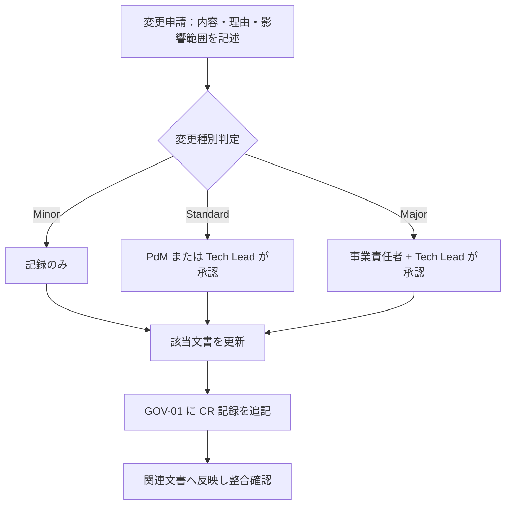

# 01-decision-log.md — 意思決定ログ

## このセクションの目的

重要な意思決定を時系列で記録し、背景と影響範囲を追跡できるようにする。**全フェーズ横断・プロジェクト開始初日から運用する**。

本書に記録するのは **プロジェクト適用後の意思決定のみ**。

## 0-H. ハイブリッド編集ガイド（要点）

- 推奨モード: Human-first または Hybrid
- 人間確認必須: 本当に決定済みか、決定者の明確性、影響範囲の漏れ

---

## 1. 凡例

| 区分 | 内容 |
| --- | --- |
| D-ID | 決定 ID（D-NNN 連番） |
| 日付 | 決定確定日（YYYY-MM-DD） |
| カテゴリ | 事業 / プロダクト / 設計 / 運用 |
| 決定内容 | 確定した方針・選択 |
| 背景 | 議論の発端、選択肢、選定理由 |
| 影響範囲 | 反映が必要な文書・コード |
| 決定者 | 最終承認者 |
| 関連 TBD | 解決された GOV-02 の TBD-ID |

---

## 2. 決定ログ

### D-001：2 リポジトリ構成 → pnpm workspaces + Turborepo モノレポへの移行

| 項目 | 内容 |
| --- | --- |
| 日付 | 2026-08-17 |
| カテゴリ | 設計 |
| 決定内容 | 2 リポジトリ構成（public/admin）・npm から、1 リポジトリ内 `apps/public`/`apps/admin` + `packages/schema` の pnpm workspaces + Turborepo モノレポへ移行（`packages/types` は実際の利用箇所が出てから切り出す方針とし、見送り） |
| 背景 | 複数リポジトリ間の DB スキーマ手動コピーによる同期漏れ事故を構造的に防ぎ、ドキュメントも1箇所に集約して運用コストを下げるため（Cloudflare 公式推奨のモノレポ構成に合わせた）。`packages/config`/`packages/ui` は検討の上、実体のある共有内容がないため見送った。 |
| 影響範囲 | DEV-01 §1/§2/§3・§5, DEV-02, DEV-03, DEV-04, DEV-05, DEV-06, DEV-07 §9, DEV-08 §1/§2, DEV-09, DEV-10, PRD-01 §1-1, PRD-02 §1-3/§3, PRD-04, OPS-02 §3, 00_DEV_GUIDE.md, CLAUDE.md, README.md, 各 skill（schema-build/scaffold/admin-design/public-design/design-review）, ルート設定（package.json / pnpm-workspace.yaml / turbo.json / eslint.config.js / .prettierrc / .devcontainer） |
| 決定者 | Tech Lead |
| 関連 TBD | — |

> 追記（2026-09-09）: その後 `packages/server-kit`（両アプリ共通のサーバー基盤）と `packages/content`（開発者が更新する Markdown）が「2 つ目の利用者が現れた」時点で切り出された（DEV-01 §1、D-015）。`packages/types` は引き続き見送り。

### D-002：CI は GitHub Actions、CD は Cloudflare Workers Builds

| 項目 | 内容 |
| --- | --- |
| 日付 | 2026-08-18 |
| カテゴリ | 運用 |
| 決定内容 | 検査（CI）と デプロイ（CD）で基盤を分ける。CI は GitHub Actions（`.github/workflows/ci.yml`）、CD は Cloudflare Workers Builds の GitHub 連携（リポジトリ内にデプロイ用ワークフローを持たない）。デプロイトリガーは staging ← `dev`、production ← `main`。D1 マイグレーションは Workers Builds が自動実行しないため、`apps/admin` 側の Deploy command に `wrangler d1 migrations apply` を前置する |
| 背景 | DEV-08 §3 で Open だった CI/CD 基盤の決定。Workers Builds が Root directory / Build Watch Paths / Deploy command のカスタマイズ / Worker ごとの GitHub check run を備え、モノレポ 2 Worker 構成の要件（DEV-08 §2 のパスフィルタ）を満たすうえ、Cloudflare API トークンをリポジトリ側で管理せずに済むため CD はそちらに寄せた。一方 PR 時の品質ゲートは Workers Builds の範囲外で、hooks（`.claude/hooks/format-and-check.sh`）は Claude Code のセッション内でしか動かず強制力にならないため、CI は GitHub Actions で別途用意した。ブランチ名は docs が指していた `develop` が実在せず既定が `dev` であったため、docs 側を実態に合わせた |
| 影響範囲 | DEV-08 §2/§3, `.github/workflows/ci.yml`, CLAUDE.md, README.md |
| 決定者 | Tech Lead |
| 関連 TBD | — |

### D-003：技術スタックを社内標準（Astro SSR + Svelte islands + Cloudflare Workers/D1/R2）に確定する

| 項目 | 内容 |
| --- | --- |
| 日付 | 2026-08-18 |
| カテゴリ | 設計 |
| 決定内容 | 本プロジェクトの技術スタックを社内標準（Astro SSR + Svelte islands + Cloudflare Workers/D1/R2、00_README §0-1 のパターン A）に確定する。技術選定の正本は DEV-01 とし、他文書は DEV-01 を参照する |
| 背景 | 本ドメイン（ペット漢方卸売の BtoB 審査制サイト）はマルチテナント SaaS・チャット・AI 機能を必要とせず、コンテンツ公開 + 軽量なトランザクション（申請・発注）に収まるため、パターン A の適用範囲に合致する（00_README §0-1 の自己診断）。本スタックの Astro SSR はリクエストごとの動的レンダリングであり、卸価格をログイン状態で出し分ける要件（INTAKE §4-2）を静的生成 + CDN のような構成分離なしに実現できる |
| 影響範囲 | 00_INTAKE、BIZ-01〜03、PRD-01〜05、DEV-01〜10、OPS-01〜02。DEV-04（API 仕様）は Astro API Route + Svelte island 構成を前提とした REST API 設計とする |
| 決定者 | 事業責任者（s.fuji@naturaling.jp）/ Tech Lead |
| 関連 TBD | — |

### D-004：Member は Organization に Membership 経由で所属する構造とする（テンプレ標準からの拡張）

| 項目 | 内容 |
| --- | --- |
| 日付 | 2026-08-18 |
| カテゴリ | 設計 |
| 決定内容 | 本リポジトリの標準テンプレートは `Member`（`apps/public` のマイページ利用者）を組織を持たない単一種別として扱うのが既定だが、本プロジェクトでは `Member` が `Organization`（取引先会社）に `Membership` を介して所属する構造に拡張する。将来 1 つの Organization に複数 Member が所属できるようスキーマを設計する |
| 背景 | INTAKE §4-6 の顧客発言「会社・取引先情報と、ログインユーザー情報は分けて管理する。将来的に、一つの会社へ複数ユーザーを所属させられる構造とする」に基づく。標準テンプレの Member モデルのみでは表現できないため、明示的な拡張として記録する |
| 影響範囲 | PRD-01 §1-1〜§1-3、PRD-02 §1-3・§2、DEV-02 §1-2・§2-2、DEV-07 §5-5 |
| 決定者 | PdM / Tech Lead |
| 関連 TBD | TBD-05（取引先側管理者権限の要否） |

### D-005：AI（LLM）機能を不採用とし、商品選び診断はルールベースで実装する

| 項目 | 内容 |
| --- | --- |
| 日付 | 2026-08-16 |
| カテゴリ | 設計 |
| 決定内容 | PRD-05 の AI 機能を不採用とする。商品選び診断（PRD-03 F-03-10）は質問回答と条件の照合によるルールベース機能として実装する |
| 背景 | INTAKE に AI・チャット機能への要望がなく、医薬品的な断定表現を避ける必要があるサービス特性上、決定的なルールベースの提案の方が生成 AI の非決定的な出力より適切と判断（PRD-05 §1）|
| 影響範囲 | PRD-05, PRD-03（AI 機能グループなし）, DEV-07（AI 機能テーブル不要）|
| 決定者 | PdM（暫定。事業責任者確認が必要）|
| 関連 TBD | — |

> 本決定は「ルールベースで実装する」までを定めたもので、**ルールの置き場所**（D1 か Content Collections か）は D-015 で決定した。

### D-006：チャット・リアルタイム通信機能を不採用とする

| 項目 | 内容 |
| --- | --- |
| 日付 | 2026-08-16 |
| カテゴリ | 設計 |
| 決定内容 | チャット・リアルタイム通信機能を不採用とする。通知はメール + マイページお知らせで代替する |
| 背景 | INTAKE に要望がなく、新規取引申請の審査・発注ステータス変更は日単位のリードタイムでも業務上問題ないため（BIZ-02 KPI-03）|
| 影響範囲 | PRD-03（チャット機能グループなし）, DEV-07（チャット関連テーブル不要）|
| 決定者 | PdM（暫定）|
| 関連 TBD | — |

### D-007：商品カタログはテナント境界（organization_id）の対象外とする

| 項目 | 内容 |
| --- | --- |
| 日付 | 2026-08-16 |
| カテゴリ | 設計 |
| 決定内容 | Manufacturer / Brand / ProductCategory / Concern / Product 等の商品カタログは運営が一元管理する共有データとし、`organization_id` を持たせない。テナント境界の適用は発注関連データ（ShippingAddress / CartItem / Order / OrderItem / Payment / Membership）に限定する |
| 背景 | 本プロジェクトの商品カタログは全取引先共通であり、標準テンプレートの単一運営前提をそのまま適用すると実態と乖離するため（PRD-01 §6）|
| 影響範囲 | PRD-01, PRD-02, DEV-02 §3, DEV-07 |
| 決定者 | PdM / Tech Lead（暫定）|
| 関連 TBD | — |

### D-008：ロール構成を AdminUser 1 ロール・Organization 側 1 ロールの最小構成とする

| 項目 | 内容 |
| --- | --- |
| 日付 | 2026-08-16 |
| カテゴリ | 設計 |
| 決定内容 | 運営側は `admin` 1 ロール（テンプレート標準の `editor` は不採用）、Organization 側は `client_user` 1 ロールの最小構成とする |
| 背景 | INTAKE §4-6 の顧客発言に、運営側は「運営管理者」、取引先側はロール区別のない「取引先ユーザー」のみが言及されており、それ以上のロール分割の要望がないため |
| 影響範囲 | PRD-01 §1-2, DEV-02 §2 |
| 決定者 | PdM（暫定）|
| 関連 TBD | TBD-05（取引先側管理者権限の要否）|

> → D-014 で改定（`role` カラム自体を廃止）。

### D-009：卸価格は取引先ごとの個別設定を許容する（標準卸価格 + 上書きテーブル方式）

| 項目 | 内容 |
| --- | --- |
| 日付 | 2026-08-16 |
| カテゴリ | 事業 / 設計 |
| 決定内容 | Product に標準卸価格（`wholesale_price`）を持たせつつ、取引先ごとの個別価格を `organization_product_prices` テーブル（Organization × Product の上書き）で表現する。個別設定が無ければ標準価格を適用する |
| 背景 | 事業責任者ヒアリングにより「個別価格はあり得る」と確認（TBD-02 解決）。掛率計算等の複雑な仕組みではなく、シンプルな価格上書きテーブルで対応する |
| 影響範囲 | BIZ-03 §2-2, PRD-01 §3-2/§6, PRD-02 §2/§6-2, PRD-03 F-03-03/F-04-01/F-07-10, PRD-04 §3-2 ADM-15, DEV-05, DEV-07 §6-7 |
| 決定者 | 事業責任者 |
| 関連 TBD | TBD-02（解決）|

> 価格モデル（標準卸価格 + 個別上書き）はそのままに、**置き場所を D1 から Content Collections へ変更した** — D-019。

### D-010：支払方法はクレジットカード決済・銀行振込のみとし、掛売り（信用取引）は提供しない

| 項目 | 内容 |
| --- | --- |
| 日付 | 2026-08-16 |
| カテゴリ | 事業 |
| 決定内容 | 全取引先が発注ごとにクレジットカード決済または銀行振込のいずれかで支払う。与信管理・請求書発行を前提とした掛売りは提供しない。支払方法は取引先ごとの制限を設けず全社共通とする |
| 背景 | 事業責任者ヒアリングにより確定（TBD-04 の支払方法スコープ部分を解決）。与信管理機能を持たないことで Organization・Order のスキーマと審査フローをシンプルに保てる |
| 影響範囲 | BIZ-03 §4-1, PRD-01（Organization に paymentTerms 属性を持たせない）, PRD-02 §6-1, DEV-07 §5-2（organizations テーブルに支払条件カラムを持たせない）|
| 決定者 | 事業責任者 |
| 関連 TBD | TBD-04（支払方法スコープの部分を解決。銀行口座・振込期限等の運用詳細は TBD-04b として継続）|

### D-011：在庫管理は行わない

| 項目 | 内容 |
| --- | --- |
| 日付 | 2026-08-16 |
| カテゴリ | 事業 |
| 決定内容 | 商品の在庫数管理・欠品表示・取り寄せ・メーカー直送機能は実装しない |
| 背景 | 事業責任者ヒアリングにより確定（TBD-06 解決）。既存の `[Assumed]` 方針がそのまま確定した |
| 影響範囲 | PRD-01, PRD-03 §4-3（除外項目として確定）|
| 決定者 | 事業責任者 |
| 関連 TBD | TBD-06（解決）|

### D-012：全文検索基盤は MVP では導入しない

| 項目 | 内容 |
| --- | --- |
| 日付 | 2026-08-16 |
| カテゴリ | 設計 |
| 決定内容 | 商品点数が数十〜百点規模の間は、D1 クエリベースの検索（キーワード・絞り込み）で開始し、全文検索基盤（D1 FTS5 等、DEV-01 §2）の導入を見送る |
| 背景 | 商品点数の想定規模（PRD-02 §5-1）に対して全文検索基盤の運用コストが見合わないため |
| 影響範囲 | DEV-10 §7-1, PRD-03 F-03-04 |
| 決定者 | Tech Lead（暫定）|
| 関連 TBD | — |

> D-017 により商品が D1 から外れたため、「D1 クエリベースの検索」も成立しない。商品数十〜百点は Content Collections の全件をサーバー側でフィルタして扱う（DEV-06 §1-1）。全文検索基盤を導入しないという結論は変わらない。

### D-013：最低発注条件・送料・キャンセル/返品条件を確定する

| 項目 | 内容 |
| --- | --- |
| 日付 | 2026-08-18 |
| カテゴリ | 事業 |
| 決定内容 | 最低発注金額は税抜 ¥10,000（発注単位の下限は商品ごとの `orderUnit` の倍数のみとし、別途の数量下限は設けない）。送料は全国一律税抜 ¥1,000、発注合計（税抜）¥30,000 以上で無料。税端数処理は税率ごとに 1 回、円未満切り捨て。キャンセルは出荷（`shipped`）前まで可能、出荷後は不可。返品・交換は商品の破損・品質不良・誤配送があった場合のみ、到着後 7 日以内の連絡を条件に受け付け、取引先都合の返品は原則不可 |
| 背景 | TBD-03 は「DB 設計前」に確定が必要な P0 事項だった。一般的な BtoB 卸取引の実務水準（最低発注額での配送コスト吸収、出荷前キャンセルの原則）を踏まえた事業責任者確認前の暫定値として、開発着手を優先し確定した。配送地域・配送会社（TBD-07）は未確定のまま残る |
| 影響範囲 | BIZ-03 §2-3・§3, PRD-03 F-04-04, OPS-01 §4-4 |
| 決定者 | 事業責任者（暫定。開発着手のため確定 — 実装後に正式レビュー推奨）|
| 関連 TBD | TBD-03（解決。配送地域・配送会社は TBD-07 として継続）|

### D-014：AdminUser はロール区分を持たない単一種別とし、`role` カラム・ロール検証を廃止する（D-008 の改定）

| 項目 | 内容 |
| --- | --- |
| 日付 | 2026-08-19 |
| カテゴリ | 設計 |
| 決定内容 | D-008 で「運営側は `admin` 1 ロール」としていた構成をさらに簡素化し、`admin_users` テーブルから `role` カラム自体を廃止する。AdminUser はロール区分を持たない単一種別とし、認可チェックは Service 層のセッション検証（`requireSession`）のみで足りるとする（`requireRole` のようなロール検証関数は不要）。Organization 側（`memberships.role` = `client_user` 1 ロール）は D-008 のまま変更しない |
| 背景 | 運営体制がサポート等の複数ロールを持たない前提であることが確定し、`admin` 固定値 1 種類のみの `role` カラムを持つこと自体が不要な間接層と判断されたため（事業責任者確認） |
| 影響範囲 | PRD-01 §1-2・§3-1, PRD-02 §2-2・§6-1, DEV-01 §1「Permission」・§4「認可チェックの徹底」・§8, DEV-02 §2-1・§3, DEV-04 §2・§5, DEV-05 §5・§12, DEV-06 §3・§13, DEV-07 §3-1・§4-1・§11, DEV-09 §3-3, 品質チェックリスト（DEV-03）, CLAUDE.md |
| 決定者 | 事業責任者（s.fuji@naturaling.jp）|
| 関連 TBD | — |

> 実装上の注意: テンプレート標準の雛形・スキル（`scaffold` — DEV-01 §9）はロールを持つ前提で書かれている。生成物に `requireRole` 等のロール分岐が残っていた場合は削る（DEV-02 §2-1）。シーダーは `apps/admin/scripts/seed-user.mjs`（DEV-07 §9）。

### D-015：商品選び診断のルールを Content Collections で管理し、診断系 4 テーブルを廃止する

| 項目 | 内容 |
| --- | --- |
| 日付 | 2026-09-09 |
| カテゴリ | 設計 |
| 決定内容 | 商品選び診断（PRD-03 F-03-10 / F-03-11）の質問・選択肢・推奨商品マッピングを `packages/content` の Markdown（Content Collections）で管理する。当初検討していた `diagnosis_sets` / `diagnosis_questions` / `diagnosis_choices` / `diagnosis_rules` の 4 テーブルは設けない。推奨商品は `Product.slug` の文字列参照で D1 の商品を引く。診断の「質問セット取得 API」は設けず、ページのビルド時にルールを解決する（回答から推奨商品を解決する `POST /api/v1/diagnosis/result` のみ残す） |
| 背景 | 当初の設計は診断系 4 テーブルを定義していたが、**対応する管理画面が PRD-04 の ADM 一覧に存在せず、テーブルはあるのに誰も更新できない状態だった**。「運営が管理画面から更新するか否か」で置き場所を決める基準（DEV-06 §1-1）に照らすと、診断ルールは開発者が更新するコンテンツであり Content Collections が適切。結果として MVP から 4 テーブルと未設計の管理画面 1 系統が外れ、公開ページの D1 読み取りも減る |
| 影響範囲 | PRD-01 §1-5・§2・§3-2・§5・§6・§7, PRD-02 §1-2・§1-4・§6-2・§7・§8, PRD-03 §1・FG-03・§4-3, PRD-04 §3-1-1・§3-2, PRD-05 §1-1, DEV-01 §1（Content Collections 行の追加）・§3・§8, DEV-02 §3-1・§4, DEV-03 §3-5, DEV-04 §5-8, DEV-05 §1-4, DEV-06 §1-1（正本）, DEV-07 §3-9・§6-4・§7-3, OPS-02 §3-6, GOV-02 TBD-09 |
| 決定者 | PdM |
| 関連 TBD | TBD-09（管理方法の部分を解決。質問項目・判定ルールの中身は未確定のまま継続）|
| 再評価条件 | 運営自身がルールを頻繁に調整したい要望が出た時点で、D1 + 管理画面への移行を再検討する（OPS-02 §3-6・§5）|

> 置き場所は本決定のまま。ただし設問が未確定のため、**診断機能そのものは D-023 で MVP から外し Coming soon 表示とした**。`POST /api/v1/diagnosis/result` も設問確定まで実装しない。

### D-016：FAQ・法務ページはページ直書きとし、規約バージョンを申請時に記録する

| 項目 | 内容 |
| --- | --- |
| 日付 | 2026-09-09 |
| カテゴリ | 設計 / 運用 |
| 決定内容 | よくある質問（SCR-27）・利用規約（SCR-28）・プライバシーポリシー（SCR-29）・特定商取引法に基づく表示（SCR-32）の文面を、Content Collections でも D1 でもなく **Astro ページに直書き**で管理する。管理画面は設けない。あわせて、利用規約の現行バージョンをコード内の定数 1 箇所で保持し、新規取引申請時に `applications.agreed_terms_version` へ記録する（サーバー側で現行バージョンとの一致を検証する） |
| 背景 | いずれも運営が日常的に更新する対象ではなく、ページ数が固定で 1 ファイル 1 ページに収まるため、コレクションを作る必要がない（DEV-06 §1-1）。法務ページは弁護士レビューと 30 日前通知を伴う改定であり（OPS-01 §5-2）、Git のコミット履歴がそのまま改定履歴として機能する点も直書きと相性がよい。一方、規約が DB のレコードとして存在しなくなるため、`agreed_to_terms` の 0/1 だけでは「どの版に同意したか」を立証できない。この欠落を埋めるために `agreed_terms_version` を追加した |
| 影響範囲 | PRD-01 §1-5・§3-2, PRD-02 §1-4・§6-2・§8・§9, PRD-03 §1・F-02-01・F-09-03・§4-3, PRD-04 §3-1-1, DEV-02 §2-3・§8-1, DEV-03 §4, DEV-04 §6-1, DEV-06 §1-1（正本）, DEV-07 §3-9・§5-1, DEV-08 §1-1・§6-2, OPS-01 §1・§5-2・§8, OPS-02 §1-2・§1-3・§3-6, GOV-02 TBD-11・TBD-20・TBD-21 |
| 決定者 | PdM |
| 関連 TBD | TBD-11（文面確定は継続）。TBD-20（運営自身が編集したい要望が出た場合の対応）・TBD-21（既存取引先への再同意の要否）を新規登録 |

### D-017：公開コンテンツを全面的に Content Collections へ移し、商品カタログ系 8 テーブルと管理画面 10 画面を廃止する

| 項目 | 内容 |
| --- | --- |
| 日付 | 2026-09-16 |
| カテゴリ | 設計 |
| 決定内容 | 商品（説明・原材料・使用方法・標準卸価格・発注単位）・メーカー・ブランドを `packages/content` の Markdown で管理する。商品カテゴリー・気になる点（Concern）は分類ラベルのみのため Markdown ではなく TypeScript 定数で持ち、商品側は frontmatter の文字列で参照する。これに伴い `products` / `manufacturers` / `brands` / `product_categories` / `concerns` / `product_concerns` / `product_images` / `organization_product_prices` の 8 テーブルと、ADM-02〜ADM-11 の 10 画面を廃止する |
| 背景 | 商品の登録・改訂を行うのは運営（納品先）ではなく開発者であり、頻度も半年に 1 回程度であることが確認された。「誰が更新するか」で置き場所を決める基準（DEV-06 §1-1）に照らすと D1 + 管理画面を持つ理由がない。D-015（診断ルール）と同じ判断を商品カタログ全体へ広げたものであり、結果として D1 は取引データ（申請・取引先・会員・発注・問い合わせ・監査ログ）のみを保持する。公開ページの D1 読み取りが消えるため Cloudflare の行読み取り課金も減る |
| 影響範囲 | PRD-01 §1-5・§3-2・§6, PRD-02 §1-1〜§1-4・§2, PRD-03 FG-03・FG-06・§4, PRD-04 §3-1-1・§3-2・§4-1, DEV-01 §1・§2, DEV-04 §5-2, DEV-05 §1, DEV-06 §1・§1-1（正本）, DEV-07 §2・§3・§6, DEV-09, OPS-02 §3-6, GOV-02 TBD-20 |
| 決定者 | 事業責任者（s.fuji@naturaling.jp）/ PdM |
| 関連 TBD | TBD-20（対象を商品・お知らせへ拡大して継続） |
| 再評価条件 | 運営自身が商品を追加・改訂したい要望が繰り返し出た時点で、D1 + 管理画面への移行を再検討する |

### D-018：お知らせも Content Collections で管理し、ADM-19〜21 を廃止する

| 項目 | 内容 |
| --- | --- |
| 日付 | 2026-09-16 |
| カテゴリ | 設計 / 運用 |
| 決定内容 | お知らせを `packages/content/news/*.md` で管理し、`news` テーブルと ADM-19〜21（お知らせ一覧・追加・編集）を廃止する。一般公開/取引先限定の出し分けは frontmatter の `visibility`（`public` / `client_only`）で表現し、下書きは `draft: true` とする |
| 背景 | D-017 と同じ基準を適用した。**運営が自分で告知を出せなくなり、臨時休業や出荷遅延の案内もデプロイを伴う**点は確認済みで、そのうえで管理画面を持たない側を選んだ |
| 影響範囲 | PRD-02 §1-4, PRD-03 F-09-01・F-09-02・F-10-03・§4, PRD-04 §3-1・§3-1-1・§3-2, DEV-04 §5-8, DEV-06 §1-1, DEV-07 §7-1, OPS-02 §3-6 |
| 決定者 | 事業責任者 / PdM |
| 関連 TBD | TBD-20 |
| 再評価条件 | 即時性を要する告知の運用が回らないと判明した時点で、`news` のみ D1 + 管理画面へ戻す（他のコンテンツは移さない） |
| 実装上の注意 | `draft` と `visibility` は**一覧・詳細の `getStaticPaths()`・サイトマップの 3 箇所すべて**で除外する。一覧から外しただけでは詳細 URL が生きたまま残る |

### D-019：取引先別の個別卸価格も Content Collections で管理する（D-009 の改定）

| 項目 | 内容 |
| --- | --- |
| 日付 | 2026-09-16 |
| カテゴリ | 事業 / 設計 |
| 決定内容 | D-009 で `organization_product_prices` テーブルとして設計した取引先別の個別卸価格を、Content Collections 側（商品 frontmatter または取引先別価格ファイル）で管理する。取引先の参照キーには ULID（`organizations.public_id`）ではなく、運営が付番する安定した**取引先コード**（例: `ORG-A001`）を用い、`organizations` に当該カラムを追加する。標準卸価格 + 個別価格による上書きという価格モデル自体は D-009 のまま変更しない |
| 背景 | 個別価格の変更頻度が年数回程度であることが確認されたため、D-017 の対象から価格だけを除外する理由がなくなった。ULID を参照キーにできないのは、承認処理の前に採番されないため CC 側に書けないからである |
| 影響範囲 | BIZ-03 §2-2, PRD-01 §3-2・§6, PRD-02 §2, PRD-03 F-03-03・F-04-01・F-07-10, PRD-04 §3-2 ADM-15, DEV-04 §5-4, DEV-05, DEV-06 §1-1, DEV-07 §5-2・§6 |
| 決定者 | 事業責任者 |
| 関連 TBD | TBD-02（D-009 で解決済み。本決定は置き場所のみの変更） |
| 実装上の注意 | 外部キー制約を張れないため、**CC 上の全価格エントリが実在する取引先コードを指すこと**を Service 層で検証し、Vitest で固定する（D-015 の `Product.slug` 参照と同じ性質の問題）。価格改定にデプロイが必要になる点は運用側の前提として OPS-02 に記載する |

### D-020：商品画像は Git 管理の静的アセットとし、R2 と `media` テーブルを不採用とする

| 項目 | 内容 |
| --- | --- |
| 日付 | 2026-09-16 |
| カテゴリ | 設計 |
| 決定内容 | 商品画像を `apps/public/src/assets/img/` にコミットし、`astro:assets` でビルド時に最適化する。`media` テーブル・`BUCKET` バインディング・R2 バケット・`apps/admin` の `vitest.config.ts` の `r2Buckets` をいずれも採用しない |
| 背景 | D-017 により画像を投入する主体が開発者だけになり、アップロード経路（管理画面）が不要になった。R2 に置くと `astro:assets` の最適化（WebP 変換・リサイズ・`width`/`height` 付与）が効かず、外部 URL として `remotePatterns` と画像変換を別途用意することになる。商品数十〜百点規模ではリポジトリ容量も問題にならない。R2 が有利になるのは「運営がアップロードする」「点数が多く Git に載せられない」「動画・PDF など大きい」場合で、いずれにも当たらない |
| 影響範囲 | PRD-02 §1-1・§1-2, PRD-03 F-06-04, DEV-01 §1・§2, DEV-02 §5, DEV-04 §5-2, DEV-07 §3, DEV-08 §1, GOV-02 TBD-27（閉じる） |
| 決定者 | Tech Lead |
| 関連 TBD | TBD-27（アップロードのサイズ上限・許可 MIME — アップロード機能自体が無くなるため解決） |
| 実装上の注意 | **削除は最初の `pnpm db:generate` より前に行う。** 生成後は削除ではなくマイグレーションになる（CLAUDE.md）。将来 R2 へ移す場合も frontmatter のパスを URL に差し替えるだけで済む |

### D-021：商品一覧・詳細は SSR 固定とし、卸価格を静的 HTML に焼き込まない

| 項目 | 内容 |
| --- | --- |
| 日付 | 2026-09-16 |
| カテゴリ | 設計 |
| 決定内容 | 商品一覧（SCR-02）・商品詳細（SCR-03）に `prerender = true` を付けない。コンテンツは Content Collections からサーバー側で読み、卸価格・発注単位・カート追加操作はセッション検証後にサーバー側で描画する。卸価格を Svelte アイランドの props に渡さない。あわせて `@astrojs/sitemap` を導入し、会員専用ルート・取引系ルート・`draft` コンテンツをサイトマップから除外する |
| 背景 | D-017 により価格が Content Collections に載るため、prerender すると**全取引先の卸価格が静的 HTML に焼き込まれ、未ログインの訪問者にも配信される**。卸価格の表示境界（PRD-02 §2-3）は SSR でしか守れない。D1 読み取りは元々発生しないため、SSR 固定にしてもコスト面の不利はない |
| 影響範囲 | PRD-02 §1-3・§2-3, PRD-04 §3-1, DEV-01 §1, DEV-06 §1・§2, DEV-08 §6 |
| 決定者 | Tech Lead |
| 関連 TBD | — |
| 実装上の注意 | 静的化してよいのは卸価格を含まないページ（法務・FAQ・会社案内等）のみ。お知らせ詳細も `visibility: client_only` を含むため SSR とする |

### D-022：管理画面の認証を Cloudflare Access に移し、`admin_users` はユーザー台帳として残す

| 項目 | 内容 |
| --- | --- |
| 日付 | 2026-09-16 |
| カテゴリ | 設計 / 運用 |
| 決定内容 | `apps/admin` の認証を Cloudflare Access に委ね、ADM-00（ログイン画面）・`admin_sessions`・`password_reset_tokens`・ログイン失敗ロックアウト・`/api/v1/auth/**`（admin 側）を廃止する。`admin_users` テーブルは**認証情報を持たないユーザー台帳**として残し、`password_hash` 列を削除する。アプリ側は `Cf-Access-Jwt-Assertion` ヘッダーの JWT を検証し、`email` で `admin_users` を引く（初回アクセス時に自動プロビジョニングする） |
| 背景 | 運営管理者の人数が少なく、認証の実装・運用（パスワードポリシー・リセット導線・ロックアウト）を自前で持つ意味が薄い。一方 `activity_log.causer_id`・`inquiries.assignee_id`・`applications` の審査担当者が `admin_users.id` を参照しているため、テーブルそのものは廃止できない |
| 影響範囲 | PRD-01 §1-2, PRD-03 FG-01・§4, PRD-04 §3-2・§5, DEV-01 §1・§4, DEV-02 §1-1・§2・§3, DEV-03 §3, DEV-04 §1-1・§2・§5-1, DEV-05 §1-2, DEV-07 §3-1・§4-1・§4-2・§4-3, DEV-08 §1・§4, OPS-02 |
| 決定者 | 事業責任者 / Tech Lead |
| 関連 TBD | TBD-32（ローカル開発・E2E での Access バイパス方式）を新規登録 |
| 実装上の注意 | **エッジでの検証だけに依存しない。** Worker の URL に直接到達された場合に素通りするため、アプリ側でも AUD tag とチーム発行の公開鍵で JWT を検証する。ローカル開発と E2E では Access を通過できないため env によるフォールバックが要るが、**本番でフォールバックが効かないこと**を Vitest で固定する（fail-closed。DEV-02 の「missing env は throw」と同じ性質） |

### D-023：商品選び診断は Coming soon 表示で公開し、MVP から外す

| 項目 | 内容 |
| --- | --- |
| 日付 | 2026-09-16 |
| カテゴリ | プロダクト |
| 決定内容 | 商品選び診断（F-03-10 / F-03-11）を MVP に含めない。`/diagnosis`（SCR-04）は公開準備中である旨を表示するページとして用意し、設問ウィザード・判定ロジック・`POST /api/v1/diagnosis/result` は実装しない。トップページ等からの導線は残す。ルールの置き場所を Content Collections とする D-015 は維持する |
| 背景 | 設問項目と判定ルールの中身（TBD-09）が未確定で、確定を待つと他機能の着手が止まる。置き場所とスキーマの形は D-015 で決まっているため、設問が固まった時点で追加実装できる |
| 影響範囲 | PRD-03 FG-03・§4-2・§4-3, PRD-04 §3-1・§3-1-1・§5, DEV-04 §5-8, DEV-06 §1-1, DEV-07 §7-3, GOV-02 TBD-09 |
| 決定者 | PdM |
| 関連 TBD | TBD-09（設問・判定ルールの確定。P0 → P1 へ降格） |

### D-024：構造化された設定値は TypeScript 定数で一元管理する

| 項目 | 内容 |
| --- | --- |
| 日付 | 2026-09-16 |
| カテゴリ | 設計 |
| 決定内容 | 以下を Markdown でも D1 でもなく TypeScript 定数として持つ。(a) FAQ（カテゴリ + 質問・回答）、(b) 送料・税率・最低発注金額・支払方法（`apps/public/src/lib/commerce.ts`）、(c) 注文・申請・取引先のステータス表示メタ（ラベル・アイコン・配色）、(d) 商品カテゴリー・気になる点の分類ラベル、(e) お問い合わせ種別マスタ、(f) サイト名・ロゴ・OGP 既定値・グローバルナビ・フッター構成。お問い合わせの `inquiries.type` には**定数の id のみを保存し、表示ラベルは保存しない** |
| 背景 | いずれも散文ではなく「カテゴリで絞る構造化データ」であり、Markdown にすると frontmatter だけのファイルが並ぶ。特に商取引条件（送料・税率・支払方法）は UI と特定商取引法に基づく表示（SCR-32）の両方に現れるため、**定数 1 箇所から両方を描画**しないと表示が食い違う。ラベルを D1 に保存しないのは、文言を直した瞬間に過去データと食い違うためである |
| 影響範囲 | PRD-03 F-09-03・F-09-04, PRD-04 §3-1-1・§8, DEV-06 §1-1, DEV-07 §7-2, OPS-02 |
| 決定者 | Tech Lead |
| 関連 TBD | TBD-11（法務文面の確定。表示は定数から描画する形で先に組める） |

### D-025：Access JWT の検証は Web Crypto で自前実装し、`jose` を導入しない

| 項目 | 内容 |
| --- | --- |
| 日付 | 2026-09-17 |
| カテゴリ | 設計 |
| 決定内容 | `Cf-Access-Jwt-Assertion` の RS256 検証を `crypto.subtle.importKey` + `verify` で実装し、チームの JWKS（`https://<team>.cloudflareaccess.com/cdn-cgi/access/certs`）をモジュールスコープに 1 時間キャッシュする。`jose` を含む JWT ライブラリは追加しない。DEV-01 §3 の「`jose` 不採用」は**自前発行の JWT セッションを禁じるもの**であり、外部 IdP が発行した JWT の検証はこの決定で明示的に例外ではないことを確定する |
| 背景 | D-022 で Access を採用した時点で「JWT を検証する」必要が生じたが、DEV-01 の不採用リストが `jose` を一律に禁じており、実装が禁止事項に見える状態だった。検証に必要なのは JWKS の取得と RS256 の署名検証だけで、いずれも Workers の Web Crypto に標準実装されている。依存を増やさない方が、Workers 対応の確認コストも供給網リスクも小さい |
| 影響範囲 | DEV-01 §2・§3, DEV-02 §1-1, `apps/admin/src/lib/server/auth/access.ts` |
| 決定者 | Tech Lead |
| 関連 TBD | TBD-32 |
| 実装上の注意 | `alg` を RS256 に固定する（`none` / HS256 への差し替えを拒否）。`aud`・`iss`・`exp` を全て検証する — 1 つでも落とすと別 Access アプリ向けのトークンが通る。未知の `kid` での再取得は 5 分に 1 回までに制限する（偽の `kid` を連打されると certs への転送が増える） |
| 改定 | **D-029 で位置づけが変わった。** JWT 検証は「唯一の手段」ではなく `ctx.access` が使えない場合のフォールバックになった。ただし本プロジェクトでは静的アセットの制約によりそのフォールバックが本番の実行経路であり、この決定の内容自体は有効なまま残る |

### D-026：ローカル開発・E2E の Access バイパスは `DEV_ADMIN_EMAIL` とし、既定値を `wrangler.jsonc` に持つ（**D-029 により廃止**）

| 項目 | 内容 |
| --- | --- |
| 日付 | 2026-09-17 |
| カテゴリ | 設計 / 運用 |
| 決定内容 | ~~`apps/admin` の development 環境の `vars` に `DEV_ADMIN_EMAIL`（既定 `dev-admin@example.test`）を置き、Access のヘッダーが無いリクエストをこの email として扱う~~ |
| 廃止理由 | `wrangler.jsonc` の `access.dev` ブロック（公式機能）がローカルに擬似 identity を注入するため、env によるバイパスが不要になった（D-029）。**この決定には穴もあった** — 既定ブロックが development であるため、`--env production` を付けずにデプロイすると `DEV_ADMIN_EMAIL` が有効な状態で公開される。`access.dev` はデプロイ済み Worker では無効なので、この経路ごと消える |
| 影響範囲 | DEV-02 §1-1, DEV-03 §3-5, DEV-08 §8, `apps/admin/wrangler.jsonc`, `apps/admin/tests/unit/access.test.ts` |
| 決定者 | Tech Lead |

### D-027：商取引条件は環境変数ではなく TypeScript 定数で持つ（D-024 の適用範囲確定）

| 項目 | 内容 |
| --- | --- |
| 日付 | 2026-09-17 |
| カテゴリ | 設計 |
| 決定内容 | 最低発注金額・送料・送料無料条件・税率を `wrangler.jsonc` の `vars`（`MIN_ORDER_AMOUNT` / `SHIPPING_FEE` / `FREE_SHIPPING_THRESHOLD`）では持たず、`apps/public/src/lib/commerce.ts` の定数に一本化する。env で持つのはセッション TTL・ロックアウト閾値・Access の設定・外部サービスの資格情報に限る |
| 背景 | D-024 が定数化を決めた一方、DEV-05 §10 と DEV-08 §8 は「デプロイなしに調整できるよう vars で持つ」と書いており、正面から矛盾していた。環境ごとに値を変えられる構造は、**特定商取引法に基づく表示（SCR-32）とカートの計算が環境ごとに食い違う**余地を作る。価格改定にデプロイが必要な点は D-019 で既に受け入れている |
| 影響範囲 | DEV-05 §10, DEV-08 §8, `apps/public/src/lib/commerce.ts` |
| 決定者 | Tech Lead |
| 関連 TBD | — |

### D-028：受注・お問い合わせの状態遷移は 1 遷移 1 ルートで受ける

| 項目 | 内容 |
| --- | --- |
| 日付 | 2026-09-17 |
| カテゴリ | 設計 |
| 決定内容 | `status` を `PATCH` のボディで受け取らず、`POST /{public_id}/{transition}` のサブルートで受ける。`PATCH` が扱うのは自由記述の列（管理メモ・配送情報・担当者）だけとする。申請（`/approve`・`/reject`）と取引先（`/suspend`・`/resume`・`/terminate`）は当初からこの形であり、受注とお問い合わせを揃えた |
| 背景 | DEV-04 §5-7 が受注だけ「PATCH でステータス変更」と書いており、参照実装（`inquiries`）とスキャフォールドの規約（1 遷移 1 ルート）に反していた。URL に遷移が現れる方が、許可された遷移の一覧がルーティングから読め、監査ログのイベント名とも 1 対 1 で対応する |
| 影響範囲 | DEV-04 §5-7・§5-8, `.claude/skills/scaffold/SKILL.md`, `apps/admin/src/pages/api/v1/{orders,inquiries}/` |
| 決定者 | Tech Lead |
| 関連 TBD | — |

### D-029：Access の identity は `ctx.access` を優先し、JWT 検証をフォールバックとして残す

| 項目 | 内容 |
| --- | --- |
| 日付 | 2026-09-17 |
| カテゴリ | 設計 |
| 決定内容 | `apps/admin` の認証を、社内の他プロジェクトと同じ Workers Access の形に揃える。(a) Access Application は**ホスト名やルートではなく Worker を対象**に作成し、Preview deployments も含める。(b) アプリ側は `ctx.access`（Astro では `Astro.locals.cfContext.access`）の有無を fail-closed で確認し、`getIdentity()` から email を得る。(c) **`ctx.access` が無い場合に限り** `Cf-Access-Jwt-Assertion` を検証する（D-025 の実装をそのまま使う）。(d) ローカルと E2E は `wrangler.jsonc` の `access.dev` ブロックが供給する擬似 identity を使い、env によるバイパスは持たない（D-026 を廃止）。(e) MFA は IdP 側で担保し、アプリに TOTP を実装しない |
| 背景 | 公式は「Access 有効時は `ctx.access` が提供され、manual JWT validation は不要」としており、他プロジェクトもその前提で統一されている。**ただし本プロジェクトはそのまま適用できない** — 公式ドキュメントは「静的アセットを配信する Worker は内部のルーター Worker の背後で実行され、ルーターは `ctx.access` を渡さない」と明記しており、Astro の Cloudflare アダプタは常に `assets` を構成するため、本番では `ctx.access` が `undefined` になりうる。一方 `Cf-Access-Jwt-Assertion` は認証済みリクエストに必ず付き、公式も「Tunnel 経由でない限りオリジン側でトークンを検証しなければならない（ヘッダーの存在確認だけでは identity 偽装を防げない）」としている。したがって両方を実装し、使える方を使う |
| 影響範囲 | DEV-01 §2・§3, DEV-02 §1-1, DEV-03 §3-5, DEV-08 §8・§9, OPS-02, `apps/admin/{wrangler.jsonc,src/middleware.ts,src/lib/server/auth/access.ts,src/env.d.ts}` |
| 決定者 | Tech Lead / 事業責任者 |
| 関連 TBD | TBD-32（Cloudflare 側の設定手順のみ残る） |
| 実装上の注意 | `ctx.access` があっても **identity に email が無ければ拒否する**（サービストークンでの到達。監査ログに紐づける相手がいない）。`ctx.access` は Service Binding / RPC 越しに伝播しない — 将来 Worker 間呼び出しを足す場合、呼ばれる側の信頼根拠は「バインディングを宣言した Worker からしか呼べない」ことであって Access ではない。**Cron Triggers は Access の対象外**で、`scheduled()` は Access 不通でも動く（止まるのは人間の操作経路だけ） |
| 運用上の注意 | ポリシー誤設定による締め出しが唯一の運用リスク。主ポリシーと独立した経路（別 IdP かサービストークン）のブレークグラスを常設し、復旧はダッシュボード側で行う。**コードで迂回路を作らない** |
| 再評価条件 | Cloudflare が静的アセット配信時にも `ctx.access` を渡すようになった時点で、JWT フォールバックと `CF_ACCESS_*` 変数を削除できる |

### D-030：Inquiry を正式な状態遷移エンティティとし、再オープンを許可する（TBD-30 の解決）

| 項目 | 内容 |
| --- | --- |
| 日付 | 2026-09-23 |
| カテゴリ | プロダクト / 設計 |
| 決定内容 | (a) `inquiries.status` を状態遷移関数（`transitionInquiry`）経由でのみ更新する正式な遷移対象とし、DEV-09 §1-1（詳細対象外）から §2-7（遷移マトリクス）へ移す。(b) `resolved → in_progress`（再オープン）を**許可する**。(c) `in_progress → new`（担当解除）も正式な遷移として認める。(d) 1 遷移 1 ルートの原則（D-028）に従い、再オープンは `/reopen`、担当解除は `/unassign` と**別ルートに分ける** |
| 背景 | DEV-09 §1-1 が「遷移関数を経由しない」と書いている一方、実装（`apps/admin/src/lib/server/services/inquiries.ts`）は遷移マトリクス付きの `transitionInquiry` になっており、しかもそれが **DEV-05 §1 で全リソースの参照実装に指定**されていた。`scaffold` スキルがこのファイルを手本に申請・取引先・受注の遷移を書くため、矛盾を残すとリソースを追加するたびに再燃する。実装側の設計が妥当と判断し、docs を実装に合わせた。再オープンを許さない場合、同一問い合わせの再対応が新規レコード起票になり、経緯が 2 行に分断される |
| 影響範囲 | DEV-04 §5-8, DEV-07 §7-2, DEV-09 §1・§1-1・§2-7, PRD-03 F-09-06, `apps/admin/src/pages/api/v1/inquiries/[id]/{reopen,unassign}.ts` |
| 決定者 | Tech Lead / PdM |
| 関連 TBD | TBD-30（本決定で解決） |
| 実装上の注意 | 決定時、`/reopen` は `transitionInquiry(..., "new", ...)` を呼んでおり、**ルート名と挙動が食い違っていた** — `resolved` から呼ぶと `resolved → new` は非許可なので 409 になり、遷移マトリクスが許している再オープンに到達できる経路が 1 つも無かった。本決定に合わせて `/reopen` を `in_progress` 着地に修正し、担当解除を `/unassign` として切り出した。`assignee_id` は `start` / `reopen` が記録し、`unassign` が NULL に戻す |

### D-031：1 人の Member が所属できる Organization は高々 1 社とする

| 項目 | 内容 |
| --- | --- |
| 日付 | 2026-09-23 |
| カテゴリ | プロダクト / 設計 |
| 決定内容 | `memberships` の UNIQUE を `(member_id, organization_id)` の複合から **`member_id` 単独**に変更し、1 Member = 1 Organization をスキーマで強制する。組織切替 UI は設けない。同一人物が複数社の担当を兼ねる場合は会社ごとに別アカウント（別メールアドレス）を作る |
| 背景 | D-004 の「1 社に複数ユーザーを所属させる」は Organization → Member の多重度（1 対多）の話であり、その逆（Member → Organization）は未定のままだった。スキーマは複合 UNIQUE で複数所属を許す一方、`getSessionOrganization` は `ORDER BY` 無しの `LIMIT 1` で、**複数所属の Member にはどの会社として振る舞うかが不定**という状態だった。`session.organization` は卸価格・カート・配送先・発注履歴の認可すべての起点であり、機能実装後にここを変えると認可モデルごとやり直しになるため、実装着手前に片方へ倒した |
| 影響範囲 | PRD-01 §3, DEV-07 §5-5, `packages/schema/src/schema.ts`, `packages/schema/migrations/`, `apps/public/src/lib/server/auth/session.ts` |
| 決定者 | Tech Lead / PdM |
| 関連 TBD | TBD-10（「1 社に複数ユーザー」は引き続き対応済み。本決定はその逆方向のみを閉じる）|
| 再評価条件 | 1 人が複数の取引先を担当する運用実態が出てきた時点。**制約を外すだけでは足りない** — セッションに「選択中の Organization」を持たせ、切替 UI とカートの扱い（切替時に破棄するか会社ごとに保持するか）を同時に決める必要がある |

---

## 3. 記録すべき意思決定の種別

- 顧客セグメントの変更
- MVP スコープの追加 / 除外
- 卸価格・支払条件・送料の変更
- 認証・権限・セキュリティ方針の変更
- データモデル・テナント構造の変更
- **公開コンテンツの置き場所（D1 / Content Collections / 直書き）の変更**（DEV-06 §1-1）
- 技術スタックの変更（DEV-01 §1 確定スタック・§2 機能別標準・§3 不採用リストの変更はすべてここに記録）
- AI・チャット機能採否の変更
- インフラ・デプロイ戦略の変更
- 契約条件・SLA の変更

---

## 4. 正仕様承認ゲート

### 4-1. 正仕様の定義

「正仕様」とは、関係者が合意し、開発・運用・契約の判断基準として参照できる状態の文書セットを指す。必須文書の status が `approved` に達し、本セクションの承認記録が残った時点で正仕様とみなす。

### 4-2. 承認条件

- 必須文書の status が `approved`（必須文書セットは適用フローにより異なる — 00_README §4。デモ・受託の軽量フローでは対象文書のみで可）
- 主要な未決事項が GOV-02 で追跡されている
- 開発着手を止める重大な未決がない
- 承認者が承認記録に記録されている

### 4-3. 承認記録フォーマット

| 承認 ID | 承認日 | 承認対象文書リスト | 承認者 | 承認時の未決事項数 | 備考 |
| --- | --- | --- | --- | --- | --- |
| APR-001 | 未実施 | BIZ-01〜03, PRD-01〜05, DEV-01〜10, OPS-01〜02, GOV-01, GOV-02 | 未定 | GOV-02 参照（複数の `[Open]` あり）| 本ドキュメント一式は AI による初稿（draft-ai）。事業責任者・Tech Lead のレビュー前 |

---

## 5. 変更管理フロー（Change Request）

### 5-1. 目的

正仕様承認後に仕様変更が生じた場合、影響範囲を特定し、無承認で実装が進むことを防ぐ。

### 5-2. 変更種別と承認レベル

| 変更種別 | 定義 | 承認レベル |
| --- | --- | --- |
| Minor | 誤字・表現修正・説明補足など内容の実質変更なし | 記録のみ（承認不要） |
| Standard | 既存方針の調整・機能スコープの変更・要件追加 / 削除 | PdM または Tech Lead いずれか 1 名の承認 |
| Major | アーキテクチャ・認証・卸価格モデル・SLA・権限モデル・テナント構造・技術スタック（DEV-01）の変更 | 事業責任者 + Tech Lead の承認 |

少人数チーム（兼務前提）を想定し、厳格な承認は Major のみとする。

> 利用規約・プライバシーポリシー・特商法表示の**文面変更は Minor ではない**。管理画面を持たずコードとして管理されるため（D-016）、変更は PR として現れるが、法務レビューを要する点で Standard 以上として扱う（OPS-01 §5-2、DEV-03 §4）。

### 5-3. 変更管理フロー

### 5-4. 変更申請記録フォーマット

<!-- TEMPLATE: 正仕様承認後に変更申請が出たら記録する -->

| CR-ID | 申請日 | 変更内容 | 種別 | 影響文書 | 承認者 | 承認日 | 反映状況 |
| --- | --- | --- | --- | --- | --- | --- | --- |
| CR-001 | YYYY-MM-DD | [変更内容の概要] | Minor / Standard / Major | [影響文書] | [承認者] | YYYY-MM-DD | 完了 / 反映中 |

---

## 6. 運用ルール

- 新たな決定が出たら本書に追記する。GOV-02 の TBD は解決時点で D-NNN に転記
- 決定の取り消し・変更は新しい D-NNN として記録し、旧 D-NNN に「→ D-MMM で置換」と注記
- 文書間で矛盾が見つかった場合、本書の最新決定が優先

---

## 7. 記入時チェックポイント

- 決定内容・背景・影響範囲が空欄になっていないか
- 決定者が明確か
- 関連 TBD（GOV-02）が転記されているか
- CR が時系列で追えるか
- Major 変更が 事業責任者 + Tech Lead に承認されているか
