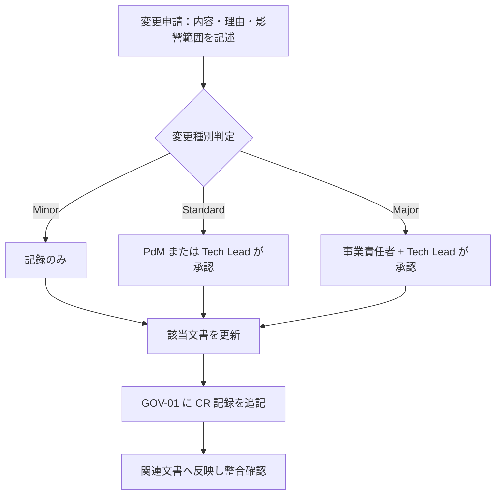

# 01-decision-log.md — 意思決定ログ

## このセクションの目的

重要な意思決定を時系列で記録し、背景と影響範囲を追跡できるようにする。**全フェーズ横断・プロジェクト開始初日から運用する**。

本書に記録するのは **プロジェクト適用後の意思決定のみ**。

## 0-H. ハイブリッド編集ガイド（要点）

- 推奨モード: Human-first または Hybrid
- 人間確認必須: 本当に決定済みか、決定者の明確性、影響範囲の漏れ

---

## 1. 凡例

| 区分 | 内容 |
| --- | --- |
| D-ID | 決定 ID（D-NNN 連番） |
| 日付 | 決定確定日（YYYY-MM-DD） |
| カテゴリ | 事業 / プロダクト / 設計 / 運用 |
| 決定内容 | 確定した方針・選択 |
| 背景 | 議論の発端、選択肢、選定理由 |
| 影響範囲 | 反映が必要な文書・コード |
| 決定者 | 最終承認者 |
| 関連 TBD | 解決された GOV-02 の TBD-ID |

---

## 2. 決定ログ

### D-001：2 リポジトリ構成 → pnpm workspaces + Turborepo モノレポへの移行

| 項目 | 内容 |
| --- | --- |
| 日付 | 2026-08-17 |
| カテゴリ | 設計 |
| 決定内容 | 2 リポジトリ構成（public/admin）・npm から、1 リポジトリ内 `apps/public`/`apps/admin` + `packages/schema` の pnpm workspaces + Turborepo モノレポへ移行（`packages/types` は実際の利用箇所が出てから切り出す方針とし、見送り） |
| 背景 | 複数リポジトリ間の DB スキーマ手動コピーによる同期漏れ事故を構造的に防ぎ、ドキュメントも1箇所に集約して運用コストを下げるため（Cloudflare 公式推奨のモノレポ構成に合わせた）。`packages/config`/`packages/ui` は検討の上、実体のある共有内容がないため見送った。 |
| 影響範囲 | DEV-01 §1/§2/§3・§5, DEV-02, DEV-03, DEV-04, DEV-05, DEV-06, DEV-07 §9, DEV-08 §1/§2, DEV-09, DEV-10, PRD-01 §1-1, PRD-02 §1-3/§3, PRD-04, OPS-02 §3, 00_DEV_GUIDE.md, CLAUDE.md, README.md, 各 skill（schema-build/scaffold/admin-design/public-design/design-review）, ルート設定（package.json / pnpm-workspace.yaml / turbo.json / eslint.config.js / .prettierrc / .devcontainer） |
| 決定者 | Tech Lead |
| 関連 TBD | — |

> 追記（2026-09-09）: その後 `packages/server-kit`（両アプリ共通のサーバー基盤）と `packages/content`（開発者が更新する Markdown）が「2 つ目の利用者が現れた」時点で切り出された（DEV-01 §1、D-015）。`packages/types` は引き続き見送り。

### D-002：CI は GitHub Actions、CD は Cloudflare Workers Builds

| 項目 | 内容 |
| --- | --- |
| 日付 | 2026-08-18 |
| カテゴリ | 運用 |
| 決定内容 | 検査（CI）と デプロイ（CD）で基盤を分ける。CI は GitHub Actions（`.github/workflows/ci.yml`）、CD は Cloudflare Workers Builds の GitHub 連携（リポジトリ内にデプロイ用ワークフローを持たない）。デプロイトリガーは staging ← `dev`、production ← `main`。D1 マイグレーションは Workers Builds が自動実行しないため、`apps/admin` 側の Deploy command に `wrangler d1 migrations apply` を前置する |
| 背景 | DEV-08 §3 で Open だった CI/CD 基盤の決定。Workers Builds が Root directory / Build Watch Paths / Deploy command のカスタマイズ / Worker ごとの GitHub check run を備え、モノレポ 2 Worker 構成の要件（DEV-08 §2 のパスフィルタ）を満たすうえ、Cloudflare API トークンをリポジトリ側で管理せずに済むため CD はそちらに寄せた。一方 PR 時の品質ゲートは Workers Builds の範囲外で、hooks（`.claude/hooks/format-and-check.sh`）は Claude Code のセッション内でしか動かず強制力にならないため、CI は GitHub Actions で別途用意した。ブランチ名は docs が指していた `develop` が実在せず既定が `dev` であったため、docs 側を実態に合わせた |
| 影響範囲 | DEV-08 §2/§3, `.github/workflows/ci.yml`, CLAUDE.md, README.md |
| 決定者 | Tech Lead |
| 関連 TBD | — |

### D-003：技術スタックを社内標準（Astro SSR + Svelte islands + Cloudflare Workers/D1/R2）に確定する

| 項目 | 内容 |
| --- | --- |
| 日付 | 2026-08-18 |
| カテゴリ | 設計 |
| 決定内容 | 本プロジェクトの技術スタックを社内標準（Astro SSR + Svelte islands + Cloudflare Workers/D1/R2、00_README §0-1 のパターン A）に確定する。技術選定の正本は DEV-01 とし、他文書は DEV-01 を参照する |
| 背景 | 本ドメイン（ペット漢方卸売の BtoB 審査制サイト）はマルチテナント SaaS・チャット・AI 機能を必要とせず、コンテンツ公開 + 軽量なトランザクション（申請・発注）に収まるため、パターン A の適用範囲に合致する（00_README §0-1 の自己診断）。本スタックの Astro SSR はリクエストごとの動的レンダリングであり、卸価格をログイン状態で出し分ける要件（INTAKE §4-2）を静的生成 + CDN のような構成分離なしに実現できる |
| 影響範囲 | 00_INTAKE、BIZ-01〜03、PRD-01〜05、DEV-01〜10、OPS-01〜02。DEV-04（API 仕様）は Astro API Route + Svelte island 構成を前提とした REST API 設計とする |
| 決定者 | 事業責任者（s.fuji@naturaling.jp）/ Tech Lead |
| 関連 TBD | — |

### D-004：Member は Organization に Membership 経由で所属する構造とする（テンプレ標準からの拡張）

| 項目 | 内容 |
| --- | --- |
| 日付 | 2026-08-18 |
| カテゴリ | 設計 |
| 決定内容 | 本リポジトリの標準テンプレートは `Member`（`apps/public` のマイページ利用者）を組織を持たない単一種別として扱うのが既定だが、本プロジェクトでは `Member` が `Organization`（取引先会社）に `Membership` を介して所属する構造に拡張する。将来 1 つの Organization に複数 Member が所属できるようスキーマを設計する |
| 背景 | INTAKE §4-6 の顧客発言「会社・取引先情報と、ログインユーザー情報は分けて管理する。将来的に、一つの会社へ複数ユーザーを所属させられる構造とする」に基づく。標準テンプレの Member モデルのみでは表現できないため、明示的な拡張として記録する |
| 影響範囲 | PRD-01 §1-1〜§1-3、PRD-02 §1-3・§2、DEV-02 §1-2・§2-2、DEV-07 §5-5 |
| 決定者 | PdM / Tech Lead |
| 関連 TBD | TBD-05（取引先側管理者権限の要否） |

### D-005：AI（LLM）機能を不採用とし、商品選び診断はルールベースで実装する

| 項目 | 内容 |
| --- | --- |
| 日付 | 2026-08-16 |
| カテゴリ | 設計 |
| 決定内容 | PRD-05 の AI 機能を不採用とする。商品選び診断（PRD-03 F-03-10）は質問回答と条件の照合によるルールベース機能として実装する |
| 背景 | INTAKE に AI・チャット機能への要望がなく、医薬品的な断定表現を避ける必要があるサービス特性上、決定的なルールベースの提案の方が生成 AI の非決定的な出力より適切と判断（PRD-05 §1）|
| 影響範囲 | PRD-05, PRD-03（AI 機能グループなし）, DEV-07（AI 機能テーブル不要）|
| 決定者 | PdM（暫定。事業責任者確認が必要）|
| 関連 TBD | — |

> 本決定は「ルールベースで実装する」までを定めたもので、**ルールの置き場所**（D1 か Content Collections か）は D-015 で決定した。

### D-006：チャット・リアルタイム通信機能を不採用とする

| 項目 | 内容 |
| --- | --- |
| 日付 | 2026-08-16 |
| カテゴリ | 設計 |
| 決定内容 | チャット・リアルタイム通信機能を不採用とする。通知はメール + マイページお知らせで代替する |
| 背景 | INTAKE に要望がなく、新規取引申請の審査・発注ステータス変更は日単位のリードタイムでも業務上問題ないため（BIZ-02 KPI-03）|
| 影響範囲 | PRD-03（チャット機能グループなし）, DEV-07（チャット関連テーブル不要）|
| 決定者 | PdM（暫定）|
| 関連 TBD | — |

### D-007：商品カタログはテナント境界（organization_id）の対象外とする

| 項目 | 内容 |
| --- | --- |
| 日付 | 2026-08-16 |
| カテゴリ | 設計 |
| 決定内容 | Manufacturer / Brand / ProductCategory / Concern / Product 等の商品カタログは運営が一元管理する共有データとし、`organization_id` を持たせない。テナント境界の適用は発注関連データ（ShippingAddress / CartItem / Order / OrderItem / Payment / Membership）に限定する |
| 背景 | 本プロジェクトの商品カタログは全取引先共通であり、標準テンプレートの単一運営前提をそのまま適用すると実態と乖離するため（PRD-01 §6）|
| 影響範囲 | PRD-01, PRD-02, DEV-02 §3, DEV-07 |
| 決定者 | PdM / Tech Lead（暫定）|
| 関連 TBD | — |

### D-008：ロール構成を AdminUser 1 ロール・Organization 側 1 ロールの最小構成とする

| 項目 | 内容 |
| --- | --- |
| 日付 | 2026-08-16 |
| カテゴリ | 設計 |
| 決定内容 | 運営側は `admin` 1 ロール（テンプレート標準の `editor` は不採用）、Organization 側は `client_user` 1 ロールの最小構成とする |
| 背景 | INTAKE §4-6 の顧客発言に、運営側は「運営管理者」、取引先側はロール区別のない「取引先ユーザー」のみが言及されており、それ以上のロール分割の要望がないため |
| 影響範囲 | PRD-01 §1-2, DEV-02 §2 |
| 決定者 | PdM（暫定）|
| 関連 TBD | TBD-05（取引先側管理者権限の要否）|

> → D-014 で改定（`role` カラム自体を廃止）。

### D-009：卸価格は取引先ごとの個別設定を許容する（標準卸価格 + 上書きテーブル方式）

| 項目 | 内容 |
| --- | --- |
| 日付 | 2026-08-16 |
| カテゴリ | 事業 / 設計 |
| 決定内容 | Product に標準卸価格（`wholesale_price`）を持たせつつ、取引先ごとの個別価格を `organization_product_prices` テーブル（Organization × Product の上書き）で表現する。個別設定が無ければ標準価格を適用する |
| 背景 | 事業責任者ヒアリングにより「個別価格はあり得る」と確認（TBD-02 解決）。掛率計算等の複雑な仕組みではなく、シンプルな価格上書きテーブルで対応する |
| 影響範囲 | BIZ-03 §2-2, PRD-01 §3-2/§6, PRD-02 §2/§6-2, PRD-03 F-03-03/F-04-01/F-07-10, PRD-04 §3-2 ADM-15, DEV-05, DEV-07 §6-7 |
| 決定者 | 事業責任者 |
| 関連 TBD | TBD-02（解決）|

### D-010：支払方法はクレジットカード決済・銀行振込のみとし、掛売り（信用取引）は提供しない

| 項目 | 内容 |
| --- | --- |
| 日付 | 2026-08-16 |
| カテゴリ | 事業 |
| 決定内容 | 全取引先が発注ごとにクレジットカード決済または銀行振込のいずれかで支払う。与信管理・請求書発行を前提とした掛売りは提供しない。支払方法は取引先ごとの制限を設けず全社共通とする |
| 背景 | 事業責任者ヒアリングにより確定（TBD-04 の支払方法スコープ部分を解決）。与信管理機能を持たないことで Organization・Order のスキーマと審査フローをシンプルに保てる |
| 影響範囲 | BIZ-03 §4-1, PRD-01（Organization に paymentTerms 属性を持たせない）, PRD-02 §6-1, DEV-07 §5-2（organizations テーブルに支払条件カラムを持たせない）|
| 決定者 | 事業責任者 |
| 関連 TBD | TBD-04（支払方法スコープの部分を解決。銀行口座・振込期限等の運用詳細は TBD-04b として継続）|

### D-011：在庫管理は行わない

| 項目 | 内容 |
| --- | --- |
| 日付 | 2026-08-16 |
| カテゴリ | 事業 |
| 決定内容 | 商品の在庫数管理・欠品表示・取り寄せ・メーカー直送機能は実装しない |
| 背景 | 事業責任者ヒアリングにより確定（TBD-06 解決）。既存の `[Assumed]` 方針がそのまま確定した |
| 影響範囲 | PRD-01, PRD-03 §4-3（除外項目として確定）|
| 決定者 | 事業責任者 |
| 関連 TBD | TBD-06（解決）|

### D-012：全文検索基盤は MVP では導入しない

| 項目 | 内容 |
| --- | --- |
| 日付 | 2026-08-16 |
| カテゴリ | 設計 |
| 決定内容 | 商品点数が数十〜百点規模の間は、D1 クエリベースの検索（キーワード・絞り込み）で開始し、全文検索基盤（D1 FTS5 等、DEV-01 §2）の導入を見送る |
| 背景 | 商品点数の想定規模（PRD-02 §5-1）に対して全文検索基盤の運用コストが見合わないため |
| 影響範囲 | DEV-10 §7-1, PRD-03 F-03-04 |
| 決定者 | Tech Lead（暫定）|
| 関連 TBD | — |

### D-013：最低発注条件・送料・キャンセル/返品条件を確定する

| 項目 | 内容 |
| --- | --- |
| 日付 | 2026-08-18 |
| カテゴリ | 事業 |
| 決定内容 | 最低発注金額は税抜 ¥10,000（発注単位の下限は商品ごとの `orderUnit` の倍数のみとし、別途の数量下限は設けない）。送料は全国一律税抜 ¥1,000、発注合計（税抜）¥30,000 以上で無料。税端数処理は税率ごとに 1 回、円未満切り捨て。キャンセルは出荷（`shipped`）前まで可能、出荷後は不可。返品・交換は商品の破損・品質不良・誤配送があった場合のみ、到着後 7 日以内の連絡を条件に受け付け、取引先都合の返品は原則不可 |
| 背景 | TBD-03 は「DB 設計前」に確定が必要な P0 事項だった。一般的な BtoB 卸取引の実務水準（最低発注額での配送コスト吸収、出荷前キャンセルの原則）を踏まえた事業責任者確認前の暫定値として、開発着手を優先し確定した。配送地域・配送会社（TBD-07）は未確定のまま残る |
| 影響範囲 | BIZ-03 §2-3・§3, PRD-03 F-04-04, OPS-01 §4-4 |
| 決定者 | 事業責任者（暫定。開発着手のため確定 — 実装後に正式レビュー推奨）|
| 関連 TBD | TBD-03（解決。配送地域・配送会社は TBD-07 として継続）|

### D-014：AdminUser はロール区分を持たない単一種別とし、`role` カラム・ロール検証を廃止する（D-008 の改定）

| 項目 | 内容 |
| --- | --- |
| 日付 | 2026-08-19 |
| カテゴリ | 設計 |
| 決定内容 | D-008 で「運営側は `admin` 1 ロール」としていた構成をさらに簡素化し、`admin_users` テーブルから `role` カラム自体を廃止する。AdminUser はロール区分を持たない単一種別とし、認可チェックは Service 層のセッション検証（`requireSession`）のみで足りるとする（`requireRole` のようなロール検証関数は不要）。Organization 側（`memberships.role` = `client_user` 1 ロール）は D-008 のまま変更しない |
| 背景 | 運営体制がサポート等の複数ロールを持たない前提であることが確定し、`admin` 固定値 1 種類のみの `role` カラムを持つこと自体が不要な間接層と判断されたため（事業責任者確認） |
| 影響範囲 | PRD-01 §1-2・§3-1, PRD-02 §2-2・§6-1, DEV-01 §1「Permission」・§4「認可チェックの徹底」・§8, DEV-02 §2-1・§3, DEV-04 §2・§5, DEV-05 §5・§12, DEV-06 §3・§13, DEV-07 §3-1・§4-1・§11, DEV-09 §3-3, 品質チェックリスト（DEV-03）, CLAUDE.md |
| 決定者 | 事業責任者（s.fuji@naturaling.jp）|
| 関連 TBD | — |

> 実装上の注意: テンプレート標準の雛形・スキル（`scaffold` — DEV-01 §9）はロールを持つ前提で書かれている。生成物に `requireRole` 等のロール分岐が残っていた場合は削る（DEV-02 §2-1）。シーダーは `apps/admin/scripts/seed-user.mjs`（DEV-07 §9）。

### D-015：商品選び診断のルールを Content Collections で管理し、診断系 4 テーブルを廃止する

| 項目 | 内容 |
| --- | --- |
| 日付 | 2026-09-09 |
| カテゴリ | 設計 |
| 決定内容 | 商品選び診断（PRD-03 F-03-10 / F-03-11）の質問・選択肢・推奨商品マッピングを `packages/content` の Markdown（Content Collections）で管理する。当初検討していた `diagnosis_sets` / `diagnosis_questions` / `diagnosis_choices` / `diagnosis_rules` の 4 テーブルは設けない。推奨商品は `Product.slug` の文字列参照で D1 の商品を引く。診断の「質問セット取得 API」は設けず、ページのビルド時にルールを解決する（回答から推奨商品を解決する `POST /api/v1/diagnosis/result` のみ残す） |
| 背景 | 当初の設計は診断系 4 テーブルを定義していたが、**対応する管理画面が PRD-04 の ADM 一覧に存在せず、テーブルはあるのに誰も更新できない状態だった**。「運営が管理画面から更新するか否か」で置き場所を決める基準（DEV-06 §1-1）に照らすと、診断ルールは開発者が更新するコンテンツであり Content Collections が適切。結果として MVP から 4 テーブルと未設計の管理画面 1 系統が外れ、公開ページの D1 読み取りも減る |
| 影響範囲 | PRD-01 §1-5・§2・§3-2・§5・§6・§7, PRD-02 §1-2・§1-4・§6-2・§7・§8, PRD-03 §1・FG-03・§4-3, PRD-04 §3-1-1・§3-2, PRD-05 §1-1, DEV-01 §1（Content Collections 行の追加）・§3・§8, DEV-02 §3-1・§4, DEV-03 §3-5, DEV-04 §5-8, DEV-05 §1-4, DEV-06 §1-1（正本）, DEV-07 §3-9・§6-4・§7-3, OPS-02 §3-6, GOV-02 TBD-09 |
| 決定者 | PdM |
| 関連 TBD | TBD-09（管理方法の部分を解決。質問項目・判定ルールの中身は未確定のまま継続）|
| 再評価条件 | 運営自身がルールを頻繁に調整したい要望が出た時点で、D1 + 管理画面への移行を再検討する（OPS-02 §3-6・§5）|

### D-016：FAQ・法務ページはページ直書きとし、規約バージョンを申請時に記録する

| 項目 | 内容 |
| --- | --- |
| 日付 | 2026-09-09 |
| カテゴリ | 設計 / 運用 |
| 決定内容 | よくある質問（SCR-27）・利用規約（SCR-28）・プライバシーポリシー（SCR-29）・特定商取引法に基づく表示（SCR-32）の文面を、Content Collections でも D1 でもなく **Astro ページに直書き**で管理する。管理画面は設けない。あわせて、利用規約の現行バージョンをコード内の定数 1 箇所で保持し、新規取引申請時に `applications.agreed_terms_version` へ記録する（サーバー側で現行バージョンとの一致を検証する） |
| 背景 | いずれも運営が日常的に更新する対象ではなく、ページ数が固定で 1 ファイル 1 ページに収まるため、コレクションを作る必要がない（DEV-06 §1-1）。法務ページは弁護士レビューと 30 日前通知を伴う改定であり（OPS-01 §5-2）、Git のコミット履歴がそのまま改定履歴として機能する点も直書きと相性がよい。一方、規約が DB のレコードとして存在しなくなるため、`agreed_to_terms` の 0/1 だけでは「どの版に同意したか」を立証できない。この欠落を埋めるために `agreed_terms_version` を追加した |
| 影響範囲 | PRD-01 §1-5・§3-2, PRD-02 §1-4・§6-2・§8・§9, PRD-03 §1・F-02-01・F-09-03・§4-3, PRD-04 §3-1-1, DEV-02 §2-3・§8-1, DEV-03 §4, DEV-04 §6-1, DEV-06 §1-1（正本）, DEV-07 §3-9・§5-1, DEV-08 §1-1・§6-2, OPS-01 §1・§5-2・§8, OPS-02 §1-2・§1-3・§3-6, GOV-02 TBD-11・TBD-20・TBD-21 |
| 決定者 | PdM |
| 関連 TBD | TBD-11（文面確定は継続）。TBD-20（運営自身が編集したい要望が出た場合の対応）・TBD-21（既存取引先への再同意の要否）を新規登録 |

---

## 3. 記録すべき意思決定の種別

- 顧客セグメントの変更
- MVP スコープの追加 / 除外
- 卸価格・支払条件・送料の変更
- 認証・権限・セキュリティ方針の変更
- データモデル・テナント構造の変更
- **公開コンテンツの置き場所（D1 / Content Collections / 直書き）の変更**（DEV-06 §1-1）
- 技術スタックの変更（DEV-01 §1 確定スタック・§2 機能別標準・§3 不採用リストの変更はすべてここに記録）
- AI・チャット機能採否の変更
- インフラ・デプロイ戦略の変更
- 契約条件・SLA の変更

---

## 4. 正仕様承認ゲート

### 4-1. 正仕様の定義

「正仕様」とは、関係者が合意し、開発・運用・契約の判断基準として参照できる状態の文書セットを指す。必須文書の status が `approved` に達し、本セクションの承認記録が残った時点で正仕様とみなす。

### 4-2. 承認条件

- 必須文書の status が `approved`（必須文書セットは適用フローにより異なる — 00_README §4。デモ・受託の軽量フローでは対象文書のみで可）
- 主要な未決事項が GOV-02 で追跡されている
- 開発着手を止める重大な未決がない
- 承認者が承認記録に記録されている

### 4-3. 承認記録フォーマット

| 承認 ID | 承認日 | 承認対象文書リスト | 承認者 | 承認時の未決事項数 | 備考 |
| --- | --- | --- | --- | --- | --- |
| APR-001 | 未実施 | BIZ-01〜03, PRD-01〜05, DEV-01〜10, OPS-01〜02, GOV-01, GOV-02 | 未定 | GOV-02 参照（複数の `[Open]` あり）| 本ドキュメント一式は AI による初稿（draft-ai）。事業責任者・Tech Lead のレビュー前 |

---

## 5. 変更管理フロー（Change Request）

### 5-1. 目的

正仕様承認後に仕様変更が生じた場合、影響範囲を特定し、無承認で実装が進むことを防ぐ。

### 5-2. 変更種別と承認レベル

| 変更種別 | 定義 | 承認レベル |
| --- | --- | --- |
| Minor | 誤字・表現修正・説明補足など内容の実質変更なし | 記録のみ（承認不要） |
| Standard | 既存方針の調整・機能スコープの変更・要件追加 / 削除 | PdM または Tech Lead いずれか 1 名の承認 |
| Major | アーキテクチャ・認証・卸価格モデル・SLA・権限モデル・テナント構造・技術スタック（DEV-01）の変更 | 事業責任者 + Tech Lead の承認 |

少人数チーム（兼務前提）を想定し、厳格な承認は Major のみとする。

> 利用規約・プライバシーポリシー・特商法表示の**文面変更は Minor ではない**。管理画面を持たずコードとして管理されるため（D-016）、変更は PR として現れるが、法務レビューを要する点で Standard 以上として扱う（OPS-01 §5-2、DEV-03 §4）。

### 5-3. 変更管理フロー

### 5-4. 変更申請記録フォーマット

<!-- TEMPLATE: 正仕様承認後に変更申請が出たら記録する -->

| CR-ID | 申請日 | 変更内容 | 種別 | 影響文書 | 承認者 | 承認日 | 反映状況 |
| --- | --- | --- | --- | --- | --- | --- | --- |
| CR-001 | YYYY-MM-DD | [変更内容の概要] | Minor / Standard / Major | [影響文書] | [承認者] | YYYY-MM-DD | 完了 / 反映中 |

---

## 6. 運用ルール

- 新たな決定が出たら本書に追記する。GOV-02 の TBD は解決時点で D-NNN に転記
- 決定の取り消し・変更は新しい D-NNN として記録し、旧 D-NNN に「→ D-MMM で置換」と注記
- 文書間で矛盾が見つかった場合、本書の最新決定が優先

---

## 7. 記入時チェックポイント

- 決定内容・背景・影響範囲が空欄になっていないか
- 決定者が明確か
- 関連 TBD（GOV-02）が転記されているか
- CR が時系列で追えるか
- Major 変更が 事業責任者 + Tech Lead に承認されているか
